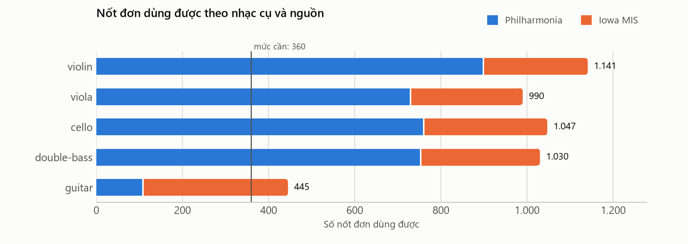
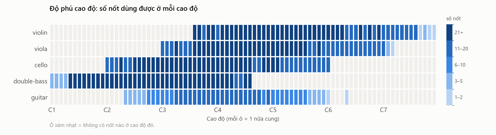

# BÁO CÁO KẾT QUẢ — Chuẩn bị dataset (Bước 0 và 1.1–1.6)

> **Thời gian thực hiện:** 07–08/10/2026 · **Phạm vi:** môi trường + toàn bộ phần dataset của Phần 1.
> **Nguyên tắc:** mọi con số dưới đây được **đo trên dữ liệu thật** bằng script trong `scripts/`, không ước lượng. Số liệu chi tiết tự sinh nằm ở [reports/dataset/dataset_stats.md](../../reports/dataset/dataset_stats.md).

## Mục lục
0. [Tóm tắt](#0-tóm-tắt)
1. [Bước 0 — Môi trường](#1-bước-0--môi-trường)
2. [Khảo sát và lọc dữ liệu Philharmonia](#2-khảo-sát-và-lọc-dữ-liệu-philharmonia)
3. [Chọn nhạc cụ và tìm nguồn bổ sung](#3-chọn-nhạc-cụ-và-tìm-nguồn-bổ-sung)
4. [Bước 1.1 — Tải dữ liệu Iowa MIS](#4-bước-11--tải-dữ-liệu-iowa-mis)
5. [Bước 1.2 — Cắt file Iowa thành nốt đơn](#5-bước-12--cắt-file-iowa-thành-nốt-đơn)
6. [Bước 1.3–1.5 — Catalog, lọc, chia tập, sắp xếp file](#6-bước-1315--catalog-lọc-chia-tập-sắp-xếp-file)
7. [Bước 1.6 — Mô tả dataset](#7-bước-16--mô-tả-dataset)
8. [Git và giấy phép dữ liệu](#8-git-và-giấy-phép-dữ-liệu)
9. [Vấn đề còn mở và việc tiếp theo](#9-vấn-đề-còn-mở-và-việc-tiếp-theo)

---

## 0. Tóm tắt

**Phần dataset đã xong: đủ nguyên liệu, sạch, chia tập không rò rỉ, sắp xếp gọn theo nhạc cụ.**

| Chỉ số | Kết quả |
|---|---|
| File âm thanh được quản lý | **5 906** (4 477 Philharmonia + 1 429 nốt cắt từ Iowa MIS) |
| Nốt đơn dùng được (5 nhạc cụ trong CSDL) | **4 653** — violin 1 141 · viola 990 · cello 1 047 · double bass 1 030 · guitar 445 |
| Mức cần mỗi nhạc cụ (≈ 360) | **Cả 5 nhạc cụ đều đạt**; guitar từ 106 → 445 nhờ Iowa |
| Nốt được chọn cho bước sau | Mỗi nhạc cụ: REF 150 · DB_POOL 200 (guitar 181) · QUERY_POOL 60 |
| Truy vấn | 445 đoạn nhạc thật (phrase) + 154 file nhạc cụ ngoài CSDL (banjo 74, mandolin 80) |
| File không dùng (để riêng trong `data/excluded/`, không xóa) | **654** = 573 kỹ thuật đặc biệt/pizz + 76 quá ngắn + 4 trùng + 1 hỏng |
| Kiểm tra cộng dồn | 4 653 dùng được + 445 phrase + 154 ngoài CSDL + 654 không dùng = **5 906** ✓ |
| Cắt nốt Iowa | 1 429 / 1 552 nốt (**92%**) |
| Kiểm tra tự động (`tests/test_catalog.py`) | **12 / 12 đạt** (không rò rỉ cao độ giữa các tập, đúng giới hạn, đủ 2 nguồn, nhãn dây đúng vật lý…) |
| Tiếng ù hạ âm trong bản thu | Phát hiện và xử lý bằng **lọc thông cao 25 Hz** (D27, §6.6); mọi số liệu trong báo cáo này đo **sau** khi lọc |

Chưa làm trong phạm vi báo cáo này: **ghép 500 file đoạn nhạc** cho CSDL (Bước 5) — dùng các nốt DB_POOL/QUERY_POOL đã chọn ở đây.

---

## 1. Bước 0 — Môi trường

| Thành phần | Phiên bản | Ghi chú |
|---|---|---|
| Python | 3.13.9 | Môi trường ảo `.venv/` |
| librosa | 1.0.0 | STFT, Mel, MFCC, pYIN, onset |
| scikit-learn | 1.9.1 | StandardScaler, KMeans, PCA |
| rtree | 1.4.1 | R\*-tree (libspatialindex) |
| numpy / scipy | 2.5.3 / 1.18.1 | |
| soundfile / matplotlib | 0.14.0 / 3.11.2 | Ghi WAV, vẽ biểu đồ |
| FFmpeg | 9.0.2 | Giải mã MP3/AIFF |

- Danh sách đầy đủ trong `requirements.txt` (`pip install -r requirements.txt` để cài lại).
- Kiểm tra: `import librosa, sklearn, rtree, soundfile` chạy được; tạo được `rtree.index.Property(dimension=8)`. **Đạt.**
- Chưa làm: khung `src/strings_mmdb/` và `config.py` (các script dataset hiện tự khai báo hằng số ở đầu file). Sẽ tạo khi bắt đầu Bước 2.

---

## 2. Khảo sát và lọc dữ liệu Philharmonia

**Cách làm:** giải mã **toàn bộ 4 477 file** (ffmpeg → mono 22 050 Hz), đo phần có âm (RMS > −40 dB so với đỉnh), đỉnh biên độ, số mẫu clipping, MD5.

### 2.1. Chất lượng kỹ thuật
| Kiểm tra | Kết quả |
|---|---|
| Giải mã lỗi | 1 file (`viola_D6_05_piano_arco-normal.mp3`) |
| Trùng nội dung (MD5) | 2 cặp: `cello_Cs6_1_mezzo-forte_arco-harmonic` = `violin_Ds5_phrase_forte_arco-spiccato`; `cello_Ds5_05_forte_arco-normal` = `viola_G6_05_fortissimo_arco-normal` |
| Clipping | 1 file (một phrase double-bass) |
| Phần có âm < 0.35 s | Lần quét đầu (07/10, chưa lọc tiếng ù): 55 nốt đơn (violin 10, viola 29, cello 11, double-bass 5), trong đó 1 là file hỏng ⇒ 54. **Sau khi lọc tiếng ù (D27, §6.6): 59** (violin 25, viola 21, cello 8, double bass 5) |
| Định dạng | 100% MP3, 44.1 kHz, mono |

**Kết luận:** chất lượng tốt. Vấn đề nằm ở **phân bố** dữ liệu, không nằm ở chất lượng.

### 2.2. Phát hiện ảnh hưởng tới thiết kế
| Phát hiện | Số liệu | Quyết định |
|---|---|---|
| Có 446 file `phrase` (đoạn nhiều nốt), docs cũ bỏ sót | violin 253, viola 55, cello 64, double-bass 74, guitar 0 | Dùng làm **truy vấn nhạc thật** |
| Spectral flux thô báo onset giả trên nốt kéo vĩ | Median ≈ 3 onset/nốt đơn (thực tế 1) | Segmentation dùng **SuperFlux** (D09) |
| Pizz quá hiếm | cello 0, double-bass 12 nốt dùng được | Bộ kéo vĩ **chỉ dùng arco** (D20) |
| Guitar thiếu nghiêm trọng | 106 nốt (cần ≈ 360) | **Bổ sung nguồn thứ hai** (D21) |
| Nốt quá ngắn | 54 nốt (+1 file hỏng); sau D27: 59 | Ngưỡng `TOO_SHORT` = 0.35 s (D22) |

---

## 3. Chọn nhạc cụ và tìm nguồn bổ sung

### 3.1. Chọn nhạc cụ
| Phương án | Nhạc cụ trong CSDL | Truy vấn ngoài CSDL | Đánh giá |
|---|---|---|---|
| **A (chọn)** | violin, viola, cello, double bass, guitar | banjo, mandolin | Có cả kéo vĩ và gảy; truy vấn "ngoài CSDL" có sẵn; chỉ thiếu guitar |
| B | 4 nhạc cụ kéo vĩ | guitar, banjo, mandolin | Đủ dữ liệu ngay nhưng CSDL không có âm gảy |
| C | 7 nhạc cụ | phải tìm thêm | Thiếu dữ liệu ở 3 nhạc cụ |
| D | Nhạc cụ dân tộc | — | Không có dataset nốt đơn sạch |

Mức dữ liệu tối thiểu mỗi nhạc cụ: **≈ 360 nốt dùng được** (REF 100 + DB_POOL 200 + QUERY_POOL 60). Riêng guitar còn cần **phủ đủ 6 dây và 49 cao độ**.

### 3.2. Nguồn bổ sung (kiểm tra ngày 07/10/2026)
| Nguồn | Giấy phép | Định dạng | Kết luận |
|---|---|---|---|
| **University of Iowa MIS** | Dùng không hạn chế | AIFF 16-bit 44.1 kHz mono, phòng tiêu âm | **Chọn**, tải cho cả 5 nhạc cụ để tránh nhiễu nguồn |
| GuitarSet | CC BY 4.0 | Bản thu guitar 30 s có chú thích | Dự phòng (truy vấn guitar nhạc thật) |
| IDMT-SMT-Guitar | CC BY-NC-ND 4.0 | WAV 44.1 kHz | Loại: cấm tạo tác phẩm phái sinh |
| NSynth | CC BY 4.0 | **16 kHz** | Loại: hệ thống sẽ nhận ra nguồn thay vì nhạc cụ |

---

## 4. Bước 1.1 — Tải dữ liệu Iowa MIS

| Nhạc cụ | Cách tải | Số file | Dung lượng | Nội dung |
|---|---|---|---|---|
| guitar | Thủ công: `Guitar.mono.1644.1.zip` (MD5 `7add3d02…`) | 45 `.aif` | 242 MB | 6 dây × 3 cường độ (pp/mf/ff), mỗi file nhiều nốt |
| violin | `scripts/p01_1_download_iowa.py` | 35 `.aiff` | 233 MB | Chỉ arco, 4 dây × 3 cường độ |
| viola | như trên | 32 | 119 MB | |
| cello | như trên | 41 | 203 MB | |
| double bass | như trên | 35 | 122 MB | |
| **Tổng** | | **188** | **≈ 920 MB** | |

- Script tải kiểm tra **dung lượng từng file với máy chủ** (file tải dở sẽ được tải lại) và ghi `manifest.csv` (URL + MD5) trong `_download/` của mỗi nhạc cụ làm bằng chứng nguồn.
- Lần chạy kiểm tra lại: 143/143 file khớp dung lượng máy chủ, không phải tải lại file nào.

---

## 5. Bước 1.2 — Cắt file Iowa thành nốt đơn

### 5.1. Cấu trúc thật của file Iowa (khảo sát trước khi cắt)
- Mỗi file chứa các nốt **đi lên từng nửa cung** đúng như khoảng trong tên file. Ví dụ `Guitar.mf.sulA.A2B2.aif` có 3 cú gảy ở giây 0.07, 12.5, 23.6 với cao độ A2 → A♯2 → B2.
- Mỗi nốt **ngân 10–13 s**, nốt sau bắt đầu khi nốt trước còn vang ⇒ **không có khoảng lặng giữa các nốt**. Cắt theo khoảng lặng thử nghiệm cho **743 đoạn** so với 353 nốt thật ⇒ không dùng được.
- Đàn guitar lên dây thấp hơn chuẩn khoảng 0.2–0.4 nửa cung ⇒ cần bù độ lệch lên dây khi so cao độ.

### 5.2. Thuật toán (`scripts/p01_2_slice_iowa.py`, phiên bản thuật toán 3)
1. Tìm ứng viên onset bằng **SuperFlux** (librosa, `lag=2`, `max_size=3`) + lùi về đầu cú gảy/kéo (backtrack).
2. Đo cao độ bằng **pYIN** trong 0.1–0.6 s sau mỗi ứng viên (đo ở 22 050 Hz cho nhanh). Bỏ ứng viên không có cao độ rõ.
3. Ước lượng độ lệch lên dây của cả file = trung vị phần lẻ nửa cung; bù trước khi so.
4. Ghép **tuần tự** với dãy nốt dự kiến lấy từ tên file:
   - bỏ ứng viên trùng cao độ với nốt vừa ghép (dao động đuôi ngân, đổi chiều vĩ);
   - chấp nhận lỗi quãng tám của pYIN **chỉ khi lệch đúng 12 hoặc 24 nửa cung**;
   - cho phép **nhảy cóc tối đa 2 nốt** nếu nốt dự kiến bị thiếu.
5. Cắt từ onset tới onset kế tiếp (tối đa 6 s), bỏ đuôi lặng (−40 dB), ghi WAV 44.1 kHz 16-bit.

Vận hành: chạy **độc lập với cửa sổ Claude Code** và **lưu kết quả từng file** (`_cache/`), nên dừng giữa chừng chạy lại sẽ làm tiếp. Lần chạy cuối: 01:44 → 02:00 ngày 08/10 (**≈ 16 phút** cho 188 file).

### 5.3. Ba phiên bản và vì sao
| Phiên bản | Thay đổi | Nốt cắt được |
|---|---|---|
| 1 | Thuật toán ban đầu | 1 371 / 1 552 (88%) — thiếu nhiều ở âm vực rất cao (viola, violin từ C6) |
| 2 | Sửa giới hạn cao độ viola (1 600 → 2 100 Hz); quy **mọi** ứng viên về quãng tám gần nốt cần tìm | 1 184 (76%) — **tệ hơn**: bồi âm trong đuôi ngân bị quy về thành "nốt phía trước", script nhảy cóc làm hỏng cả chuỗi |
| **3 (dùng)** | Chỉ chấp nhận lỗi quãng tám khi lệch đúng 12/24 nửa cung; nhảy cóc tối đa 2 nốt | **1 429 (92%)** |

| Nhạc cụ | Phiên bản 1 | Phiên bản 2 | **Phiên bản 3** |
|---|---|---|---|
| violin | 239 | 141 | **251 / 312 (80%)** |
| viola | 247 | 183 | **267 / 292 (91%)** |
| cello | 283 | 256 | **291 / 309 (94%)** |
| double bass | 261 | 263 | **279 / 286 (98%)** |
| guitar | 341 | 341 | **341 / 353 (97%)** |

### 5.4. Chất lượng nốt cắt được
| Nhạc cụ | Độ lệch cao độ so với tên nốt (trung vị / tối đa) | Thời lượng nốt (trung vị) |
|---|---|---|
| violin | 0.20 / 0.60 nửa cung | 5.82 s |
| viola | 0.20 / 0.60 | 3.46 s |
| cello | 0.20 / 0.60 | 5.49 s |
| double bass | 0.10 / 0.50 | 4.88 s |
| guitar | 0.05 / 0.55 | 6.00 s |

- Mọi nốt được giữ đều lệch **≤ 0.6 nửa cung** so với tên ⇒ nhãn cao độ đáng tin. Nốt không chắc chắn bị **loại** chứ không bị đoán.
- File cắt kém nhất: `Violin.arco.pp.sulD.D4Bb4` (1/9), `Cello.arco.mf.sulC.C4Gb4` (2/7), `Violin.arco.ff.sulA.D6G6` (2/6), `Cello.arco.pp.sulA.Ab5` (0/1), `Guitar.pp.sulB.B3` (0/1). Chủ yếu là mức **pp** (rất nhỏ) và âm vực cao, nơi pYIN kém chắc chắn.
- **Chưa kiểm tra bằng tai.** Đề xuất nghe ngẫu nhiên khoảng 20 file trong `data/notes/*/iowa/`.

---

## 6. Bước 1.3–1.5 — Catalog, lọc, chia tập, sắp xếp file

Script: `scripts/p01_3_build_catalog.py` (≈ 4 phút). Kết quả: `data/catalog.csv` (**5 906 dòng = 5 906 file**) và các thư mục đã sắp xếp. Chạy lại cho kết quả giống hệt (seed cố định).

### 6.1. Bước 1.3 — Catalog hợp nhất
Mỗi file một dòng với: nguồn, nhạc cụ, nốt, MIDI, cường độ, kỹ thuật, nhóm kỹ thuật, dây (Iowa), thời lượng, **phần có âm**, đỉnh, số mẫu clipping, MD5, `status`, `split`, `selected`, lý do loại, đường dẫn mới và đường dẫn gốc.

### 6.2. Bước 1.4 — Lọc (`status`)
| Nguồn | Tổng | OK | CORRUPT | DUPLICATE | TOO_SHORT |
|---|---|---|---|---|---|
| Philharmonia | 4 477 | 4 413 | 1 | 4 | 59 |
| Iowa | 1 429 | 1 412 | 0 | 0 | 17 |
| **Tổng** | **5 906** | **5 825** | **1** | **4** | **76** |

Ngoài ra **573** file OK nhưng không dùng vì kỹ thuật (D20): nhiều nhất `pizz-normal` 98, `arco-col-legno-battuto` 72, `natural-harmonic` 54, `artificial-harmonic` 50, `con-sord` 44.

> Lần quét 07/10 đếm được 55 nốt dưới 0.35 s. Con số đó tính cả file hỏng (0 s); catalog xếp file hỏng vào `CORRUPT` trước nên `TOO_SHORT` của Philharmonia khi đó là 54. Sau khi thêm lọc tiếng ù (D27, §6.6), phần có âm được đo lại: **59** Philharmonia + **17** Iowa.

### 6.3. Bước 1.5 — Chia tập (`split`) và chọn nốt (`selected`)
Quy tắc: `midi mod 5` ∈ {0,1} → REF, {2,3} → DB_POOL, {4} → QUERY_POOL (D24), áp dụng chung cho cả hai nguồn. Mỗi nhạc cụ chọn tối đa REF 150, DB_POOL 200, QUERY_POOL 60, trải đều theo (nguồn, cao độ, cường độ) (D23).

| Nhạc cụ | Nguồn | REF (chọn / có) | DB_POOL (chọn / có) | QUERY_POOL (chọn / có) |
|---|---|---|---|---|
| violin | Philharmonia | 103 / 391 | 139 / 360 | 39 / 146 |
| | Iowa | 47 / 102 | 61 / 97 | 21 / 45 |
| viola | Philharmonia | 100 / 297 | 133 / 277 | 41 / 154 |
| | Iowa | 50 / 103 | 67 / 107 | 19 / 52 |
| cello | Philharmonia | 93 / 296 | 127 / 306 | 36 / 157 |
| | Iowa | 57 / 114 | 73 / 117 | 24 / 57 |
| double bass | Philharmonia | 104 / 300 | 141 / 302 | 43 / 149 |
| | Iowa | 46 / 112 | 59 / 110 | 17 / 57 |
| guitar | Philharmonia | 40 / 40 | 41 / 41 | 23 / 25 |
| | Iowa | 110 / 137 | 140 / 140 | 37 / 62 |
| **Mỗi nhạc cụ** | | **150** | **200** (guitar **181**) | **60** |

- Guitar DB_POOL chỉ có 181 nốt (< 200) nên **chọn hết**. Khi ghép 100 file × ~6 nốt, mỗi nốt guitar được dùng lại ≈ 3.3 lần, so với ≈ 3 lần ở các nhạc cụ khác. Chấp nhận được.
- Mọi tập được chọn đều có **cả hai nguồn**, nên hệ thống không thể "đoán nhạc cụ theo phòng thu".

### 6.4. Sắp xếp file
```
data/
├── catalog.csv                      5 906 dòng
├── notes/<nhạc cụ>/<nguồn>/         4 653 nốt dùng được (646 MB)
│   ├── violin/      philharmonia 897 · iowa 244
│   ├── viola/       philharmonia 728 · iowa 262
│   ├── cello/       philharmonia 759 · iowa 288
│   ├── double-bass/ philharmonia 751 · iowa 279
│   └── guitar/      philharmonia 106 · iowa 339
├── queries/                         599 file truy vấn (35 MB)
│   ├── phrases/     violin 252 · viola 55 · cello 64 · double-bass 74
│   └── unseen/      banjo 74 · mandolin 80
├── excluded/<lý do>/<nhạc cụ>/      654 file không dùng (13 MB)
│   ├── technique/   573      ├── too_short/  76
│   ├── duplicate/   4        └── corrupt/    1
└── interim/iowa_notes/              kết quả trung gian của bước 1.2
```
File được **chép** từ `raw/`, bản gốc giữ nguyên. Xóa `data/` rồi chạy lại script là có lại đúng như cũ.

### 6.5. Kiểm tra tự động (`tests/test_catalog.py`): 12 / 12 đạt
| Kiểm tra | Kết quả |
|---|---|
| Mỗi file trên đĩa có đúng một dòng catalog, mọi đường dẫn tồn tại | ✅ 5 906 / 5 906 |
| Đúng 1 CORRUPT, 4 DUPLICATE | ✅ |
| `TOO_SHORT` ⇔ phần có âm < 0.35 s (kiểm tra **quy tắc**, không cố định con số, vì con số đổi khi đổi cách đo) | ✅ |
| Nhãn dây Iowa là dây có thật của nhạc cụ; không nốt nào thấp hơn dây buông (D28) | ✅ |
| Không cặp (nhạc cụ, cao độ) nào nằm ở hai tập (**chống rò rỉ**) | ✅ 0 vi phạm |
| Mọi nốt tuân quy tắc `midi mod 5` | ✅ |
| Số nốt được chọn không vượt giới hạn | ✅ |
| Mỗi (nhạc cụ, tập) được chọn đều có cả hai nguồn | ✅ |
| Banjo, mandolin không lọt vào `data/notes/` | ✅ |
| File lỗi chỉ nằm trong `data/excluded/` | ✅ |
| `data/notes/` chỉ có arco (bộ kéo vĩ) và pluck/harmonic (guitar) | ✅ |
| Mỗi nhạc cụ ≥ 360 nốt dùng được | ✅ |

### 6.6. Tiếng ù hạ âm và lọc thông cao 25 Hz (D27)
**Phát hiện.** Khi vẽ hình minh họa nốt A3 cho phần lý thuyết, F0 đo được của một nốt guitar là 240 Hz thay vì 220 Hz. Kiểm tra kỹ thì thấy nhiều bản thu chứa **tiếng ù hạ âm**: dao động dưới 20 Hz (tai không nghe được) do rung sàn, gió điều hòa, rung giá micro.

| Bản thu | Năng lượng dưới 20 Hz (trung vị) | Ghi chú |
|---|---|---|
| Guitar Iowa | **92.8%** | 297/340 file có trên 50% năng lượng dưới 20 Hz; tần số khoảng 1–10 Hz |
| Guitar Philharmonia | 33.7% | Khoảng 10–30 Hz |
| Banjo / mandolin | 37.6% / 26.5% | |
| Cello Iowa | — | 46 file trên 50% |
| Viola Philharmonia | — | 264 file trên 10% |

**Hậu quả nếu không lọc.** Đỉnh và RMS bị tiếng ù chi phối, nên phần có âm (`active_sec`) đo sai: lệch hơn 0.5 s ở **41–56%** nốt Iowa của cello, double bass, guitar, viola. Mọi đặc trưng năng lượng và phổ cũng bị lệch.

**Cách xử lý.** Lọc thông cao Butterworth bậc 4, tần số cắt **25 Hz**, không lệch pha (`sosfiltfilt`), ngay sau khi giải mã. Nốt thấp nhất của 5 nhạc cụ là C1 = 32.7 Hz, chỉ yếu đi khoảng 1 dB. Sau khi lọc và đo lại, **28 file đổi trạng thái** (chủ yếu ở nhóm TOO_SHORT). Mọi số liệu trong báo cáo này là số **sau** khi lọc.

**Còn lại.** Khoảng 48 file guitar vẫn có tiếng ù 25–80 Hz, nằm trên tần số cắt. Hướng xử lý (lọc thích nghi theo cao độ) để ở mục chờ P07.

### 6.7. Hai sửa lỗi nhỏ ngày 08/10
| Lỗi | Hậu quả | Sửa |
|---|---|---|
| Iowa ghi dây Mi trầm của guitar là `sulE`, dây Mi cao là `sul_E`; script cắt nốt bỏ dấu `_` nên **gộp cả hai thành `E`** | Tầng "dây" của guitar sai: một "dây E" phủ từ E2 tới B5 | Nhãn mới `lowE` / `highE` (D28); cắt lại 12 file liên quan; 113 nốt đổi nhãn, không nốt nào đổi cao độ hay tập; thêm test `test_iowa_string_labels_match_physics` |
| Thông báo lỗi của ffmpeg (file hỏng) chứa **địa chỉ bộ nhớ**, đổi mỗi lần chạy | `catalog.csv` khác nhau từng byte giữa hai lần chạy | Bỏ phần địa chỉ; catalog nay giống hệt giữa các lần chạy |

---

## 7. Bước 1.6 — Mô tả dataset

Script: `scripts/p01_6_dataset_stats.py`. Bảng đầy đủ (tự sinh): [reports/dataset/dataset_stats.md](../../reports/dataset/dataset_stats.md); cùng số liệu dạng CSV trong `reports/dataset/`.

### 7.1. Số nốt dùng được theo nhạc cụ và nguồn


| Nhạc cụ | Philharmonia | Iowa | Tổng | ≥ 360? |
|---|---|---|---|---|
| violin | 897 | 244 | 1 141 | ✅ |
| viola | 728 | 262 | 990 | ✅ |
| cello | 759 | 288 | 1 047 | ✅ |
| double bass | 751 | 279 | 1 030 | ✅ |
| guitar | 106 | 339 | 445 | ✅ (trước khi bổ sung: 106 ❌) |

### 7.2. Độ phủ cao độ


| Nhạc cụ | Âm vực | Số cao độ có nốt / số nửa cung | Nốt mỗi cao độ (trung vị) | Cao độ trống |
|---|---|---|---|---|
| violin | G3 – B7 | 53 / 53 | 23 | — |
| viola | C3 – D7 | 51 / 51 | 21 | — |
| cello | C2 – C6 | 49 / 49 | 22 | — |
| double bass | C1 – G4 | 44 / 44 | 24.5 | — |
| guitar | E2 – E6 | 46 / 49 | 10 | C♯6, D6, D♯6 |

**Nhận xét (dùng cho đề mục 1):**
- **Âm vực đúng như lý thuyết**: double bass thấp nhất (C1), rồi cello (C2), viola (C3), violin cao nhất (tới B7); guitar nằm khoảng giữa (E2–E6).
- **Âm vực chồng lấn mạnh**: cả 5 nhạc cụ cùng có nốt ở **13 cao độ G3–G4**; từng cặp còn chồng lấn rộng hơn nhiều (ví dụ viola và violin chung G3–D7). Chỉ dựa vào cao độ thì **không phân biệt được** nhạc cụ, phải dựa vào **âm sắc** (MFCC, centroid…). Đây là lý do bộ đặc trưng lấy âm sắc làm chính.
- **Phủ kín âm vực**: bộ kéo vĩ không trống cao độ nào. Guitar chỉ trống 3 nốt ở đỉnh (C♯6–D♯6), vì Iowa guitar dừng ở B5.
- **Thời lượng khác nhau giữa hai nguồn**: nốt Philharmonia thường ~1 s (guitar 3.6 s), nốt Iowa ngân 3.4–6 s. Project chỉ dùng tối đa 1.5 s đầu mỗi nốt, nên khác biệt này không ảnh hưởng.
- **Số liệu âm học sơ bộ** (centroid, RMS-CV, ZCR, MFCC… theo nhạc cụ, theo nốt, theo nguồn thu) đã được đo bằng script minh họa `scripts/theory_figures.py` cho phần lý thuyết: xem [01_THEORY/15](../01_THEORY/15_AUDIO_FEATURES.md) và các file nhạc cụ [05](../01_THEORY/05_VIOLIN.md)–[09](../01_THEORY/09_GUITAR.md). Số chính thức (pipeline Bước 3) sẽ điền vào [INSTRUMENT_CHARACTERISTICS](../04_PART_1/02_AUDIO_ANALYSIS/INSTRUMENT_CHARACTERISTICS.md) §5.

---

## 8. Git và giấy phép dữ liệu

| Việc | Kết quả |
|---|---|
| Nguồn `Strings/` | Người dùng xác nhận: [Philharmonia Sound Samples](https://philharmonia.co.uk/resources/sound-samples/) |
| Điều khoản Philharmonia | Dùng tự do, kể cả thương mại; **cấm bán hoặc công khai nguyên dạng file mẫu** |
| Repo GitHub `tmk-123/CSDLDPT` | **Public**; các commit cũ có chứa 4 477 file mp3 |
| Đã làm (commit `0fcc0cd`) | Ngừng theo dõi dữ liệu Philharmonia trong git; `.gitignore` bỏ qua `raw/` và `data/`; file trên máy giữ nguyên |
| **Còn mở** | Commit chưa push. Lịch sử cũ trên GitHub vẫn chứa file mẫu ⇒ cần chọn: chuyển repo Private, viết lại lịch sử, hoặc chấp nhận |

---

## 9. Vấn đề còn mở và việc tiếp theo

### 9.1. Cần người dùng quyết định
| # | Vấn đề | Lựa chọn |
|---|---|---|
| 1 | Lịch sử repo public còn chứa file Philharmonia | Chuyển Private (khuyên dùng) · viết lại lịch sử · để vậy |
| 2 | Commit `0fcc0cd` chưa push; scripts, tests, reports, docs mới chưa commit | Commit + push khi đồng ý |

### 9.2. Hạn chế đã biết (chấp nhận được, ghi để báo cáo)
- Violin Iowa chỉ cắt được 80% số nốt (âm vực cao, mức pp). Không ảnh hưởng tới việc đủ dữ liệu.
- Guitar DB_POOL 181 nốt (< 200) ⇒ nốt được dùng lại nhiều hơn một chút khi ghép.
- Khoảng 48 file guitar còn tiếng ù 25–80 Hz sau khi lọc 25 Hz (mục chờ P07).
- Guitar trống 3 cao độ đỉnh (C♯6–D♯6).
- Nốt Iowa chưa được nghe kiểm tra bằng tai.

### 9.4. Phát hiện từ phần lý thuyết cần quyết định trước Bước 3
Khi viết lại [01_THEORY](../01_THEORY/README.md) với số đo trên dataset thật, xuất hiện 7 điểm cần xem lại (chi tiết ở [DESIGN_DECISIONS](../08_AI_CONTEXT/DESIGN_DECISIONS.md) P07–P13; bảng dưới liệt kê các điểm chính):

| Mã | Phát hiện |
|---|---|
| P08 | pYIN `fmin = 40 Hz` không đo được 18 nốt double bass C1 → D♯1 (đề xuất 30 Hz) |
| P09 | 13 chiều MFCC std mang ít thông tin về nhạc cụ (≤ 13% phương sai) và bị nguồn thu ảnh hưởng nhiều hơn |
| P10 | RMS-CV phụ thuộc độ dài nốt khi thu (violin 0.25 s: 0.88; 1.5 s: 0.48) |
| P11 | Tiếng ồn nền trên đuôi nốt gảy nhỏ làm đặc trưng phổ sai |
| **P12** | **Đặc trưng nhận ra nhạc cụ trong cùng nguồn thu (94–98%) nhưng gần như không chuyển sang nguồn khác (29–53%)** → cần thêm phép đánh giá khác nguồn |
| P13 | CSDL chỉ có 1 nhạc cụ gảy (guitar, 76% nốt từ Iowa): "gảy" trùng "guitar"; banjo, mandolin gảy bị xếp gần guitar khoảng một nửa số lần |

### 9.3. Việc tiếp theo (theo [PART_1_PLAN](../02_PLANS/PART_1_PLAN.md))
1. **Bước 2:** `load_audio()` dùng chung (mono, 22 050 Hz, peak-normalize, cắt lặng).
2. **Bước 3:** đặc trưng 32D cho nốt REF + ma trận tương quan + boxplot ⇒ điền số liệu âm học cho đề mục 1.
3. **Bước 4:** 20 prototype (K-means 4 cụm / nhạc cụ).
4. **Bước 5:** ghép **500 file đoạn nhạc** cho CSDL + 100 file truy vấn từ các nốt DB_POOL/QUERY_POOL đã chọn.
