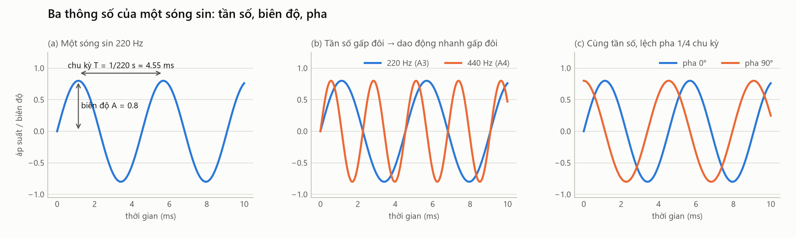

# 01. Âm thanh cơ bản — dao động, sóng, tần số, biên độ, pha

> **Đọc xong file này bạn sẽ hiểu:** âm thanh thực chất là gì; ba con số mô tả một sóng (tần số, biên độ, pha); vì sao project quan tâm tới tần số và biên độ nhưng bỏ qua pha.
> **Cần biết trước:** không cần gì.
> **Đọc tiếp:** [02 Pitch, note, octave, semitone](02_PITCH_NOTE_OCTAVE_SEMITONE.md).

---

## 1. Âm thanh là gì?

**Là gì.** Âm thanh là **sự dao động của áp suất không khí** lan truyền tới tai.

**Hình dung.** Gảy một dây đàn: dây rung qua lại rất nhanh. Mỗi lần dây đẩy ra, nó **nén** lớp không khí bên cạnh; mỗi lần dây lùi về, nó để lại một vùng không khí **giãn** (loãng hơn). Các vùng nén–giãn này nối đuôi nhau lan ra xung quanh với tốc độ khoảng **343 m/s** (trong không khí ở 20 °C), giống như gợn sóng lan trên mặt nước khi ném hòn sỏi. Khi tới tai, chúng làm màng nhĩ rung theo, và não "nghe" thấy âm thanh.

```
Dây đàn rung → nén/giãn không khí → sóng áp suất lan đi → màng nhĩ rung → não cảm nhận âm thanh
                                                      ↘ micro rung → tín hiệu điện → file âm thanh
```

**Điều quan trọng:** thứ truyền đi không phải là không khí chạy tới tai, mà là **trạng thái nén–giãn** (giống như "làn sóng" khán giả trên sân vận động: mỗi người chỉ đứng lên ngồi xuống tại chỗ, nhưng làn sóng chạy vòng quanh sân).

**Vì sao quan trọng với project.** Micro thu âm làm đúng việc của màng nhĩ: nó ghi lại **áp suất theo thời gian**. Một file âm thanh vì vậy chỉ là một **dãy số áp suất** (xem [12 Âm thanh số](12_DIGITAL_AUDIO.md)). Mọi thông tin về nhạc cụ, nốt, cách chơi… đều nằm ẩn trong dãy số đó, và việc của project là **rút chúng ra**.

---

## 2. Dao động đơn giản nhất: sóng sin

**Là gì.** Sóng sin (sine wave) là kiểu dao động "trơn" và đều đặn nhất: áp suất lên xuống theo hình đường cong hàm sin, lặp lại mãi với cùng một nhịp.

**Hình dung.** Một con lắc đung đưa nhẹ, hoặc một âm thoa (cái nĩa kim loại dùng để lên dây đàn) sau khi gõ: nó phát ra một âm "trong", rất "tinh khiết", không có màu sắc gì đặc biệt. Đó gần như là một sóng sin.

**Vì sao bắt đầu từ sóng sin?** Vì (như sẽ thấy ở file 03) **mọi âm thanh của nhạc cụ đều là tổng của nhiều sóng sin**. Hiểu một sóng sin là hiểu "viên gạch" để xây mọi âm thanh khác.

Một sóng sin được mô tả hoàn toàn bằng **ba con số**: tần số, biên độ, pha.



---

## 3. Tần số (frequency)

**Là gì.** Tần số là **số lần dao động lặp lại trong một giây**. Đơn vị là **Hertz (Hz)**: 1 Hz = 1 lần/giây.

**Hình dung.** Nếu dây đàn đi qua đi lại đúng 440 lần mỗi giây, âm thanh nó tạo ra có tần số 440 Hz.

**Chu kỳ (period).** Thời gian để dao động lặp lại một lần gọi là chu kỳ, ký hiệu `T`:

```
T = 1 / f
```
- `f`: tần số (Hz)
- `T`: chu kỳ (giây)

**Ví dụ.**
| Tần số f | Chu kỳ T = 1/f | Gặp ở đâu trong project |
|---|---|---|
| 41.20 Hz | 24.3 ms | Dây buông thấp nhất của **double bass** (E1) |
| 82.41 Hz | 12.1 ms | Dây buông thấp nhất của **guitar** (E2) |
| 220 Hz | 4.55 ms | Nốt A3 — nốt mà **cả 5 nhạc cụ** đều chơi được |
| 440 Hz | 2.27 ms | Dây A buông của **violin** và **viola** (A4, nốt chuẩn) |
| 659.26 Hz | 1.52 ms | Dây buông cao nhất của **violin** (E5) |

Trong hình trên, panel (b): sóng 440 Hz (cam) dao động **nhanh gấp đôi** sóng 220 Hz (xanh) — trong cùng 10 ms, nó lên xuống nhiều gấp đôi.

**Tai người nghe được bao nhiêu?** Khoảng **20 Hz – 20 000 Hz** (người lớn tuổi thường mất dần phần cao). Dưới 20 Hz gọi là **hạ âm** (cảm thấy rung hơn là nghe); trên 20 000 Hz là **siêu âm**.

**Tần số và cảm nhận.** Tần số càng cao, ta nghe càng **cao/thanh/bổng**; càng thấp, nghe càng **trầm**. Cảm nhận "cao–thấp" này gọi là **pitch (cao độ)** — một khái niệm gần nhưng **không giống** tần số (xem [02](02_PITCH_NOTE_OCTAVE_SEMITONE.md)).

**Vì sao quan trọng với project.**
- Mỗi nốt nhạc ứng với một tần số cụ thể (A4 = 440 Hz). Biết tần số là biết nốt.
- Mỗi nhạc cụ chỉ chơi được một **khoảng tần số** (double bass trầm, violin cao) — một manh mối để phân biệt nhạc cụ.
- Nhưng nhiều nhạc cụ **chơi chung** nhiều tần số (vùng G3–G4 cả 5 nhạc cụ đều chơi được), nên tần số **không đủ** để phân biệt. Ta còn cần âm sắc (file 03).
- **Phát hiện thực tế trong dataset:** nhiều bản thu bị lẫn tiếng ù **dưới 20 Hz** (hạ âm, tai không nghe thấy) — ví dụ 93% năng lượng của các bản thu guitar Iowa nằm dưới 20 Hz. Vì vậy project **lọc bỏ mọi thành phần dưới 25 Hz** trước khi phân tích (quyết định D27). Hiểu "tần số" giúp ta nhận ra đây là tiếng ù chứ không phải tiếng đàn: nốt thấp nhất của 5 nhạc cụ là 32.7 Hz.

---

## 4. Biên độ (amplitude) và độ to

**Là gì.** Biên độ là **độ lớn của dao động** — áp suất lệch khỏi mức bình thường nhiều hay ít. Panel (a) của hình: biên độ A = 0.8 là khoảng cách từ đường 0 tới đỉnh sóng.

**Hình dung.** Gảy dây đàn nhẹ thì dây rung với biên độ nhỏ → nghe nhỏ. Gảy mạnh thì dây văng xa hơn → biên độ lớn → nghe to. **Tần số không đổi** (vẫn cùng nốt), chỉ **biên độ** thay đổi.

**Decibel (dB).** Tai cảm nhận độ to theo **tỉ lệ** chứ không theo hiệu số: từ 1 lên 2 nghe "tăng" giống như từ 10 lên 20. Vì vậy người ta đo độ to bằng thang logarit, đơn vị **decibel**:

```
L (dB) = 20 · log10( A / A_ref )
```
- `A`: biên độ cần đo
- `A_ref`: biên độ tham chiếu (trong project thường là **biên độ lớn nhất** của chính file đó)
- `log10`: logarit cơ số 10
- hệ số `20`: quy ước cho biên độ (với công suất thì dùng 10)

**Ví dụ.**
| Tỉ lệ A / A_ref | dB | Ý nghĩa |
|---|---|---|
| 1 | 0 dB | Bằng mức tham chiếu |
| 2 | +6 dB | Gấp đôi biên độ |
| 1/2 | −6 dB | Còn một nửa |
| 1/10 | −20 dB | Còn 1/10 |
| 1/100 | −40 dB | Còn 1% — ngưỡng project dùng để xác định **"phần có âm"** của một nốt |

**Biên độ trong âm nhạc.** Nhạc công điều khiển độ to bằng **cường độ (dynamics)**: *pianissimo (pp)* rất nhỏ → *piano (p)* → *mezzo-piano (mp)* → *mezzo-forte (mf)* → *forte (f)* to → *fortissimo (ff)* rất to. Dataset ghi cường độ trong tên file (ví dụ `violin_A4_025_forte_arco-normal.mp3`).

**Vì sao quan trọng với project.**
- **Độ to của bản thu không cho biết nhạc cụ là gì**: cùng một cây violin, đặt micro gần hay xa, chỉnh mức thu to hay nhỏ, biên độ đều khác. Vì vậy project **chuẩn hóa biên độ** (đưa đỉnh về 0.95) và **không dùng độ to tuyệt đối** làm đặc trưng.
- Nhưng **cách độ to thay đổi theo thời gian** thì rất có ích: kéo vĩ giữ độ to đều, gảy thì to vụt rồi nhỏ dần (xem [04](04_HOW_STRING_INSTRUMENTS_WORK.md), [13](13_WAVEFORM.md)). Đặc trưng **RMS-CV** đo đúng điều này.
- Chơi to còn làm âm **sáng** hơn (nhiều bồi âm cao hơn) — cường độ ảnh hưởng nhẹ tới âm sắc (đo được ở [11](11_PLAYING_TECHNIQUES.md)).

---

## 5. Pha (phase)

**Là gì.** Pha cho biết sóng **đang ở điểm nào trong chu kỳ** tại thời điểm bắt đầu tính. Đo bằng độ (0°–360°) hoặc radian (0–2π).

**Hình dung.** Hai người cùng đi bộ với cùng nhịp bước (cùng tần số), nhưng một người bước chân trái trước, một người bước chân phải trước: họ lệch pha nhau nửa chu kỳ (180°). Panel (c) của hình: hai sóng cùng 220 Hz, cùng biên độ, nhưng sóng cam bắt đầu sớm hơn 1/4 chu kỳ (lệch 90°).

**Vì sao quan trọng với project — và vì sao project BỎ QUA nó.**
- Với một âm thanh đơn lẻ, **tai người gần như không nghe ra sự khác biệt về pha**: dịch toàn bộ âm thanh sớm/muộn vài mili-giây, nghe vẫn như nhau.
- Pha còn phụ thuộc **thời điểm bắt đầu ghi âm** — một thứ ngẫu nhiên, không nói gì về nhạc cụ.
- Vì vậy khi phân tích phổ (file 14), project chỉ giữ **độ lớn** của từng tần số và **bỏ pha**. Mọi đặc trưng (MFCC, centroid…) đều tính từ độ lớn.
- Pha chỉ quan trọng khi **cộng** nhiều âm với nhau (hai âm ngược pha có thể triệt tiêu nhau) — ví dụ khi project ghép các nốt thành đoạn nhạc thì dùng chuyển tiếp mềm (crossfade) để tránh tiếng "tách".

---

## 6. Công thức tổng quát của một sóng sin

```
x(t) = A · sin(2π · f · t + φ)
```
| Ký hiệu | Tên | Ý nghĩa | Ví dụ |
|---|---|---|---|
| `x(t)` | giá trị tại thời điểm t | áp suất (hoặc điện áp, hoặc số trong file) | — |
| `A` | biên độ | độ lớn dao động | 0.8 |
| `f` | tần số | số chu kỳ mỗi giây (Hz) | 220 |
| `t` | thời gian | tính bằng giây | 0.001 (1 ms) |
| `φ` (phi) | pha ban đầu | vị trí xuất phát trong chu kỳ (radian) | 0 |
| `2π` | hằng số | đổi "số chu kỳ" sang góc (1 chu kỳ = 2π radian) | — |

**Tính thử:** A = 0.8, f = 220 Hz, φ = 0, tại t = 1 ms:
```
x = 0.8 · sin(2π · 220 · 0.001) = 0.8 · sin(1.382) = 0.8 · 0.982 = 0.786
```
→ sau 1 ms, sóng đang ở gần đỉnh (đỉnh là 0.8). Đúng với panel (a): đỉnh đầu tiên ở khoảng 1.14 ms (= T/4).

---

## 7. Âm thanh thật không phải một sóng sin

Âm thanh của violin, guitar… **không** đơn giản như sóng sin: dạng sóng của chúng gồ ghề, phức tạp (xem hình nốt A3 ở [03](03_F0_HARMONICS_TIMBRE.md)). Lý do: dây đàn rung **theo nhiều kiểu cùng lúc**, mỗi kiểu là một sóng sin với tần số khác nhau. Âm ta nghe là **tổng** của tất cả. Các sóng sin thành phần đó gọi là **harmonic (bồi âm)** — chủ đề của file 03, và là chìa khóa để hiểu vì sao các nhạc cụ nghe khác nhau.

---

## 8. Tóm tắt và liên hệ với project

| Khái niệm | Một câu | Trong project dùng ở đâu |
|---|---|---|
| Âm thanh | Dao động áp suất không khí lan truyền | File âm thanh = dãy số áp suất do micro ghi |
| Tần số | Số dao động mỗi giây (Hz) | Xác định nốt (F0); phổ; lọc bỏ tiếng ù < 25 Hz |
| Chu kỳ | Thời gian một lần dao động, T = 1/f | Đo cao độ bằng cách tìm chu kỳ lặp (pYIN) |
| Biên độ | Độ lớn dao động; đo bằng dB | Chuẩn hóa đỉnh; ngưỡng "phần có âm" −40 dB; đặc trưng RMS, RMS-CV |
| Pha | Vị trí trong chu kỳ | **Bỏ qua** khi tính đặc trưng (chỉ giữ độ lớn phổ) |
| Sóng sin | Viên gạch cơ bản | Mọi âm thanh = tổng nhiều sóng sin (file 03, 14) |
