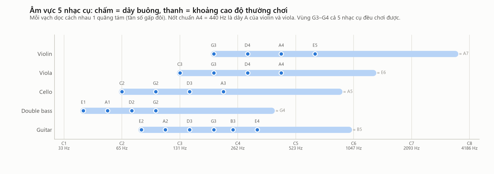

# 02. Pitch, note, octave, semitone — từ tần số tới tên nốt

> **Đọc xong file này bạn sẽ hiểu:** cao độ (pitch) khác tần số ra sao; nốt nhạc là gì; vì sao A3, A4, A5 cùng tên; nửa cung là gì; và **công thức đổi tên nốt ra tần số** (và ngược lại).
> **Cần biết trước:** [01 Âm thanh cơ bản](01_SOUND_BASICS.md) (tần số, Hz).
> **Đọc tiếp:** [03 F0, harmonic, timbre](03_F0_HARMONICS_TIMBRE.md).

---

## 1. Pitch (cao độ) — cảm nhận "cao hay thấp"

**Là gì.** Pitch là **cảm nhận của tai** về độ cao–thấp của một âm. Nó là khái niệm **tâm lý–cảm nhận**, còn tần số là đại lượng **vật lý** đo được bằng máy.

**Hình dung.** Nghe tiếng sáo và tiếng tù và: không cần máy đo, bạn vẫn biết tiếng sáo "cao" hơn. Đó là pitch. Máy đo thì nói: tiếng sáo dao động nhiều lần mỗi giây hơn — đó là tần số.

**Quan hệ với tần số.** Với âm thanh **lặp lại đều** (âm của nhạc cụ có cao độ), pitch ta nghe gần như hoàn toàn được quyết định bởi **tần số lặp lại** của dạng sóng (gọi là F0, xem [03](03_F0_HARMONICS_TIMBRE.md)). Nhưng có một điểm quan trọng:

> Tai cảm nhận cao độ theo **tỉ lệ**, không theo hiệu số.
> Từ 100 Hz lên 200 Hz nghe "cao lên một khoảng" giống hệt từ 1 000 Hz lên 2 000 Hz — dù hiệu số là 100 Hz và 1 000 Hz.

Đây là lý do âm nhạc dùng **quãng tám** và **nửa cung** (đều là tỉ lệ), và vì sao các trục tần số trong hình của project thường vẽ theo **thang log**.

**Vì sao quan trọng với project.** Nhãn trong dataset (`A4`, `C3`…) là **pitch đã đặt tên**. Khi cắt nốt Iowa, project **đo** tần số rồi đổi ra pitch để kiểm tra có đúng nốt ghi trong tên file không.

---

## 2. Octave (quãng tám) — tần số gấp đôi

**Là gì.** Hai âm cách nhau **một quãng tám** khi tần số của âm này **gấp đôi** âm kia.

**Hình dung.** Đàn ông và phụ nữ cùng hát một bài: thường giọng nữ cao hơn đúng một quãng tám, nhưng ta vẫn thấy họ "hát cùng nốt". Hai âm cách quãng tám nghe **rất giống nhau, chỉ khác độ cao** — vì vậy chúng được đặt **cùng tên**.

**Ví dụ:** họ nốt La (A):
```
A1 = 55 Hz  →  A2 = 110 Hz  →  A3 = 220 Hz  →  A4 = 440 Hz  →  A5 = 880 Hz  →  A6 = 1 760 Hz
       ×2           ×2            ×2             ×2             ×2
```
Con số sau tên nốt (1, 2, 3…) là **số thứ tự quãng tám**.

**Vì sao hai âm cách quãng tám nghe "giống nhau"?** Vì chúng **chia sẻ rất nhiều bồi âm**: các bồi âm của A4 (440, 880, 1 320…) đều nằm sẵn trong chuỗi bồi âm của A3 (220, **440**, 660, **880**, 1 100, **1 320**…). Phần này giải thích kỹ ở [03](03_F0_HARMONICS_TIMBRE.md).

**Vì sao quan trọng với project.**
- Thuật toán đo cao độ (pYIN) **hay nhầm quãng tám** (đo ra 110 Hz thay vì 220 Hz). Khi cắt nốt Iowa, project phải xử lý riêng lỗi này (chỉ chấp nhận khi lệch **đúng** 12 hoặc 24 nửa cung).
- Đặc trưng **chroma** gộp mọi quãng tám làm một (A3 = A4 = "La"). Đó là lý do project **không** dùng chroma: nó đo "nốt gì" chứ không đo "nhạc cụ gì" (xem [15](15_AUDIO_FEATURES.md)).

---

## 3. Semitone (nửa cung) — bước nhỏ nhất

**Là gì.** Âm nhạc phương Tây chia **một quãng tám thành 12 bước bằng nhau** (theo tỉ lệ). Mỗi bước gọi là **một nửa cung (semitone)**. Hai bước là một **cung (tone)**.

**Bằng nhau theo tỉ lệ nghĩa là gì?** Mỗi lần lên một nửa cung, tần số **nhân** với cùng một số `r`. Lên 12 lần thì phải ra gấp đôi (một quãng tám), nên:

```
r¹² = 2   ⇒   r = 2^(1/12) ≈ 1.059463
```
→ mỗi nửa cung, tần số tăng khoảng **5.95%**. Cách chia này gọi là **bình quân 12 (12-TET, equal temperament)** — chuẩn của piano, guitar có phím, và của toàn bộ dataset.

**Ví dụ** (từ dây A buông của violin):
```
A4  = 440.00 Hz
A♯4 = 440.00 × 1.059463 = 466.16 Hz
B4  = 466.16 × 1.059463 = 493.88 Hz
C5  = 493.88 × 1.059463 = 523.25 Hz
...  (sau 12 bước)
A5  = 880.00 Hz  (= 440 × 2)
```

**Cent — đơn vị nhỏ hơn.** 1 nửa cung = **100 cent**. Dùng để đo độ lệch nhỏ:
```
độ lệch (cent) = 1200 · log2( f_đo / f_chuẩn )
```
Ví dụ: tai người bình thường phân biệt được khoảng 5–10 cent. Vibrato của violin dao động khoảng ±20 cent (đo thật ở [11](11_PLAYING_TECHNIQUES.md)). Guitar Iowa được lên dây thấp hơn chuẩn khoảng 20–40 cent (phát hiện khi cắt nốt).

**Vì sao quan trọng với project.**
- Mỗi phím đàn guitar đúng bằng **1 nửa cung**; mỗi vị trí ngón tay trên violin cũng vậy (xem [04](04_HOW_STRING_INSTRUMENTS_WORK.md)).
- Khi cắt nốt Iowa, nốt chỉ được giữ nếu cao độ đo được lệch **≤ 0.6 nửa cung** (60 cent) so với tên nốt.
- Dataset được chia tập **theo nửa cung**: 5 nửa cung liên tiếp rơi vào đủ 3 tập (quy tắc `midi mod 5`, xem [16](16_DATASET_MODEL.md)).

---

## 4. Note (nốt) — tên gọi của một cao độ

**Là gì.** Nốt là **cái tên** con người đặt cho một cao độ, để viết nhạc và giao tiếp. Nó là **nhãn**, không phải đại lượng đo.

**12 tên trong một quãng tám.** Có 7 chữ cái gốc (hệ quốc tế):

| Chữ cái | C | D | E | F | G | A | B |
|---|---|---|---|---|---|---|---|
| Tên Việt / Ý | Đô | Rê | Mi | Fa | Sol | La | Si |

Thêm **5 nốt "đen"** ở giữa bằng dấu **thăng ♯** (cao hơn nửa cung) hoặc **giáng ♭** (thấp hơn nửa cung):

```
C   C♯/D♭   D   D♯/E♭   E   F   F♯/G♭   G   G♯/A♭   A   A♯/B♭   B   | C (quãng tám sau)
0     1     2     3     4   5     6     7     8     9    10     11   | 12
```
- **C♯ và D♭ là cùng một cao độ** (gọi là "đồng âm"). Dataset Philharmonia viết thăng bằng chữ `s` (`As4` = A♯4); Iowa viết giáng bằng `b` (`Bb4` = B♭4 = A♯4).
- Giữa **E–F** và **B–C** **không có** nốt đen: chúng vốn cách nhau sẵn nửa cung (giống bàn phím piano: chỗ đó không có phím đen).

**Số quãng tám đổi ở nốt C.** Quy ước (ký hiệu khoa học): đếm từ C. Nên `B3` → (lên nửa cung) → `C4`, chứ không phải B3 → C3. Ví dụ đúng thứ tự: … A3, A♯3, B3, **C4**, C♯4, …

**Nốt chuẩn.** Quốc tế quy ước **A4 = 440 Hz** (gọi là "La 440"). Đây là dây A của violin và viola, và là nốt dàn nhạc lấy để lên dây.

---

## 5. Công thức: tên nốt ↔ tần số

**Số MIDI.** Để tính toán, mỗi nốt được đánh **một số nguyên**, tăng 1 sau mỗi nửa cung:
```
midi = 12 × (số quãng tám + 1) + vị trí trong quãng tám (C = 0 … B = 11)
```
Ví dụ: A4 → 12 × (4 + 1) + 9 = **69**; C4 → 12 × 5 + 0 = **60**; E1 → 12 × 2 + 4 = **28**.

**Từ nốt ra tần số:**
```
f = 440 × 2^((midi − 69) / 12)
```
| Thành phần | Ý nghĩa |
|---|---|
| `440` | Tần số của nốt chuẩn A4 (Hz) |
| `midi − 69` | Nốt cần tính cách A4 bao nhiêu nửa cung (âm = thấp hơn) |
| `/ 12` | Đổi số nửa cung ra số quãng tám |
| `2^(…)` | Mỗi quãng tám nhân đôi tần số |

**Ví dụ tính:**
- C4 (midi 60): 440 × 2^(−9/12) = 440 × 0.5946 = **261.63 Hz**
- E1 (midi 28): 440 × 2^(−41/12) = **41.20 Hz** (dây buông thấp nhất của double bass)
- E5 (midi 76): 440 × 2^(7/12) = 440 × 1.4983 = **659.26 Hz** (dây E của violin)

**Từ tần số ra nốt** (dùng khi **đo** cao độ của một bản thu):
```
midi = 69 + 12 × log2( f / 440 )        → làm tròn ra số nguyên gần nhất; phần lẻ × 100 là độ lệch (cent)
```
Ví dụ: đo được 222.6 Hz → midi = 69 + 12 × log2(0.5059) = 57.20 → nốt 57 = **A3**, lệch +20 cent.

## 6. Bảng tần số một quãng tám (quãng tám 4)

| Nốt | C4 | C♯4 | D4 | D♯4 | E4 | F4 | F♯4 | G4 | G♯4 | A4 | A♯4 | B4 | C5 |
|---|---|---|---|---|---|---|---|---|---|---|---|---|---|
| MIDI | 60 | 61 | 62 | 63 | 64 | 65 | 66 | 67 | 68 | 69 | 70 | 71 | 72 |
| Hz | 261.63 | 277.18 | 293.66 | 311.13 | 329.63 | 349.23 | 369.99 | 392.00 | 415.30 | 440.00 | 466.16 | 493.88 | 523.25 |

Muốn quãng tám 3: chia đôi mọi số (A3 = 220); quãng tám 5: nhân đôi (A5 = 880).

---

## 7. Một nốt nhạc liên quan tới tần số như thế nào — tóm gọn

```
Tên nốt "A4"  ─(quy ước)→  số MIDI 69  ─(công thức)→  F0 = 440 Hz  ─(vật lý)→  dây rung 440 lần/giây
                                                                              ─(tai)→  nghe nốt "La giữa"
```
- **Nốt** là tên, **MIDI** là số thứ tự, **F0** là tần số vật lý, **pitch** là cảm nhận.
- Ngoài F0, âm thanh còn chứa nhiều tần số khác (bồi âm 880, 1 320… Hz) — nhưng ta vẫn nghe ra **một** nốt A4. Vì sao: xem [03](03_F0_HARMONICS_TIMBRE.md).

---

## 8. Áp dụng vào 5 nhạc cụ của project



| Nhạc cụ | Dây buông thấp nhất | Tần số | Dây buông cao nhất | Tần số | Khoảng thường chơi |
|---|---|---|---|---|---|
| Violin | G3 | 196.00 Hz | E5 | 659.26 Hz | G3 → khoảng A7 (3 520 Hz) |
| Viola | C3 | 130.81 Hz | A4 | 440.00 Hz | C3 → khoảng E6 (1 318.5 Hz) |
| Cello | C2 | 65.41 Hz | A3 | 220.00 Hz | C2 → khoảng A5 (880 Hz) |
| Double bass | E1 | 41.20 Hz | G2 | 98.00 Hz | E1 (C1 = 32.70 Hz nếu có phần nối dài) → khoảng G4 (392 Hz) |
| Guitar | E2 | 82.41 Hz | E4 | 329.63 Hz | E2 → khoảng B5 (987.8 Hz) |

**Nhận xét quan trọng:**
- Mỗi nhạc cụ có một "vùng" riêng: double bass thấp nhất, violin cao nhất. Âm vực là **một manh mối** để đoán nhạc cụ.
- Nhưng các vùng **chồng lấn rất nhiều**: cả 5 nhạc cụ cùng chơi được 13 nốt **G3–G4**; violin và viola chung hầu hết âm vực. Vì vậy **chỉ biết nốt thì không biết nhạc cụ**. Phải dựa vào âm sắc (file 03).
- Chi tiết từng dây và từng nốt: [05 Violin](05_VIOLIN.md), [06 Viola](06_VIOLA.md), [07 Cello](07_CELLO.md), [08 Double bass](08_DOUBLE_BASS.md), [09 Guitar](09_GUITAR.md).

## 9. Liên hệ với dataset của project
| Khái niệm | Trong dataset |
|---|---|
| Nốt | Cột `note` (`As4`, `C3`…) đọc từ tên file |
| Số MIDI | Cột `midi`, tính bằng công thức §5 |
| Quãng tám | Chữ số cuối tên nốt; quyết định cách đặt tên |
| Nửa cung | Đơn vị chia tập: `midi mod 5` (A4 = 69 → 69 mod 5 = 4 → tập QUERY_POOL) |
| Cent | Ngưỡng kiểm tra cao độ khi cắt nốt Iowa: lệch ≤ 60 cent |
