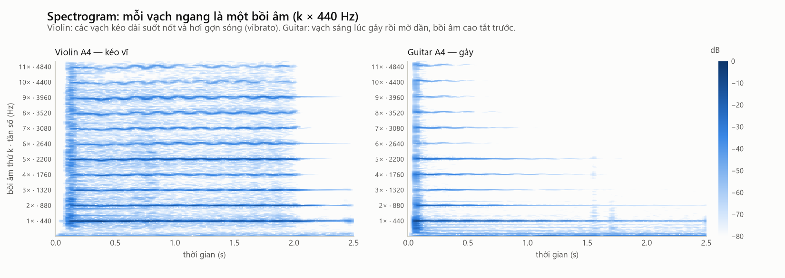

# 04. Nhạc cụ dây hoạt động thế nào

> **Đọc xong file này bạn sẽ hiểu:** một nhạc cụ dây gồm những bộ phận gì; vì sao dây dài/căng/nặng thì phát ra nốt trầm/cao; bấm dây làm đổi nốt ra sao; vì sao **cùng một nốt có thể chơi ở nhiều vị trí**; kéo vĩ và gảy khác nhau thế nào; thân đàn "tô màu" âm thanh ra sao.
> **Cần biết trước:** [01](01_SOUND_BASICS.md), [02](02_PITCH_NOTE_OCTAVE_SEMITONE.md), [03](03_F0_HARMONICS_TIMBRE.md).
> **Đọc tiếp:** từng nhạc cụ: [05 Violin](05_VIOLIN.md) · [06 Viola](06_VIOLA.md) · [07 Cello](07_CELLO.md) · [08 Double bass](08_DOUBLE_BASS.md) · [09 Guitar](09_GUITAR.md).

---

## 1. Họ nhạc cụ dây

Các nhà nghiên cứu nhạc cụ xếp nhạc cụ theo **thứ gì rung để tạo ra âm** (hệ thống Hornbostel–Sachs):

```
Nhạc cụ dây (chordophone): âm tạo ra từ DÂY rung
 └── Loại có cần đàn (lute): dây căng dọc theo cần, gắn vào thân đàn rỗng
      ├── Kéo vĩ (bowed): dùng cây vĩ kéo qua dây
      │     ├── Violin        (nhỏ nhất, cao nhất)
      │     ├── Viola
      │     ├── Cello
      │     └── Double bass   (lớn nhất, trầm nhất)
      └── Gảy (plucked): dùng ngón tay hoặc miếng gảy
            ├── Guitar
            ├── Banjo         (thân là mặt trống)
            └── Mandolin      (dây đôi)
```
- **Violin, viola, cello** cùng thuộc **họ violin**: cùng hình dáng, cùng cách lên dây (cách nhau quãng 5), chỉ khác kích thước.
- **Double bass** dùng trong dàn nhạc cùng nhóm với họ violin, nhưng có nhiều nét của **họ viol** cổ: vai đàn dốc, lên dây cách nhau quãng 4.
- **Guitar** là nhạc cụ gảy, có **phím đàn** (thanh kim loại trên cần).

**Vì sao quan trọng với project.** Hai nhánh **kéo vĩ** và **gảy** tạo ra âm thanh rất khác nhau về **đường bao thời gian** (§6). Đây là khác biệt dễ đo nhất. Còn **bên trong họ violin**, các nhạc cụ khác nhau chủ yếu về **kích thước**, nên khó phân biệt hơn nhiều.

---

## 2. Các bộ phận chung

```
  khóa lên dây ── cần đàn ──────────── bàn phím ──────── ngựa đàn ── (thân đàn)
     (pegs)        (neck)            (fingerboard)       (bridge)
       │                                                    │
       └──────────── DÂY căng giữa hai điểm này ────────────┘
```
| Bộ phận | Vai trò |
|---|---|
| **Dây (string)** | Thứ rung đầu tiên. Quyết định cao độ |
| **Khóa lên dây** | Vặn để tăng/giảm độ căng → chỉnh cao độ dây buông |
| **Bàn phím / phím đàn** | Nơi ngón tay bấm để rút ngắn phần dây rung. Họ violin **không có phím**; guitar **có phím** |
| **Ngựa đàn (bridge)** | Truyền rung động từ dây xuống thân đàn |
| **Thân đàn (body)** | Hộp gỗ rỗng: khuếch đại và "tô màu" âm thanh |
| **Lỗ thoát âm** | Hình chữ f (họ violin) hoặc lỗ tròn (guitar) |
| **Hồn đàn, thanh đỡ trầm** | (Họ violin) thanh gỗ nhỏ bên trong, truyền và phân bố rung động trong thân |

---

## 3. Vì sao một dây phát ra một nốt nhất định — định luật Mersenne

**Là gì.** Tần số cơ bản của một dây căng (F0) phụ thuộc vào ba thứ: **dây dài bao nhiêu**, **căng bao nhiêu**, và **nặng bao nhiêu**.

**Hình dung.**
- Dây **ngắn** hơn → rung **nhanh** hơn → nốt **cao** hơn (vì thế bấm ngón tay để rút ngắn dây thì nốt cao lên).
- Dây **căng** hơn → rung **nhanh** hơn → nốt **cao** hơn (vì thế vặn khóa để lên dây).
- Dây **nặng** hơn (to hơn, quấn kim loại) → rung **chậm** hơn → nốt **trầm** hơn (vì thế dây trầm luôn to nhất).

**Công thức:**
```
F0 = (1 / (2L)) × √(T / μ)
```
| Ký hiệu | Ý nghĩa | Đơn vị |
|---|---|---|
| `L` | Chiều dài **phần dây rung** (từ ngựa đàn tới điểm bấm hoặc đầu cần) | mét |
| `T` | Lực căng của dây | Newton |
| `μ` (mu) | Khối lượng mỗi mét dây | kg/m |
| `√(T/μ)` | Tốc độ sóng chạy dọc dây | m/s |
| `2L` | Quãng đường sóng chạy hết một vòng (đi và về) | mét |

**Ví dụ.** Dây A của violin: phần dây rung dài khoảng 0.328 m, phải rung ở F0 = 440 Hz. Tốc độ sóng trên dây = 2 × 0.328 × 440 ≈ 289 m/s. Giả sử dây căng T = 50 N (khoảng sức nặng của 5 kg), thì dây phải nặng μ = 50 / 289² ≈ **0.6 gam mỗi mét**: đúng cỡ một dây violin thật.

**Áp dụng cho 5 nhạc cụ.** Nhạc cụ càng trầm thì phải có **dây càng dài và càng nặng**:

| Nhạc cụ | Chiều dài dây rung (khoảng) | Dây buông thấp nhất |
|---|---|---|
| Violin | 0.33 m | G3 = 196 Hz |
| Viola | 0.37 m | C3 = 131 Hz |
| Guitar | 0.65 m | E2 = 82 Hz |
| Cello | 0.69 m | C2 = 65 Hz |
| Double bass | khoảng 1.05 m | E1 = 41 Hz |

Muốn trầm hơn mà dây không quá dài thì phải dùng dây **nặng** hơn (quấn kim loại). Đây là lý do thân và dây của cello, double bass to như vậy, và vì sao kích thước nhạc cụ gắn chặt với âm vực của nó.

---

## 4. Bấm dây = đổi chiều dài dây rung = đổi nốt

**Bản chất.** Khi đặt ngón tay ép dây xuống bàn phím, phần dây rung chỉ còn **từ ngón tay tới ngựa đàn**. L ngắn lại thì F0 tăng (công thức §3, với T và μ không đổi).

**Mỗi nửa cung ngắn đi bao nhiêu?** Để nốt cao lên 1 nửa cung (F0 × 1.0595), L phải **chia** cho 1.0595, tức ngắn đi khoảng **5.6%**. Lên một quãng tám thì L **giảm một nửa**: bấm đúng **giữa dây**.
```
L_n = L × 2^(−n/12)          (n = số nửa cung muốn tăng)
khoảng cách từ đầu cần tới vị trí bấm thứ n = L × (1 − 2^(−n/12))
```
**Ví dụ: phím đàn guitar** (dây dài 650 mm):
| Phím | Nốt tăng | Khoảng cách từ đầu cần |
|---|---|---|
| 1 | +1 nửa cung | 650 × (1 − 0.9439) = **36.5 mm** |
| 5 | +5 | **163.1 mm** |
| 7 | +7 | **216.2 mm** |
| 12 | +12 (1 quãng tám) | **325.0 mm** — đúng giữa dây |

Các phím **gần nhau dần** khi lên cao, vì mỗi bước rút ngắn 5.6% của **phần còn lại**.

**Họ violin không có phím.** Người chơi tự đặt ngón tay theo tai. Hệ quả:
- Có thể **rung ngón tay** quanh vị trí bấm → cao độ dao động nhẹ (**vibrato**).
- Có thể **trượt** liên tục giữa hai nốt (**glissando**).
- Cao độ có thể lệch nhẹ khỏi chuẩn (mấy cent).

Guitar có phím nên cao độ "đóng khung" đúng 12-TET; vibrato chỉ rất nhỏ.

---

## 5. Cùng một nốt, nhiều vị trí trên đàn

**Bản chất.** Mỗi dây buông ở một nốt khác nhau; bấm lên từ dây trầm hơn thì có thể **tới cùng một nốt** với dây cao hơn.

**Ví dụ violin — nốt A4 (440 Hz):**
```
Dây A buông                    → A4   (dây mỏng, buông: sáng, vang ngân, không vibrato được)
Dây D, bấm lên 7 nửa cung      → A4   (dây dày hơn, có ngón bấm: ấm hơn, có vibrato)
Dây G, bấm lên 14 nửa cung     → A4   (dây dày nhất, phần dây rung ngắn: tối, "đặc")
```
**Ví dụ guitar — nốt E4 (329.63 Hz):** dây 1 buông · dây 2 phím 5 · dây 3 phím 9 · dây 4 phím 14 · dây 5 phím 19.

**Vì sao cùng nốt mà khác âm sắc?** Mỗi dây có **độ dày, chất liệu, độ cứng** khác nhau, và phần dây rung dài/ngắn khác nhau → harmonic được kích thích khác nhau. Nhạc sĩ cố ý viết "chơi trên dây G" (*sul G*) để lấy âm sắc tối, dày của dây đó.

**Trong dataset của project.** Bộ Iowa **ghi rõ dây** (`sulG`, `sulE`…). Ví dụ có cả `guitar_A2_…_lowE_E2B2.wav` (nốt A2 trên dây Mi trầm, phím 5) và `guitar_A2_…_A_A2B2.wav` (nốt A2 trên dây La buông). Đây là lý do khi thu thập dữ liệu guitar, project cần **phủ đủ 6 dây** chứ không chỉ đủ số nốt ([16](16_DATASET_MODEL.md)).

---

## 6. Hai cách làm dây rung: kéo vĩ và gảy

### 6.1. Kéo vĩ (arco)
**Cách làm.** Cây vĩ là thanh gỗ căng **lông đuôi ngựa** xoa nhựa thông (rosin, cho dính). Kéo vĩ ngang qua dây.

**Chuyện gì xảy ra ("dính – trượt").** Lông vĩ **dính** vào dây và kéo dây đi theo, tới khi lực căng của dây thắng lực dính thì dây **trượt** bật về, rồi lại bị dính tiếp… Chu trình dính–trượt lặp lại **đúng F0 lần mỗi giây**. Kết quả là dây có một "góc gấp" chạy vòng qua lại (chuyển động Helmholtz), và lực truyền xuống ngựa đàn có dạng **răng cưa**.

**Âm thanh tạo ra:**
- Sóng răng cưa chứa **mọi harmonic**, với độ mạnh giảm khoảng 1/k (công thức A ở [03](03_F0_HARMONICS_TIMBRE.md) §3) → **giàu harmonic, sáng**.
- Vĩ **liên tục bơm năng lượng** → âm **giữ đều (sustain)** chừng nào còn kéo.
- Kèm **tiếng vĩ cọ dây** (nhiễu nhẹ, nhiều tần số cao).
- Người chơi đổi âm sắc bằng **tốc độ vĩ, lực ép, vị trí kéo** (gần ngựa: sáng/gắt; gần bàn phím: mềm/mờ).

### 6.2. Gảy (pluck / pizzicato)
**Cách làm.** Ngón tay (hoặc miếng gảy) kéo dây lệch sang một bên rồi **thả**.

**Chuyện gì xảy ra.** Lúc thả, dây có hình **tam giác** (đỉnh ở chỗ gảy). Hình tam giác đó tương đương một tổng các harmonic. Sau đó **không có gì bơm thêm năng lượng**, nên dây rung yếu dần.

**Âm thanh tạo ra:**
- **Bật lên rất nhanh** (vài mili-giây) rồi **tắt dần** theo kiểu hàm mũ.
- **Harmonic cao tắt trước** harmonic thấp → âm từ "sáng" lúc đầu chuyển dần sang "tròn".
- Vị trí gảy quyết định harmonic nào mạnh: gảy gần ngựa → nhiều harmonic cao (sáng, "kim loại"); gảy gần giữa dây → harmonic thấp trội (ấm).

### 6.3. So sánh bằng dữ liệu thật


Cùng nốt A4: violin kéo vĩ giữ độ to trong khoảng 0 đến −15 dB suốt hơn 2 giây (gợn lên xuống do vĩ). Guitar bật lên rồi **tụt đều**: còn −20 dB sau khoảng 1 giây, −30 dB sau 1.5 giây.



Spectrogram (cách đọc ở [14](14_FFT_STFT_SPECTRUM.md)): mỗi vạch ngang là một harmonic. Violin: các vạch **kéo dài đều** tới lúc nhấc vĩ, hơi gợn sóng (vibrato). Guitar: các vạch **sáng lúc gảy rồi mờ dần**, vạch cao (harmonic cao) **tắt trước**.

**Đo bằng đặc trưng RMS-CV** (độ dao động của năng lượng; trung vị trên toàn dataset, `reports/theory/feature_summary_by_instrument.csv`): guitar **0.88**, cao hơn hẳn nhóm kéo vĩ (violin 0.65, double bass 0.59, cello 0.55, viola 0.52). Đây là đặc trưng tách **gảy ↔ kéo vĩ** rõ nhất.

---

## 7. Thân đàn — bộ khuếch đại và "bộ lọc màu"

**Vì sao cần thân đàn?** Một sợi dây rất mảnh, rung chỉ đẩy được **rất ít** không khí: dây căng trên khung kim loại gần như không nghe thấy. Ngựa đàn truyền rung động xuống **mặt gỗ rộng** của thân đàn; mặt gỗ và khối khí bên trong mới đẩy không khí đủ mạnh để ta nghe rõ.

**Cộng hưởng (resonance).** Thân đàn **không khuếch đại đều mọi tần số**. Nó có những tần số "ưa thích" (cộng hưởng) mà nó rung rất mạnh, và những tần số nó rung yếu.
- Các vùng cộng hưởng này **cố định theo cây đàn**, không đổi khi chơi nốt khác. Vì vậy chúng in một "dấu vân tay" lên **mọi nốt** của cây đàn đó. Đây là phần rất quan trọng của âm sắc, và là thứ **MFCC** được thiết kế để bắt ([15](15_AUDIO_FEATURES.md)).
- Thân đàn **càng lớn** thì cộng hưởng ở tần số **càng thấp**.

**Ví dụ violin.** Cộng hưởng thấp nhất của violin (khối khí trong thân, thoát qua lỗ f) ở khoảng **280 Hz**. Các nốt dưới mức đó (dây G: 196–280 Hz) nhận rất ít khuếch đại ở F0, nên F0 của chúng **phát ra yếu**. Dữ liệu thật khớp đúng điều này: violin chơi A3 (220 Hz) có harmonic 1 yếu hơn harmonic 2 tới 19.4 dB ([03](03_F0_HARMONICS_TIMBRE.md) §4). Viola và cello thân lớn hơn, cộng hưởng thấp hơn, nên A3 của chúng có F0 mạnh.

**Ví dụ double bass.** Thân double bass vẫn **quá nhỏ** so với bước sóng của các nốt thấp nhất (41–60 Hz), nên các F0 đó phát ra yếu; ta nghe nốt chủ yếu nhờ các harmonic ([08](08_DOUBLE_BASS.md)).

---

## 8. Hai thứ ngoài nhạc cụ cũng làm đổi âm thanh

### 8.1. Độ to khi chơi
Kéo vĩ mạnh hơn không chỉ to hơn mà còn **kích thích nhiều harmonic cao hơn** → **sáng hơn**. Đo trên violin Philharmonia (trung vị centroid; `reports/theory/violin_technique_dynamics.csv`): *forte* và *fortissimo* ≈ **2 370 Hz**, *mezzo-piano* ≈ **1 880 Hz**. Lưu ý xu hướng không đều tuyệt đối (*pianissimo* 2 015 Hz cao hơn *mezzo-piano*), vì khi chơi rất nhỏ thì **tiếng vĩ cọ dây** chiếm phần lớn hơn (nhiễu nhiều tần số cao). Xem hình ở [11](11_PLAYING_TECHNIQUES.md).

### 8.2. Phòng thu và micro
Phòng (vang hay không vang), loại micro, khoảng cách đặt micro đều làm đổi phổ thu được. Cùng nhạc cụ, cùng cao độ, chỉ khác nơi thu:


Centroid của bản thu Iowa (phòng tiêu âm) so với Philharmonia: cello **+60%**, violin **+21.5%**, double bass **+10.5%**, guitar **+4.9%**, viola **+1.1%**. Đây là lý do project **trộn cả hai nguồn vào mọi tập dữ liệu**: để hệ thống học "đây là cello" chứ không học "đây là phòng thu Iowa" ([16](16_DATASET_MODEL.md)).

---

## 9. Tổng kết: nhạc cụ khác nhau ở đâu, đo bằng gì

| Khác biệt vật lý | Thấy ở đâu trong tín hiệu | Đặc trưng project dùng để đo |
|---|---|---|
| Kích thước → âm vực | F0 cao hay thấp | median log2 F0 |
| Kích thước thân, gỗ → cộng hưởng | Hình bao của phổ (vùng nào được khuếch đại) | MFCC (mean) |
| Dây và cách kích thích → harmonic | Phổ "sáng" hay "tối" | Spectral centroid, rolloff, bandwidth |
| Kéo vĩ hay gảy | Đường bao năng lượng: giữ đều hay tắt dần | RMS-CV, MFCC (std) |
| Tiếng vĩ, tiếng gảy | Thành phần nhiễu | ZCR |
| Vibrato, thay đổi theo thời gian | Phổ và cao độ dao động | MFCC (std) |

Bộ đặc trưng đầy đủ và lý do chọn: [15 Đặc trưng âm thanh](15_AUDIO_FEATURES.md).
