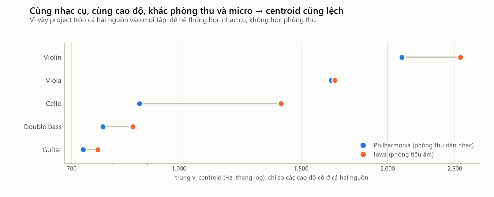

# 07. Cello (violoncello, trung hồ cầm)

> **Đọc xong file này bạn sẽ biết:** cello khác violin, viola ở đâu; 4 dây với nốt, quãng tám, tần số; vì sao trên cello mỗi nửa cung cách nhau gấp đôi violin; "nốt sói" là gì; các cách chơi và số đo của chúng; phổ, âm sắc, đặc trưng nhận dạng; vì sao phòng thu làm "độ sáng" của cello lệch tới 60%; cello trong dataset.
> **Cần biết trước:** [04](04_HOW_STRING_INSTRUMENTS_WORK.md), [05 Violin](05_VIOLIN.md).
> **Đọc tiếp:** [08 Double bass](08_DOUBLE_BASS.md).

---

## 1. Cello là gì, thuộc họ nào

```
Nhạc cụ dây → có cần đàn → kéo vĩ → HỌ VIOLIN:  violin · viola · CELLO
```
- Cello (tên đầy đủ *violoncello*) là thành viên **lớn nhất** của họ violin, giữ giọng **trầm và nam trung** trong dàn nhạc. Âm vực của cello gần với **giọng nam** người, nên âm cello thường được tả là "giống tiếng người hát".
- **Tư thế chơi:** quá to để kẹp dưới cằm. Người chơi **ngồi**, đàn đứng giữa hai đầu gối, tựa xuống sàn bằng một **cọc chống** (thanh kim loại rút ra từ đáy đàn). Vì thế kích thước cello **không bị giới hạn** bởi cánh tay như viola (so sánh [06](06_VIOLA.md) §3).

---

## 2. Cấu tạo

Cùng các bộ phận như violin ([05](05_VIOLIN.md) §2), với kích thước khác hẳn:

| | Violin | Cello | Ảnh hưởng tới âm thanh |
|---|---|---|---|
| Chiều dài thân | khoảng 35.5 cm | khoảng **75–76 cm** (gấp khoảng 2.1 lần) | Thân to → cộng hưởng ở tần số thấp |
| Hông đàn (chiều sâu thân) | khoảng 3 cm | khoảng **11–12 cm**, sâu hơn hẳn so với tỉ lệ | Khối khí bên trong lớn → cộng hưởng khí thấp (khoảng **100 Hz**) |
| Phần dây rung | khoảng 32.8 cm | khoảng **69 cm** | Dây dài → trầm ([04](04_HOW_STRING_INSTRUMENTS_WORK.md) §3) |
| Dây | mảnh | **rất dày**, quấn kim loại | Dây nặng → rung chậm → trầm |
| Cọc chống | không có | có | Truyền một phần rung động xuống sàn |

**Vì sao cello "vừa cỡ" còn viola thì không?** Cello thấp hơn viola đúng **1 quãng tám** (tần số chia 2). Thân cello dài gấp khoảng 1.8–1.9 lần viola, lại **sâu hơn nhiều**. Thể tích khí lớn làm cộng hưởng khí xuống thấp, nên cello không "thiếu cỡ" như viola. Cộng hưởng khí khoảng **100 Hz** nằm gần dây G buông (98 Hz), giúp vùng trầm của cello vang và đầy.

---

## 3. Cơ chế tạo âm

Giống violin: kéo vĩ (dính – trượt, [04](04_HOW_STRING_INSTRUMENTS_WORK.md) §6.1) → sóng răng cưa giàu harmonic → ngựa đàn → thân đàn cộng hưởng → không khí. Khác biệt:
- **Dây dài và nặng** nên rung với **biên độ lớn** (nhìn thấy được dây rung khi kéo dây C), và vĩ cần lực ép lớn hơn.
- **Thân lớn** khuếch đại vùng **thấp và giữa** (dưới khoảng 1 kHz) mạnh hơn violin, nên âm **ấm, tròn**.

### Nốt sói (wolf tone) — một hiện tượng riêng của cello
**Là gì.** Trên hầu hết cây cello có một nốt (thường khoảng **E3 – F♯3**, 165–185 Hz, tùy cây đàn) phát ra âm **rung giật, gầm gừ**, như tiếng sói tru. Vì vậy người ta gọi nó là "nốt sói".

**Bản chất.** Ở nốt đó, F0 của dây **trùng** một cộng hưởng mạnh của thân đàn. Dây và thân trao đổi năng lượng qua lại quá mạnh: thân hút năng lượng của dây rồi trả lại, lặp đi lặp lại. Kết quả là âm to lên nhỏ xuống liên tục, vĩ khó giữ dây ổn định.

**Liên hệ với project.** Nốt sói làm **đường bao năng lượng dao động** (RMS-CV tăng) và phổ không ổn định ở một vài nốt nhất định. Đây là ví dụ cho việc **đặc tính của tín hiệu phụ thuộc vào từng nốt** của từng cây đàn. Một vector đặc trưng tốt phải chịu được những bất thường cục bộ như vậy, và đó là lý do so sánh dùng **nhiều nốt** chứ không phải một nốt.

---

## 4. Bốn dây và cách lên dây chuẩn

```
Cello
 ├── Dây C (Đô, dày nhất)  → C2 → 65.41 Hz
 ├── Dây G (Sol)           → G2 → 98.00 Hz
 ├── Dây D (Rê)            → D3 → 146.83 Hz
 └── Dây A (La, mảnh nhất) → A3 → 220.00 Hz
```
- **Quãng tám:** C2, G2 thuộc quãng tám 2; D3, A3 thuộc quãng tám 3. Tất cả **dưới** C4 = 261.63 Hz.
- **Cách nhau quãng 5** (nhân 1.4983): 65.41 → 98.00 → 146.83 → 220.00 Hz.
- **Thấp hơn viola đúng 1 quãng tám** (cùng tên dây C-G-D-A, tần số bằng **một nửa**): viola C3 130.81 → cello C2 65.41; viola A4 440 → cello A3 220.
- **Thấp hơn violin 1 quãng tám + 1 quãng 5** (19 nửa cung) ở dây thấp nhất: violin G3 196 Hz, cello C2 65.41 Hz, tỉ lệ 2^(19/12) = 2.997, gần đúng **3 lần**.

---

## 5. Bấm dây: từ dây buông lên từng nửa cung

**Ví dụ trên dây C** (dây rung dài khoảng 690 mm):
```
Dây C buông ......... C2    65.41 Hz     dây rung dài 690 mm
   ↓ +1 nửa cung (ngón tay cách đầu cần 38.7 mm)
C♯2 ................ 69.30 Hz
   ↓ +2 (75.3 mm)
D2 ................. 73.42 Hz
   ↓ +3 (109.8 mm)
D♯2 ................ 77.78 Hz
   ↓ +4 (142.4 mm)
E2 ................. 82.41 Hz     ← bằng dây Mi trầm của guitar
   ↓ +5 (173.1 mm)
F2 ................. 87.31 Hz
   ↓ +6 (202.1 mm)
F♯2 ................ 92.50 Hz
   ↓ +7 (229.5 mm)
G2 ................. 98.00 Hz     ← trùng dây G buông
   ↓ … mỗi bước nhân 1.0595 …
   ↓ +12 (345 mm, giữa dây)
C3 ................. 130.81 Hz    ← gấp đôi 65.41: lên 1 quãng tám
```

**Mỗi nửa cung cách nhau khoảng 39 mm**, gấp đôi violin (18 mm), vì dây dài gấp đôi. Bàn tay cello vì thế chỉ phủ được khoảng **3–4 nửa cung** (một ngón một nửa cung), không phủ đủ 7 nửa cung giữa hai dây như violin. Người chơi cello phải **đổi thế bấm thường xuyên hơn**.

**Bảng đầy đủ** (tên nốt · tần số Hz):

| Bấm thêm | Dây C | Dây G | Dây D | Dây A |
|---|---|---|---|---|
| **dây buông (0)** | **C2 · 65.41** | **G2 · 98.00** | **D3 · 146.83** | **A3 · 220.00** |
| +1 | C♯2 · 69.30 | G♯2 · 103.83 | D♯3 · 155.56 | A♯3 · 233.08 |
| +2 | D2 · 73.42 | A2 · 110.00 | E3 · 164.81 | B3 · 246.94 |
| +3 | D♯2 · 77.78 | A♯2 · 116.54 | F3 · 174.61 | C4 · 261.63 |
| +4 | E2 · 82.41 | B2 · 123.47 | F♯3 · 185.00 | C♯4 · 277.18 |
| +5 | F2 · 87.31 | C3 · 130.81 | G3 · 196.00 | D4 · 293.66 |
| +6 | F♯2 · 92.50 | C♯3 · 138.59 | G♯3 · 207.65 | D♯4 · 311.13 |
| +7 | G2 · 98.00 | D3 · 146.83 | A3 · 220.00 | E4 · 329.63 |
| +8 | G♯2 · 103.83 | D♯3 · 155.56 | A♯3 · 233.08 | F4 · 349.23 |
| +9 | A2 · 110.00 | E3 · 164.81 | B3 · 246.94 | F♯4 · 369.99 |
| +10 | A♯2 · 116.54 | F3 · 174.61 | C4 · 261.63 | G4 · 392.00 |
| +11 | B2 · 123.47 | F♯3 · 185.00 | C♯4 · 277.18 | G♯4 · 415.30 |
| **+12 (1 quãng tám)** | **C3 · 130.81** | **G3 · 196.00** | **D4 · 293.66** | **A4 · 440.00** |

**Mỗi dây chơi được tới đâu** (bộ Iowa, có ghi dây):

| Dây | Dây buông | Nốt cao nhất trong dataset Iowa | Số nửa cung |
|---|---|---|---|
| C | C2 · 65.41 Hz | C♯4 · 277.18 Hz | 25 |
| G | G2 · 98.00 Hz | G4 · 392.00 Hz | 24 |
| D | D3 · 146.83 Hz | D♯5 · 622.25 Hz | 25 |
| A | A3 · 220.00 Hz | A5 · 880.00 Hz | 24 |

---

## 6. Một nốt trên nhiều dây

- **A3 = 220 Hz** có 4 cách: dây A buông · dây D +7 · dây G +14 · dây C +21.
- **Chỉ có trên dây C:** 7 nốt **C2 → F♯2** (65.41 → 92.50 Hz).
- Dây A của cello là dây "hát": sáng và căng khi lên cao. Dây C trầm, dày, rất vang. Cùng một nốt chơi trên dây C (bấm cao) nghe **tối và căng** hơn trên dây A buông.

---

## 7. Âm vực

- **Thấp nhất: C2 = 65.41 Hz.**
- **Cao nhất:** nhạc giao hưởng thường viết tới khoảng **A5 = 880 Hz**; nghệ sĩ giỏi chơi cao hơn nữa.
- **Trong dataset:** Philharmonia **C2 → C6** (65.41 → 1 046.50 Hz, 49 cao độ); Iowa **C2 → A5** (46 cao độ).
- **Chồng lấn:** C2 → G4 chung với double bass; E2 → C6 chung với guitar; C3 → C6 chung với viola; G3 → C6 chung với violin. Cello là nhạc cụ **chồng lấn với cả 4 nhạc cụ còn lại**.

---

## 8. Các cách chơi

| Kỹ thuật (tên trong dataset) · số nốt | Người chơi làm gì | Âm thanh đổi ra sao | Đo được (so cặp cùng nốt, cùng độ dài) |
|---|---|---|---|
| Arco thường · 743 | Kéo vĩ, thường kèm vibrato | Mốc so sánh | — |
| Không vibrato · 17 | Ngón tay đứng yên | Âm phẳng, đứng | centroid ×1.22 (xem ghi chú) |
| Vibrato mạnh · 8 | Rung ngón tay mạnh | Cao độ dao động | centroid ×1.20 |
| Col legno battuto · 18 | Gõ dây bằng gỗ vĩ | Tiếng gõ ngắn, nhiều nhiễu | centroid ×1.16 · flatness **×7.0** |
| Láy trưởng (`arco-major-trill`) · 13 | Đổi nhanh giữa 2 nốt cách 2 nửa cung | Cao độ nhảy liên tục, nhiễu chuyển nốt | centroid ×1.22 · flatness ×3.5 |
| Láy thứ (`arco-minor-trill`) · 10 | Như trên, cách 1 nửa cung | Như trên | centroid ×1.25 · flatness ×2.8 |
| Harmonic (`arco-harmonic`) · 16 | Chạm nhẹ vào điểm nút | Âm trong, gần sóng sin, cao | centroid ×0.92 |

**Ghi chú trung thực.** Hầu như **mọi** kỹ thuật đặc biệt của cello đều sáng hơn arco thường khoảng 20%, **kể cả "không vibrato"**. Ở violin, không vibrato lại tối hơn 5% ([05](05_VIOLIN.md) §8). Vật lý không giải thích được vì sao bỏ vibrato làm âm sáng hơn 22%. Khả năng cao là các nốt kỹ thuật đặc biệt được thu ở **một buổi thu khác** (micro hoặc vị trí khác). Đây là ví dụ về việc **khác biệt do điều kiện thu lẫn vào khác biệt do kỹ thuật**. Ta không thể tách hai thứ này nếu chỉ nhìn số đo.

Pizzicato rất phổ biến ở cello nhưng không có trong bộ nốt đơn Philharmonia (chỉ có trong 2 đoạn phrase). Cơ chế và hiệu ứng giống pizzicato của violin: bật rồi tắt dần.

**Cường độ:** nốt to sáng hơn nốt nhỏ cùng cao độ, cùng độ dài: centroid ×1.14 (Philharmonia, 337 cặp), ×1.10 (Iowa, 95 cặp).

---

## 9. Âm sắc và phổ của cello

**Mô tả bằng lời:** ấm, tròn, đầy, "giống giọng người"; vùng trầm sâu và vang; vùng cao (dây A) căng và "hát".

**Ví dụ nốt A3 (220 Hz) — dây A buông** (`cello_A3_025_forte_arco-normal`):
```
h1 (220 Hz)    0.0 dB   ← F0 mạnh nhất
h2 (440 Hz)   −9.1 dB
h3 (660 Hz)  −46.6 dB   ← gần như biến mất
h4 (880 Hz)  −29.7 dB
h5 (1100 Hz) −32.5 dB
h6 (1320 Hz) −39.3 dB
```
Gần như chỉ còn h1 và h2: âm **tròn, tối**. A3 là dây buông cao nhất của cello, nằm giữa âm vực, nơi thân đàn khuếch đại F0 tốt. *(Đây là một bản thu nốt ngắn 0.25 s; h3 yếu bất thường có thể do vị trí kéo vĩ. Đừng coi một bản thu là đại diện cho cả nhạc cụ, xem [03](03_F0_HARMONICS_TIMBRE.md) §4.)*

**Phổ theo quãng tám** (trung vị trên 1 047 nốt cello dùng được):

| Quãng tám | 2 (65–123 Hz) | 3 (131–247 Hz) | 4 (262–494 Hz) | 5 (523–988 Hz) | 6 (≥ 1 047 Hz) |
|---|---|---|---|---|---|
| Centroid | 620 Hz | 921 Hz | 1 341 Hz | 1 879 Hz | 2 356 Hz (15 nốt) |
| Centroid ÷ F0 | **7.0** | 4.9 | 3.7 | 2.6 | 2.3 |

Ở quãng tám 2, centroid gấp **7 lần** F0: năng lượng dồn lên các harmonic cao, vì F0 của các nốt rất thấp (65–123 Hz) được thân đàn khuếch đại kém hơn các harmonic của chúng.

**Đặc trưng toàn bộ** (trung vị, 1 047 nốt): centroid **1 172 Hz** · rolloff 1 954 Hz · ZCR 0.050 · RMS-CV 0.55.

### 9.1. Phòng thu làm cello "đổi giọng" tới 60%



| Cello, arco thường | Philharmonia (734 nốt) | Iowa (288 nốt) | Chênh lệch |
|---|---|---|---|
| Centroid trung vị | 951 Hz | 1 404 Hz | Iowa sáng hơn 48%; so riêng các cao độ hai nguồn cùng có: **+60.1%** |
| ZCR trung vị | 0.036 | 0.086 | gấp 2.4 lần |

Mức chênh này **lớn hơn khoảng cách giữa cello và viola** (centroid trung vị 1 172 so với 1 712 Hz, cách 46%). Nói cách khác, chỉ nhìn độ sáng thì một nốt cello thu ở Iowa trông **giống viola thu ở Philharmonia hơn là giống cello thu ở Philharmonia**.

Nguyên nhân là hai nơi thu khác nhau về micro, khoảng cách đặt micro và phòng. Iowa thu trong **phòng tiêu âm** (không có tiếng vang). Hai bộ dữ liệu không công bố đủ thông tin để biết chính xác yếu tố nào gây ra phần lớn chênh lệch.

**Hệ quả cho project:**
1. Mọi tập dữ liệu (REF, DB_POOL, QUERY_POOL) đều **trộn cả hai nguồn**. Có test tự động kiểm tra điều này (`test_selected_uses_both_sources`). Nhờ vậy hệ thống không thể "nhận nhạc cụ bằng phòng thu".
2. Các đặc trưng **ít bị phòng thu ảnh hưởng** được ưu tiên ([15](15_AUDIO_FEATURES.md) đo mức ảnh hưởng của từng đặc trưng).

---

## 10. Đặc trưng nào giúp nhận ra cello

| Manh mối | Đặc trưng | Mạnh / yếu |
|---|---|---|
| Vùng âm giữa – trầm (65 → 1 047 Hz) | median log2 F0 | Thu hẹp còn cello, double bass, guitar, viola; không đủ để chọn một |
| Tối hơn viola, violin; sáng hơn double bass | centroid, rolloff | **Bị phòng thu ảnh hưởng mạnh** (§9.1) |
| Kéo vĩ: âm giữ đều | RMS-CV, MFCC std | Tách khỏi guitar (cùng vùng E2 → A5) |
| Hình dạng cộng hưởng thân lớn (đầy ở vùng dưới 1 kHz) | **MFCC mean** | Manh mối chính để tách khỏi double bass và viola |

**Cặp dễ nhầm:**
- **Cello ↔ double bass** (chung C2 → G4, cùng kéo vĩ). Ở cùng nốt, centroid lúc cao lúc thấp hơn nhau: G3 951 vs 861 Hz, A3 1 042 vs 1 217 Hz, C4 1 199 vs 983 Hz ([03](03_F0_HARMONICS_TIMBRE.md) §6). Không có quy luật đơn giản "cello luôn sáng hơn".
- **Cello ↔ viola** (chung C3 → C6), càng khó khi bản thu cello bị "sáng lên" do phòng thu.
- **Cello ↔ guitar** (chung E2 → C6): dễ tách hơn nhờ **đường bao** (kéo vĩ giữ đều, gảy tắt dần).

---

## 11. Cello trong dataset của project

| | Philharmonia | Iowa MIS |
|---|---|---|
| File gốc | 889 file = **825 nốt đơn** + 64 đoạn phrase | 41 file aiff (mỗi file một dãy nốt trên một dây) |
| Sau khi xử lý | 8 nốt quá ngắn; 56 nốt kỹ thuật khác arco (để riêng); **2 file trùng với file của nhạc cụ khác** (§11.1) | Cắt được **291 nốt** (dự kiến 309), 3 nốt quá ngắn |
| Nốt dùng được | **759** (arco thường 734, không vibrato 17, vibrato mạnh 8) · C2 → C6 | **288** · C2 → A5 · dây C 74, G 73, D 70, A 71 |

**Tổng: 1 047 nốt cello dùng được**; project chọn 410 (REF 150, DB_POOL 200, QUERY_POOL 60).

### 11.1. Hai file cello trùng với file của nhạc cụ khác
Kiểm tra MD5 tìm ra hai cặp file **giống hệt từng byte**, cả hai cặp đều dính tới cello:

| File cello | Trùng với | Nhãn khác nhau ở |
|---|---|---|
| `cello_Ds5_05_forte_arco-normal.mp3` | `viola_G6_05_fortissimo_arco-normal.mp3` | Nhạc cụ, nốt (D♯5 so với G6), cường độ |
| `cello_Cs6_1_mezzo-forte_arco-harmonic.mp3` | `violin_Ds5_phrase_forte_arco-spiccato.mp3` (một đoạn phrase) | Nhạc cụ, nốt, kỹ thuật, và cả loại file (nốt đơn so với đoạn nhiều nốt) |

Trong mỗi cặp, ít nhất một nhãn chắc chắn sai. Project không đoán, mà loại **cả bốn file** (status DUPLICATE, [06](06_VIOLA.md) §11.1).
