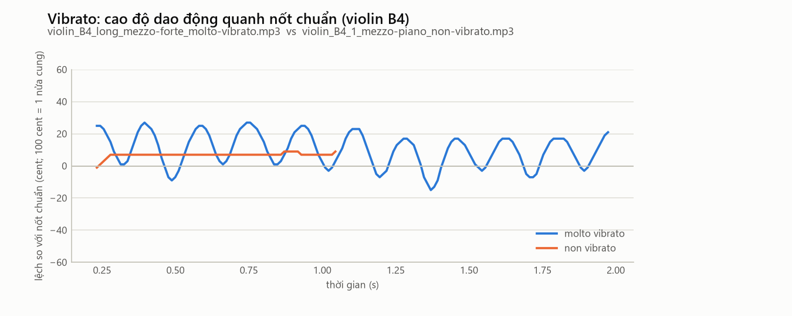
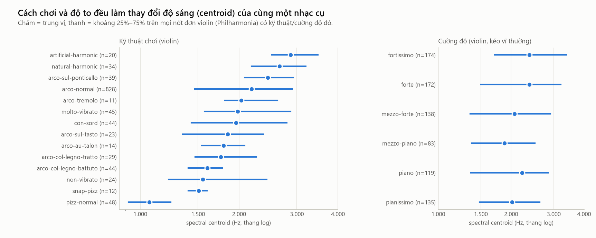

# 11. Cách chơi (kỹ thuật) — mỗi kỹ thuật làm âm thanh thay đổi ra sao

> **Đọc xong file này bạn sẽ biết:** kỹ thuật chơi là gì; các kỹ thuật được chia thành nhóm theo **khâu nào** của quá trình tạo âm mà chúng thay đổi; mỗi nhóm làm đặc trưng âm thanh đổi bao nhiêu (đo trên dataset); vì sao phải thu thập một nhạc cụ ở nhiều cách chơi; và vì sao CSDL của project vẫn chỉ giữ cách chơi arco.
> **Cần biết trước:** [04](04_HOW_STRING_INSTRUMENTS_WORK.md) (chuỗi tạo âm), [05 Violin](05_VIOLIN.md) §8 (bảng kỹ thuật violin).
> **Đọc tiếp:** [12 Âm thanh số](12_DIGITAL_AUDIO.md).

---

## 1. Kỹ thuật chơi là gì, vì sao quan trọng

**Là gì.** Kỹ thuật chơi (playing technique) là **cách** người chơi làm cho dây phát ra âm: kéo vĩ hay gảy, kéo ở đâu, kéo mạnh hay nhẹ, tay trái có rung không, có chạm nhẹ thay vì ấn không…

**Bản chất.** Cùng một nhạc cụ, cùng một nốt (cùng F0), nhưng đổi kỹ thuật thì **công thức harmonic, đường bao và lượng nhiễu** đều đổi. Nói cách khác, kỹ thuật đổi **âm sắc** ([03](03_F0_HARMONICS_TIMBRE.md) §4). Có kỹ thuật đổi ít (bỏ vibrato), có kỹ thuật đổi rất mạnh (gảy thay vì kéo vĩ).

**Vì sao quan trọng với project.** Hệ thống phải nhận ra "đây là violin" dù người chơi dùng kỹ thuật nào. Muốn vậy, ta phải biết **kỹ thuật làm đặc trưng dịch đi bao xa** so với khoảng cách giữa các nhạc cụ. Nếu một kỹ thuật làm violin "trông giống viola" hơn là giống chính violin chơi thường, thì đó là nguồn nhầm lẫn cần tính đến.

---

## 2. Bản đồ: kỹ thuật thay đổi khâu nào của chuỗi tạo âm

Chuỗi tạo âm của nhạc cụ dây ([04](04_HOW_STRING_INSTRUMENTS_WORK.md)): **kích thích dây → dây rung → ngựa đàn → thân đàn → không khí**. Mỗi nhóm kỹ thuật can thiệp vào một khâu:

```
KHÂU 1: Kích thích dây bằng gì?     → kéo vĩ (arco) · gảy (pizzicato) · gõ bằng gỗ vĩ (col legno battuto) · snap pizz
KHÂU 2: Kích thích ở ĐÂU trên dây?  → sát ngựa (sul ponticello) · bình thường · trên bàn phím (sul tasto) · vị trí gảy guitar
KHÂU 3: Kích thích MẠNH thế nào?    → cường độ pp … ff · phần vĩ (au talon = gốc vĩ, punta d'arco = đầu vĩ)
KHÂU 4: Tay trái làm gì với dây?    → vibrato / không vibrato · láy (trill) · vuốt (glissando) · harmonic (chạm nhẹ)
KHÂU 5: Thay đổi ngựa đàn / thân?   → con sordino (kẹp cái tắt tiếng lên ngựa đàn)
KHÂU 6: Nối các nốt ra sao?          → legato, staccato, spiccato, détaché, martelé… (chỉ có trong đoạn phrase)
```

---

## 3. Từng nhóm: vật lý và số đo

**Cách đo** (giống [05](05_VIOLIN.md) §8): so mỗi nốt dùng kỹ thuật X với nốt **arco thường cùng nhạc cụ, cùng cao độ, cùng độ dài nốt** (Philharmonia), rồi lấy trung vị. `×1.28` = cao hơn 28%; `+0.59` = cộng thêm vào RMS-CV.

### 3.1. Khâu 1 — đổi cách kích thích dây: thay đổi **mạnh nhất**

| Kỹ thuật | Vật lý | Violin: đo được |
|---|---|---|
| **Pizzicato** (gảy) | Không còn vĩ bơm năng lượng → bật rồi tắt dần; dây hình tam giác → harmonic tụt nhanh (1/k²) | centroid **×0.68** · RMS-CV **+0.59** · ZCR ×0.66 |
| **Col legno battuto** (gõ bằng gỗ vĩ) | Cú gõ ngắn: kích thích cả dải tần như tiếng gõ, cao độ yếu | flatness **×3.1** · RMS-CV +0.30 |
| **Snap pizz** (dây đập bàn phím) | Thêm tiếng "tách" cơ học: nhiễu thuần | flatness **×15.7** · RMS-CV +0.61 |
| **Col legno tratto** (kéo bằng gỗ vĩ) | Gỗ trơn, "dính" kém → dao động dính – trượt không đều, nhiều tiếng xì | flatness ×1.9 |

**Đổi cơ chế kích thích thì đổi mọi thứ cùng lúc:** đường bao (RMS-CV), lượng nhiễu (flatness) và độ sáng (centroid). Với cello, col legno battuto còn làm flatness tăng **×7.0**.

### 3.2. Khâu 2 — đổi vị trí kích thích: đổi **độ sáng**
| Kỹ thuật | Vật lý | Violin: đo được |
|---|---|---|
| **Sul ponticello** (sát ngựa) | Kích thích gần đầu dây → harmonic cao được kích thích mạnh (cùng nguyên lý với vị trí gảy guitar, [09](09_GUITAR.md) §3) | centroid **×1.28** · ZCR ×1.79 · flatness ×2.4 |
| **Sul tasto** (trên bàn phím) | Kích thích xa đầu dây → harmonic cao yếu | centroid **×0.89** · ZCR ×0.82 |

### 3.3. Khâu 3 — đổi lực kích thích: cường độ
Kéo vĩ hoặc gảy **mạnh hơn** → "góc gấp" trên dây sắc hơn → nhiều harmonic cao hơn → **sáng hơn**. So nốt to (*forte*, *fortissimo*) với nốt nhỏ (*piano*, *pianissimo*) cùng cao độ, cùng độ dài:

| Nhạc cụ | Philharmonia | Iowa |
|---|---|---|
| Violin | centroid ×1.18 (286 cặp) | ×1.15 (74 cặp) |
| Viola | ×1.10 (256) | ×1.02 (84) |
| Cello | ×1.14 (337) | ×1.10 (95) |
| Double bass | ×1.10 (264) | ×1.06 (97) |
| Guitar | ×1.14 (33) | ×0.78 (116): **ngược**, do tiếng ồn nền ([09](09_GUITAR.md) §8.1) |

Cường độ đổi độ sáng khoảng **10–18%**: ít hơn khâu 1, 2 nhưng **luôn có mặt**, vì mọi bản thu đều có một cường độ nào đó. Đó là lý do dataset cần **nhiều cường độ** cho mỗi nốt.

**Phần vĩ dùng để kéo.** *Au talon* (gốc vĩ, gần tay cầm, nặng): đầu nốt nhấn mạnh, RMS-CV +0.28, flatness ×3.4 (violin). *Punta d'arco* (đầu vĩ, nhẹ): âm mỏng, nhẹ (chỉ có trong phrase).

### 3.4. Khâu 4 — tay trái: đổi **cao độ theo thời gian** hoặc đổi **harmonic**
| Kỹ thuật | Vật lý | Đo được |
|---|---|---|
| **Vibrato** | Ngón tay lắc → cao độ dao động khoảng 5–7 lần/giây | Violin *molto vibrato*: độ lệch chuẩn cao độ **12.4 cent**, so với 2.8 cent khi không vibrato ([05](05_VIOLIN.md) §8.1). Centroid chỉ đổi khoảng 5–12% (violin, viola) |
| **Láy** (trill) | Đổi rất nhanh giữa 2 nốt | Cello: centroid ×1.22–1.25, flatness ×2.8–3.5 |
| **Vuốt** (glissando) | Trượt ngón tay → F0 trượt liên tục | F0 không còn là một số |
| **Harmonic** (chạm nhẹ vào nút) | Chỉ còn các harmonic có nút tại điểm chạm → nốt cao, ít harmonic | Violin: centroid **×0.79** (tự nhiên), ×0.91 (nhân tạo); cello ×0.92; guitar ×0.98 |



### 3.5. Khâu 5 — con sordino (tắt tiếng)
Kẹp một vật nặng lên ngựa đàn → ngựa rung khó hơn ở tần số cao → âm **nhỏ và "che"**. Số đo trên violin: centroid ×1.05, không thấy tối đi như lý thuyết dự đoán. Cái tắt tiếng chủ yếu đổi **hình dạng** phổ (làm yếu vùng 2–4 kHz), điều mà một con số centroid khó thấy. MFCC mô tả được thay đổi này ([15](15_AUDIO_FEATURES.md)).

### 3.6. Khâu 6 — cách nối nốt (chỉ có trong đoạn phrase)
| Tên | Nghĩa | Âm thanh |
|---|---|---|
| *Legato* | Nối liền các nốt, không ngắt | Không có khoảng lặng giữa nốt → **khó tách nốt** ([17](17_ONSET_SEGMENTATION.md)) |
| *Détaché* | Mỗi nốt một chiều kéo vĩ, rõ ràng | Đầu nốt rõ |
| *Staccato* | Nốt ngắn, ngắt | Nhiều khoảng lặng, nốt ngắn |
| *Spiccato* | Vĩ nảy trên dây | Nốt rất ngắn, có tiếng "nảy" |
| *Martelé* | Nốt nhấn mạnh như "đóng búa", ngắt rõ | Đầu nốt rất mạnh |
| *Tenuto*, *portato* | Giữ đủ trường độ / hơi tách | Trung gian |

Các đoạn phrase là **nhạc thật** gồm nhiều nốt liên tiếp. Project dùng chúng làm **truy vấn thực tế**, không đưa vào CSDL.



---

## 4. Kỹ thuật nào có trong dataset

Số **nốt đơn** Philharmonia theo kỹ thuật (Iowa chỉ có arco thường cho bộ kéo vĩ và gảy thường cho guitar):

| Nhạc cụ | Arco (giữ trong CSDL) | Kỹ thuật khác (để riêng ở `data/excluded/technique/`) |
|---|---|---|
| Violin | arco thường 850 · vibrato mạnh 45 · không vibrato 25 | pizz 49 · con sordino 44 · col legno battuto 44 · ponticello 39 · harmonic tự nhiên 34 · col legno tratto 29 · sul tasto 23 · harmonic nhân tạo 20 · au talon 14 · snap pizz 12 · tremolo 11 · pizz glissando 8 · khác 2 |
| Viola | arco thường 708 · vibrato mạnh 21 · không vibrato 21 | pizz 39 · harmonic nhân tạo 30 · láy thứ 21 · glissando 20 · láy trưởng 20 · harmonic tự nhiên 20 · snap pizz 11 · pizz glissando 8 |
| Cello | arco thường 743 · không vibrato 17 · vibrato mạnh 8 | col legno battuto 18 · harmonic 16 · láy trưởng 13 · láy thứ 10 |
| Double bass | arco thường 756 | pizz 12 · col legno battuto 10 |
| Guitar | **gảy thường 71 · harmonic 35** (guitar giữ cả hai, đều là gảy) | — |

Ngoài ra còn 445 **đoạn phrase** (violin 252, double bass 74, cello 64, viola 55) với các cách nối nốt ở §3.6.

---

## 5. Vì sao phải thu một nhạc cụ ở nhiều cách chơi — và vì sao CSDL chỉ giữ arco

**Vì sao phải thu nhiều cách chơi** (yêu cầu của CLAUDE.md):
1. **Để đo được "một nhạc cụ thay đổi bao nhiêu".** Không có dữ liệu nhiều kỹ thuật thì không thể biết pizzicato làm violin tối đi 32%, hay ponticello làm sáng lên 28%. Các con số ở §3 chỉ có được vì dataset có các kỹ thuật đó.
2. **Để biết đâu là "dấu vân tay" thật của nhạc cụ.** Thứ **không đổi** qua mọi kỹ thuật là thân đàn (cộng hưởng cố định). Thứ **đổi** theo kỹ thuật là đường bao, nhiễu, độ sáng. Hiểu điều này giúp chọn đặc trưng: MFCC mean (hình bao phổ, chứa cộng hưởng thân đàn) là đặc trưng quan trọng ([15](15_AUDIO_FEATURES.md)).
3. **Để kiểm tra độ bền của hệ thống.** Người dùng thật có thể gửi bất kỳ kỹ thuật nào.

**Vì sao CSDL vẫn chỉ giữ arco (quyết định D20):**
- **Mất cân bằng:** mỗi kỹ thuật khác arco chỉ có 8–49 nốt, so với 700–850 nốt arco. Trộn vào thì chúng thành những "đảo" nhỏ rải rác, không đủ nốt để đại diện.
- **Phân tán:** khâu 1 (gảy, gõ) làm âm đổi **mạnh hơn khoảng cách giữa các nhạc cụ kéo vĩ**. Ví dụ, violin pizzicato tối đi 32% (×0.68), trong khi violin và viola ở cùng nốt chỉ cách nhau 3–16%. Trộn vào thì "tiếng violin" bị kéo về phía guitar (cũng là gảy).
- **Phạm vi đề tài:** "tiếng nhạc cụ" được hiểu là âm **đặc trưng, phổ biến nhất** của nhạc cụ đó: kéo vĩ với bộ kéo vĩ, gảy với guitar.

**Cái giá phải trả** (ghi vào báo cáo như một giới hạn): truy vấn bằng violin pizzicato, double bass gảy (jazz)… có thể bị nhận nhầm sang guitar. Các nốt kỹ thuật khác **không bị xóa**: chúng nằm ở `data/excluded/technique/` và có thể dùng làm **truy vấn khó** khi đánh giá ở Phần 2 (chưa quyết định).

---

## 6. Liên hệ với dataset và đặc trưng

| Tầng trong mô hình dữ liệu ([16](16_DATASET_MODEL.md)) | Ví dụ |
|---|---|
| **Metadata** `technique` (đọc từ tên file) | `arco-normal`, `pizz-normal`, `molto-vibrato` |
| **Metadata** `technique_family` (project gom nhóm) | `arco`, `pizz`, `special` (bộ kéo vĩ); `pluck`, `harmonic` (guitar, banjo, mandolin) |
| **Đặc tính tín hiệu** bị kỹ thuật thay đổi | Đường bao, công thức harmonic, lượng nhiễu, cao độ theo thời gian |
| **Đặc trưng** nhạy với kỹ thuật | RMS-CV (đường bao), flatness (nhiễu), centroid/rolloff (độ sáng), MFCC std (biến đổi theo thời gian) |
