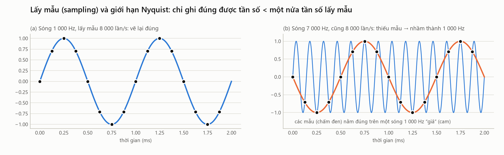

# 12. Âm thanh số — lấy mẫu, lượng tử hóa, và một file âm thanh chứa gì

> **Đọc xong file này bạn sẽ biết:** âm thanh (sóng áp suất liên tục) được biến thành dãy con số ra sao; tần số lấy mẫu và giới hạn Nyquist là gì; vì sao project dùng 22 050 Hz mà không mất thông tin quan trọng; độ sâu bit, kênh, định dạng nén; **một file âm thanh chứa những thông tin gì, và không chứa gì**; chuỗi tiền xử lý của project.
> **Cần biết trước:** [01](01_SOUND_BASICS.md) (sóng, tần số, biên độ).
> **Đọc tiếp:** [13 Dạng sóng](13_WAVEFORM.md).

---

## 1. Từ sóng âm tới con số

```
Dây đàn rung → không khí dao động (áp suất lên xuống liên tục)
   → MICRO: màng micro rung theo, biến áp suất thành ĐIỆN ÁP (vẫn liên tục)
   → BỘ CHUYỂN ĐỔI ADC: cứ mỗi khoảng thời gian rất ngắn, ĐO điện áp một lần, ghi thành MỘT CON SỐ
   → dãy con số = âm thanh số, lưu vào file
```
Máy tính không lưu được một đường cong liên tục, chỉ lưu được **các con số rời rạc**. Âm thanh số là kết quả của hai phép "chặt nhỏ":
- **Chặt theo thời gian** = **lấy mẫu** (sampling, §2).
- **Chặt theo độ lớn** = **lượng tử hóa** (quantization, §4).

---

## 2. Lấy mẫu (sampling) và tần số lấy mẫu

**Là gì.** Lấy mẫu là đo giá trị của tín hiệu tại các thời điểm cách đều nhau. Mỗi giá trị đo được gọi là một **mẫu** (sample).

**Tần số lấy mẫu** (sample rate, ký hiệu `sr`) = số mẫu trong một giây, đơn vị Hz.
```
sr = 44 100 Hz  →  mỗi giây có 44 100 con số
                →  hai mẫu liên tiếp cách nhau 1 / 44 100 s ≈ 0.0227 ms
```

**Ví dụ.** Dây A violin rung 440 lần/giây. Mỗi chu kỳ dài 1/440 s ≈ 2.27 ms, và với sr = 44 100 Hz, mỗi chu kỳ được ghi bằng 44 100 / 440 ≈ **100 mẫu**. Đủ để vẽ lại hình dạng sóng rất chi tiết.

**Công thức vị trí mẫu thứ n:**
```
x[n] = x(n / sr)           n = 0, 1, 2, …
```
| Ký hiệu | Ý nghĩa |
|---|---|
| `x(t)` | Tín hiệu liên tục (áp suất hoặc điện áp tại thời điểm t giây) |
| `x[n]` | Mẫu thứ n (một con số) |
| `n / sr` | Thời điểm lấy mẫu thứ n (giây) |

---

## 3. Giới hạn Nyquist — lấy mẫu thưa quá thì sai tần số

**Định lý (Nyquist – Shannon).** Lấy mẫu với tần số `sr` thì chỉ ghi đúng được các thành phần có tần số **nhỏ hơn sr / 2**. Mức `sr / 2` gọi là **tần số Nyquist**.

**Hình dung.** Muốn biết một sóng lên xuống bao nhiêu lần, mỗi chu kỳ phải có **ít nhất 2 mẫu** (một lúc lên, một lúc xuống). Ít hơn thế, các mẫu "nhìn" giống một sóng **chậm hơn**.



**Ví dụ (hình, mô phỏng):** lấy mẫu 8 000 lần/s, Nyquist = 4 000 Hz.
- (a) Sóng 1 000 Hz < 4 000 Hz: các mẫu vẽ lại đúng sóng.
- (b) Sóng 7 000 Hz > 4 000 Hz: các mẫu (chấm đen) nằm đúng trên một sóng **1 000 Hz "giả"** (đường cam). Máy tính không thể biết sóng thật là 7 000 Hz.

Hiện tượng này gọi là **aliasing** (chồng phổ): tần số trên Nyquist "gập" xuống thành một tần số giả:
```
f_giả = | f − sr × round(f / sr) |        ví dụ: | 7 000 − 8 000 × 1 | = 1 000 Hz
```

**Hệ quả:**
- Tai người nghe tới khoảng 20 000 Hz, nên đĩa CD chọn **sr = 44 100 Hz** (Nyquist 22 050 Hz). Cả Philharmonia và Iowa đều thu ở 44 100 Hz.
- Trước khi **hạ** tần số lấy mẫu (resample), phải **lọc bỏ** mọi thành phần trên Nyquist mới. Thư viện librosa tự làm việc này, nên không xảy ra aliasing.

### Vì sao project dùng 22 050 Hz?
Project đổi mọi file về **sr = 22 050 Hz** (Nyquist **11 025 Hz**), bỏ đi mọi thứ trên 11 025 Hz. Có mất gì quan trọng không?

| Kiểm tra | Kết quả |
|---|---|
| F0 cao nhất của 5 nhạc cụ trong dataset | B7 = 3 951 Hz (violin), **dưới** Nyquist → F0 luôn được giữ |
| Năng lượng trên 11 025 Hz, đo trên 40 nốt ngẫu nhiên mỗi (nhạc cụ, nguồn), ở 44 100 Hz gốc | Trung vị chỉ **0.000–0.026%** tổng năng lượng; vài file cá biệt cao hơn (tối đa 27% ở một nốt viola Iowa) |
| Đặc trưng dùng tới vùng nào | Ngay cả với violin ở quãng tám cao nhất: centroid trung vị khoảng 3.3 kHz, rolloff 85% khoảng 5.6 kHz → nằm gọn dưới 11 kHz |

**Kết luận:** gần như toàn bộ năng lượng và thông tin âm sắc nằm dưới 11 kHz. Đổi lại, xử lý **nhanh gấp 2 lần** (ít mẫu hơn một nửa). Điều quan trọng nhất là **mọi file (CSDL và truy vấn) dùng cùng một sr**, vì gần như mọi đặc trưng đổi giá trị khi sr đổi ([15](15_AUDIO_FEATURES.md)).

**Áp dụng cho 5 nhạc cụ** (ở sr = 22 050 Hz):

| Nhạc cụ | F0 thấp nhất → số mẫu mỗi chu kỳ | F0 cao nhất trong dataset → harmonic còn giữ (< 11 025 Hz) |
|---|---|---|
| Double bass | C1 32.70 Hz → **674 mẫu** | G4 392 Hz → 28 harmonic |
| Cello | C2 65.41 Hz → 337 mẫu | C6 1 046.50 Hz → 10 harmonic |
| Guitar | E2 82.41 Hz → 268 mẫu | E6 1 318.51 Hz (harmonic) → 8 harmonic |
| Viola | C3 130.81 Hz → 169 mẫu | D7 2 349.32 Hz → 4 harmonic |
| Violin | G3 196.00 Hz → 113 mẫu | B7 3 951.07 Hz → **2 harmonic** |

Nốt rất cao của violin chỉ còn 2 harmonic dưới Nyquist. Nhưng như [05](05_VIOLIN.md) §10 cho thấy, ở vùng đó violin vốn đã gần như chỉ có vài harmonic đầu.

---

## 4. Lượng tử hóa (quantization) và độ sâu bit

**Là gì.** Mỗi mẫu phải được ghi bằng một số **hữu hạn** chữ số nhị phân (bit). Số bit quyết định có bao nhiêu **mức** giá trị.
```
16 bit → 2^16 = 65 536 mức, từ −32 768 tới +32 767
```
**Hình dung.** Như đo chiều cao bằng thước chỉ có vạch centimet: mọi số đo bị làm tròn tới vạch gần nhất. Sai số làm tròn nghe như một lớp **tiếng xì** rất nhỏ.

**Dải động (dynamic range)** = khoảng cách giữa âm to nhất và lớp tiếng xì làm tròn:
```
dải động ≈ 6.02 × số_bit  dB   →  16 bit ≈ 96 dB
```
96 dB là rất rộng: tiếng xì do làm tròn nhỏ hơn âm to nhất khoảng 63 000 lần. Tiếng ồn của phòng thu và micro thường lớn hơn tiếng xì này nhiều ([09](09_GUITAR.md) §8.1 cho thấy tiếng ồn nền ảnh hưởng tới đặc trưng thế nào).

**Khi xử lý**, project đổi mọi mẫu thành số thực `float32` trong khoảng **[−1, 1]**: mẫu int16 = 16 384 thành 16 384 / 32 768 = **0.5**.

**Clipping (bị cắt đỉnh).** Nếu âm thanh to vượt mức lớn nhất ghi được, đỉnh sóng bị **cắt phẳng** ở ±1. Thông tin bị mất, và cắt đỉnh sinh ra harmonic giả. Catalog có cột `clipped` đếm số mẫu chạm ±0.999 ([16](16_DATASET_MODEL.md)).

---

## 5. Kênh, định dạng và nén

| Khái niệm | Nghĩa | Trong dataset |
|---|---|---|
| **Mono** | 1 kênh: một dãy mẫu | Cả Philharmonia và Iowa đều **mono** |
| **Stereo** | 2 kênh (trái, phải): hai dãy mẫu song song | File truy vấn của người dùng có thể stereo → project lấy **trung bình** hai kênh |
| **WAV / AIFF (PCM)** | Lưu nguyên dãy mẫu, **không nén**, không mất gì | Iowa: AIFF PCM 16 bit; nốt Iowa sau khi cắt: WAV PCM 16 bit, 44 100 Hz |
| **MP3** | **Nén có mất mát**: bỏ những phần tai khó nghe (theo mô hình cảm nhận của tai) để file nhỏ hơn nhiều lần. PCM mono 16 bit, 44 100 Hz cần 705.6 kbit/s; MP3 ở đây chỉ khoảng 100 kbit/s, tức nhỏ hơn khoảng 7 lần | Philharmonia: MP3, 44 100 Hz, mono, khoảng 73–136 kbit/s |
| **FLAC** | Nén **không mất mát** | Không dùng |

**MP3 có làm hỏng đặc trưng không?** Nén MP3 bỏ chủ yếu các chi tiết **tần số cao** và các thành phần bị âm to hơn che khuất. Ở mức 73–136 kbit/s, phần lớn thông tin dưới 11 kHz được giữ. Tuy vậy, đây là **một khác biệt nữa giữa hai nguồn** (Philharmonia nén, Iowa không nén), cộng thêm vào khác biệt về phòng và micro ([04](04_HOW_STRING_INSTRUMENTS_WORK.md) §8.2). Đó là thêm một lý do để trộn hai nguồn vào mọi tập dữ liệu.

**Dung lượng.** 1 giây âm thanh mono, 44 100 Hz, 16 bit (2 byte/mẫu) = 44 100 × 2 = **88 200 byte** ≈ 86 KB. Một sequence 3–8 s của project (22 050 Hz, 16 bit) = 132–353 KB.

---

## 6. Một file âm thanh chứa những thông tin gì — và KHÔNG chứa gì

Đây là câu hỏi CLAUDE.md yêu cầu trả lời. Lấy ví dụ file `violin_A4_1_fortissimo_arco-normal.mp3`:

| Phần | Nội dung | Ví dụ | Ai tạo ra |
|---|---|---|---|
| **1. Phần đầu (header) — thông tin kỹ thuật** | Định dạng, codec, tần số lấy mẫu, số kênh, độ sâu bit / bitrate, thời lượng | MP3, 44 100 Hz, 1 kênh, khoảng 100 kbit/s, dài 1.985 s | Phần mềm ghi âm |
| **2. Dữ liệu âm thanh** | **Dãy mẫu**: sr × thời_lượng con số | 44 100 × 1.985 ≈ 87 500 con số | Micro + ADC |
| **3. Tên file** (KHÔNG nằm trong nội dung file) | Nhạc cụ, nốt, độ dài, cường độ, kỹ thuật | `violin`, `A4`, `1`, `fortissimo`, `arco-normal` | **Con người** đặt theo quy ước của bộ dữ liệu |

**Điều quan trọng nhất:** **trong dãy mẫu không có chỗ nào ghi "đây là violin" hay "đây là nốt A4"**. Dãy mẫu chỉ là áp suất theo thời gian. Mọi thứ khác phải được **suy ra**:
- **F0, harmonic, đường bao, phổ** là các **đặc tính** có sẵn trong dãy mẫu, nhưng phải tính mới thấy ([13](13_WAVEFORM.md), [14](14_FFT_STFT_SPECTRUM.md)).
- **Tên nhạc cụ, nốt, kỹ thuật** chỉ có trong **tên file** (metadata), do người thu âm đặt. Chúng có thể **sai** ([06](06_VIOLA.md) §11.1).

**Vì sao điều này quyết định cách thiết kế hệ thống:** file truy vấn của người dùng **không có tên chuẩn** ("ghi_am_1.wav"). Hệ thống tìm kiếm vì vậy **chỉ được dùng dãy mẫu**, tức là các đặc trưng tính từ tín hiệu. Metadata chỉ dùng để chia dữ liệu và chấm điểm kết quả ([16](16_DATASET_MODEL.md)).

---

## 7. Chuỗi tiền xử lý của project

Mọi file, dù là CSDL hay truy vấn, đi qua **cùng một hàm** `load_audio` ([PREPROCESSING](../04_PART_1/02_AUDIO_ANALYSIS/PREPROCESSING.md)):

| Bước | Làm gì | Vì sao |
|---|---|---|
| 1. Giải mã | MP3, AIFF, WAV… → dãy mẫu | Mọi định dạng về cùng một dạng |
| 2. Mono | Trung bình các kênh | Đặc trưng tính trên một dãy |
| 3. Resample | → 22 050 Hz (có lọc chống aliasing) | Đủ thông tin (§3), nhanh gấp 2, mọi file cùng sr |
| 4. float32 | Mẫu trong [−1, 1] | Tính toán số thực |
| 5. Lọc thông cao 25 Hz | Bỏ **tiếng ù hạ âm** (dưới 20 Hz, tai không nghe được) | Đo thật: 93% năng lượng của nốt guitar Iowa nằm dưới 20 Hz (tiếng ù của phòng, rung sàn). Không lọc thì mọi phép đo năng lượng bị sai ([16](16_DATASET_MODEL.md)). Nốt thấp nhất C1 = 32.7 Hz chỉ yếu đi khoảng 1 dB (quyết định D27) |
| 6. Chuẩn hóa đỉnh | Nhân để đỉnh = 0.95 | Độ to khi thu (micro gần hay xa) **không** phải đặc điểm của nhạc cụ |
| 7. Cắt lặng (chỉ nốt đơn) | Bỏ phần lặng đầu, cuối (dưới −40 dB so với đỉnh) | Lặng làm lệch trung bình các đặc trưng |
| 8. Giới hạn 1.5 s (chỉ nốt REF) | Lấy 1.5 s đầu | Để nốt REF giống các đoạn trong sequence (dài 0.35–1.2 s) |

*Bước 5 đã được dùng khi lập catalog (đo phần có âm, phát hiện nốt quá ngắn). Cần thêm vào thiết kế tiền xử lý cho bước trích đặc trưng; xem [DESIGN_DECISIONS](../08_AI_CONTEXT/DESIGN_DECISIONS.md) D27.*
