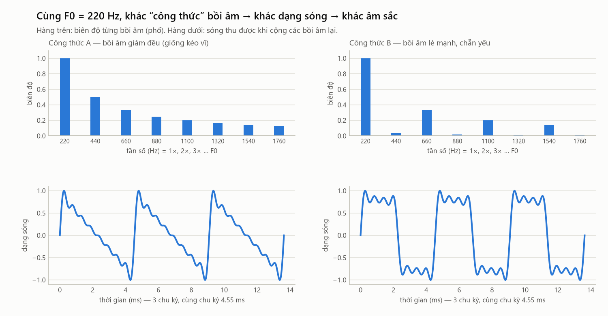
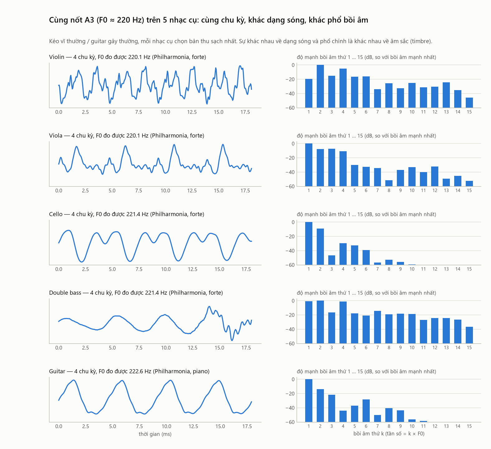
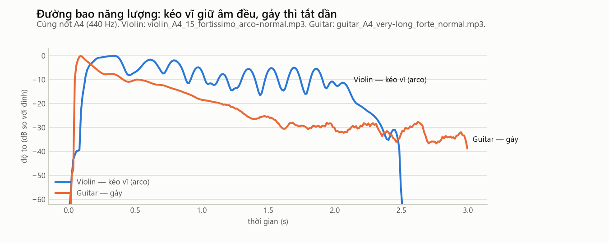

# 13. Dạng sóng (waveform) — nhìn âm thanh theo thời gian

> **Đọc xong file này bạn sẽ biết:** dạng sóng là gì và đọc nó ra sao; nhìn dạng sóng thấy được F0 (chu kỳ) và đường bao (to dần, giữ, tắt); RMS và ZCR, hai đặc trưng tính thẳng từ dạng sóng; vì sao **không thể so hai âm thanh bằng cách so từng mẫu**; dạng sóng còn thiếu gì, và vì sao phải chuyển sang phổ.
> **Cần biết trước:** [03](03_F0_HARMONICS_TIMBRE.md) (harmonic), [12](12_DIGITAL_AUDIO.md) (mẫu, sr).
> **Đọc tiếp:** [14 FFT, STFT, phổ](14_FFT_STFT_SPECTRUM.md).

---

## 1. Dạng sóng là gì

**Là gì.** Dạng sóng là hình vẽ **giá trị các mẫu theo thời gian**: trục ngang là thời gian, trục dọc là biên độ (áp suất, chuẩn hóa về [−1, 1]). Đây là cách nhìn **trực tiếp nhất** vào dãy số trong file âm thanh ([12](12_DIGITAL_AUDIO.md) §6).

**Hai mức nhìn** cho hai loại thông tin khác nhau:

| Phóng to (vài mili-giây) | Thu nhỏ (vài giây) |
|---|---|
| Thấy **từng chu kỳ** lặp lại → đo được **F0** | Chu kỳ dày đặc thành một "khối" → thấy **đường bao**: to dần, giữ, tắt |
| Thấy **hình dạng** chu kỳ (do công thức harmonic) | Thấy nốt bắt đầu, kết thúc ở đâu |

---

## 2. Phóng to: chu kỳ, F0 và hình dạng

**Chu kỳ** `T` là thời gian dạng sóng lặp lại một lần; `F0 = 1 / T` ([03](03_F0_HARMONICS_TIMBRE.md) §1).

**Áp dụng cho 5 nhạc cụ** (dây buông thấp nhất):

| Nhạc cụ | Nốt | F0 | Chu kỳ T | Số mẫu mỗi chu kỳ (22 050 Hz) |
|---|---|---|---|---|
| Double bass | E1 | 41.20 Hz | 24.27 ms | 535 |
| Cello | C2 | 65.41 Hz | 15.29 ms | 337 |
| Guitar | E2 | 82.41 Hz | 12.13 ms | 268 |
| Viola | C3 | 130.81 Hz | 7.64 ms | 169 |
| Violin | G3 | 196.00 Hz | 5.10 ms | 113 |

**Hình dạng chu kỳ do harmonic quyết định.** Cùng F0, cộng các harmonic với độ mạnh khác nhau sẽ ra những hình dạng rất khác nhau ([03](03_F0_HARMONICS_TIMBRE.md) §3):



Dữ liệu thật: cùng nốt A3 (chu kỳ 4.55 ms) trên 5 nhạc cụ, 5 hình dạng khác nhau:



---

## 3. Vì sao KHÔNG so hai âm thanh bằng cách so từng mẫu

Ý tưởng ngây thơ: hai file giống nhau thì dãy mẫu giống nhau, vậy cứ trừ từng mẫu rồi cộng lại. **Cách này không dùng được**, vì:

1. **Pha.** Hai lần kéo cùng một nốt trên cùng cây violin cho ra các harmonic với **pha** (vị trí bắt đầu, [01](01_SOUND_BASICS.md) §5) khác nhau. Dạng sóng khác hẳn, nhưng **tai nghe như nhau**: tai gần như không nhạy với pha của các harmonic.
2. **Thời điểm.** Lệch nhau chỉ nửa chu kỳ (2.3 ms với A3) là các mẫu đổi dấu: chỗ dương thành âm. Hiệu từng mẫu khi đó **lớn nhất**, dù hai âm giống hệt nhau.
3. **Độ dài.** Hai file dài khác nhau thì không có cách ghép "mẫu thứ n với mẫu thứ n" có nghĩa.

**Kết luận:** phải biến dãy mẫu thành những con số **không phụ thuộc pha, thời điểm, độ dài**, tức là các **đặc trưng** ([15](15_AUDIO_FEATURES.md)). Phần lớn đặc trưng được tính trên **phổ biên độ** ([14](14_FFT_STFT_SPECTRUM.md)), vì phổ biên độ bỏ đi thông tin pha.

---

## 4. Thu nhỏ: đường bao (envelope)

**Là gì.** Đường bao là đường **bao quanh đỉnh** của dạng sóng, cho thấy độ to thay đổi theo thời gian. Người ta thường chia đường bao của một nốt thành 4 pha (gọi là **ADSR**):

```
độ to
  │     ╱╲
  │    ╱  ╲______________
  │   ╱                  ╲
  │  ╱                    ╲
  │ ╱                      ╲___
  └──────────────────────────────→ thời gian
    A   D        S          R
 Attack  Decay  Sustain    Release
 (bật)  (giảm  (giữ)      (tắt sau khi
        sau đỉnh)          ngừng chơi)
```
| Pha | Kéo vĩ (violin, viola, cello, double bass) | Gảy (guitar) |
|---|---|---|
| **Attack** | Lớn dần khi vĩ bắt đầu kéo; người chơi điều khiển được độ nhanh | **Rất nhanh**: đạt đỉnh sau khoảng 30–60 ms (đo trên nốt guitar) |
| **Decay** | Nhẹ hoặc không có | Bắt đầu tắt ngay sau đỉnh |
| **Sustain** | **Có**, kéo dài chừng nào còn kéo vĩ; hơi gợn do vĩ và vibrato | **Không có** |
| **Release** | Khi nhấc vĩ, tắt nhanh (thân đàn và phòng còn vang một chút) | Tắt dần theo hàm mũ: guitar **−18 đến −21 dB sau 1 s** |



**Nhạc cụ gảy tắt nhanh chậm khác nhau** (mức năng lượng 1 giây sau đỉnh, trung vị trên 40–50 nốt): guitar −18 đến −21 dB · mandolin −27 dB · banjo **−37 dB**. Banjo có thân là mặt trống nên tắt nhanh nhất ([10](10_BANJO_MANDOLIN.md) §2).

---

## 5. RMS — đo độ to theo thời gian

**Là gì.** RMS (*root mean square*, căn bậc hai của trung bình bình phương) là con số đo **độ mạnh** của tín hiệu trong một đoạn ngắn (một **frame**, xem [14](14_FFT_STFT_SPECTRUM.md) §3).

**Hình dung.** Trung bình cộng các mẫu thì gần bằng 0, vì dương và âm triệt tiêu nhau. Bình phương lên trước (cho hết âm), lấy trung bình, rồi căn bậc hai để về lại đơn vị cũ.

**Công thức** (frame có N mẫu):
```
RMS = √( (1/N) × Σ x[n]² )
RMS (dB) = 20 × log10( RMS / RMS_lớn_nhất )      ← 0 dB ở lúc to nhất, âm khi nhỏ hơn
```
| Thành phần | Ý nghĩa |
|---|---|
| `x[n]²` | Bình phương mẫu: luôn dương, tỉ lệ với năng lượng |
| `(1/N) Σ` | Trung bình trên frame |
| `√` | Đưa về cùng đơn vị với biên độ |
| `20 log10(…)` | Đổi ra decibel ([01](01_SOUND_BASICS.md) §4) |

**Ví dụ.** Sóng sin biên độ 1: RMS = 1/√2 ≈ 0.707. Sóng sin biên độ 0.1: RMS ≈ 0.0707, tức −20 dB so với sóng trước.

**Dãy RMS theo thời gian chính là đường bao (đo bằng số).** Project dùng nó ở ba chỗ:
1. **Tìm phần có âm:** các frame có RMS > −40 dB so với đỉnh. Catalog đo `active_sec` theo cách này; nốt có phần có âm **< 0.35 s** bị loại là `TOO_SHORT` (quyết định D22).
2. **Đặc trưng RMS-CV** (độ dao động của đường bao): **RMS-CV = độ lệch chuẩn (RMS) ÷ trung bình (RMS)** trên các frame có âm. Kéo vĩ giữ đều → RMS-CV thấp; gảy tắt dần → RMS-CV cao (§6).
3. **Không** dùng trung bình RMS làm đặc trưng, vì nó chỉ đo độ to khi thu (micro gần hay xa), không phải đặc điểm của nhạc cụ. Hơn nữa mọi file đã được chuẩn hóa đỉnh ([12](12_DIGITAL_AUDIO.md) §7).

**Vì sao RMS-CV không đổi khi âm to lên.** Nhân mọi mẫu với a thì mọi RMS cũng nhân a; độ lệch chuẩn và trung bình cùng nhân a nên tỉ số giữ nguyên. Đó là lý do dùng **CV** (tỉ số) thay cho độ lệch chuẩn.

---

## 6. ZCR — đếm số lần dạng sóng cắt trục 0

**Là gì.** ZCR (*zero-crossing rate*) là tỉ lệ các cặp mẫu liên tiếp **đổi dấu** (từ dương sang âm hoặc ngược lại).

**Công thức** (frame N mẫu):
```
ZCR = (1 / (N − 1)) × Σ  1[ x[n] × x[n−1] < 0 ]
```
`1[…]` bằng 1 khi điều kiện đúng (hai mẫu trái dấu), bằng 0 khi sai.

**Hình dung và ví dụ.** Một sóng sin tần số f cắt trục 0 **hai lần mỗi chu kỳ**. Ở sr = 22 050 Hz:
```
ZCR ≈ 2 × f / sr        sin 440 Hz → 2 × 440 / 22 050 ≈ 0.040
                        sin 4 000 Hz → ≈ 0.363
```
Với âm thật (nhiều harmonic), các harmonic cao và nhiễu tạo thêm nhiều lần cắt trục nhỏ, nên ZCR tăng. **ZCR là một thước đo thô, rẻ của "lượng tần số cao + nhiễu"**, tính được mà không cần FFT.

**Trên 5 nhạc cụ** (trung vị): violin **0.115** · viola 0.089 · cello 0.050 · guitar 0.031 · double bass **0.017**. Thứ tự gần khớp với độ sáng (centroid), cộng thêm tiếng vĩ cọ dây của bộ kéo vĩ.

**Điểm yếu:** ZCR rất nhạy với **tiếng ồn nền** và điều kiện thu. Cùng nhạc cụ, đổi nguồn thu làm ZCR lệch trung bình **50.8%** (so với 10.5% của centroid). Chi tiết ở [15](15_AUDIO_FEATURES.md).

---

## 7. Dạng sóng còn thiếu gì?

Nhìn dạng sóng, ta thấy được **F0** (chu kỳ) và **đường bao**. Nhưng **không thấy được** trực tiếp:
- **Có những harmonic nào, mạnh bao nhiêu**: chúng đã bị cộng lẫn vào nhau thành một đường duy nhất.
- **Thân đàn khuếch đại vùng tần số nào.**

Mà đó chính là phần lớn của âm sắc ([03](03_F0_HARMONICS_TIMBRE.md) §4). Muốn "tách" dạng sóng trở lại thành từng tần số, cần **phép biến đổi Fourier** ([14](14_FFT_STFT_SPECTRUM.md)).

---

## 8. Liên hệ với dataset của project

| Thông tin từ dạng sóng | Ở đâu trong project |
|---|---|
| Đỉnh (giá trị tuyệt đối lớn nhất) | Cột `peak` trong catalog; cờ `LOW_LEVEL` nếu đỉnh < 0.01 |
| Số mẫu chạm ±1 | Cột `clipped` (bị cắt đỉnh, [12](12_DIGITAL_AUDIO.md) §4) |
| Phần có âm (RMS > −40 dB) | Cột `active_sec`; quy tắc TOO_SHORT < 0.35 s |
| Đường bao | Đặc trưng **RMS-CV** (1 trong 32 chiều) |
| Số lần cắt trục 0 | Đặc trưng **ZCR** (1 trong 32 chiều) |
| Thời điểm bắt đầu nốt | Tách nốt (onset) dùng cả năng lượng lẫn phổ ([17](17_ONSET_SEGMENTATION.md)) |
