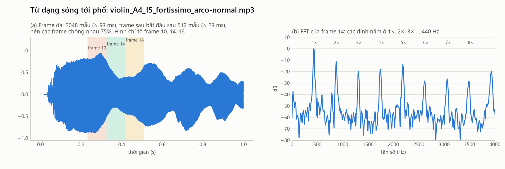

# 14. FFT, STFT, phổ và spectrogram — nhìn âm thanh theo tần số

> **Đọc xong file này bạn sẽ biết:** phép biến đổi Fourier "tách" một dạng sóng thành các tần số ra sao (trực giác trước, công thức sau); FFT là gì; vì sao phải cắt tín hiệu thành frame và nhân cửa sổ; đánh đổi giữa độ phân giải thời gian và tần số; phổ khác spectrogram thế nào và đọc spectrogram ra sao; thang Mel; "đường bao phổ" khác "các vạch harmonic" ở đâu, và vì sao điều đó dẫn tới MFCC.
> **Cần biết trước:** [03](03_F0_HARMONICS_TIMBRE.md) (harmonic), [13](13_WAVEFORM.md) (dạng sóng).
> **Đọc tiếp:** [15 Đặc trưng âm thanh](15_AUDIO_FEATURES.md).

---

## 1. Ý tưởng: một dạng sóng = tổng các sóng sin

File [03](03_F0_HARMONICS_TIMBRE.md) cho thấy âm của một nốt là **tổng các harmonic**, mỗi harmonic là một sóng sin. Phép biến đổi Fourier làm điều **ngược lại**: nhận một dạng sóng, trả lời "trong đó có những sóng sin nào, mỗi sóng mạnh bao nhiêu".

```
Dạng sóng (theo thời gian)  ──Fourier──→  Phổ (theo tần số)
"áp suất lúc t là bao nhiêu"              "tần số f mạnh bao nhiêu"
```
Cùng một âm thanh, hai cách nhìn. Phổ cho thấy trực tiếp thứ mà dạng sóng giấu đi: **công thức harmonic** và **vùng cộng hưởng** của thân đàn.

---

## 2. Biến đổi Fourier rời rạc (DFT)

**Hình dung.** Muốn biết trong tín hiệu có tần số f không, ta **so** tín hiệu với một sóng sin (và cos) tần số f: nhân từng mẫu với nhau rồi cộng lại. Nếu tín hiệu "nhịp" cùng sóng đó, tích luôn cùng dấu và tổng **lớn**. Nếu không, các tích dương và âm triệt tiêu, tổng **gần 0**. Làm vậy với mọi tần số, ta được phổ.

**Công thức** (một đoạn N mẫu):
```
X[k] = Σ_{n=0}^{N−1}  x[n] × e^(−j·2π·k·n/N)        k = 0, 1, …, N/2
     = Σ x[n]·cos(2π·k·n/N)  −  j · Σ x[n]·sin(2π·k·n/N)
```
| Thành phần | Ý nghĩa |
|---|---|
| `x[n]` | Mẫu thứ n của đoạn tín hiệu |
| `k` | Số thứ tự **bin** tần số (một "ngăn" tần số) |
| `e^(−j·2π·k·n/N)` | Một cặp sóng cos và sin có đúng k chu kỳ trong N mẫu. Đây là "sóng mẫu" để so |
| `X[k]` | Kết quả so sánh: một số phức |
| `\|X[k]\|` (độ lớn) | **Tần số đó mạnh bao nhiêu** → đây là **phổ biên độ**, thứ project dùng |
| góc của `X[k]` | Pha của thành phần đó → project **bỏ**, vì tai gần như không nhạy với pha ([13](13_WAVEFORM.md) §3) |

**Bin k ứng với tần số nào:**
```
f_k = k × sr / N               độ phân giải tần số  Δf = sr / N
```
**Ví dụ của project:** sr = 22 050 Hz, N = 2 048 mẫu:
- Δf = 22 050 / 2 048 = **10.77 Hz**: hai bin liền nhau cách nhau 10.77 Hz.
- Có N/2 + 1 = **1 025 bin**, từ 0 Hz tới 11 025 Hz (Nyquist).
- Harmonic h1 của nốt A4 (440 Hz) rơi vào bin 440 / 10.77 ≈ **41**.

**FFT** (*Fast Fourier Transform*) là **thuật toán nhanh** để tính DFT, cho cùng kết quả. Tính thẳng cần khoảng N² phép nhân (2 048² ≈ 4.2 triệu); FFT chỉ cần khoảng N·log2(N) (2 048 × 11 ≈ 22 500), **nhanh hơn khoảng 190 lần**.

---

## 3. Vì sao phải cắt thành frame: STFT

**Vấn đề.** Âm nhạc **thay đổi theo thời gian**: nốt đổi, harmonic tắt dần, vibrato. Một FFT trên cả file chỉ cho **một** phổ trung bình, mất hết thông tin "lúc nào có gì".

**Giải pháp: STFT** (*Short-Time Fourier Transform*, biến đổi Fourier thời gian ngắn):
```
1. Cắt tín hiệu thành các đoạn ngắn gọi là FRAME (project: 2 048 mẫu ≈ 93 ms)
2. Frame sau bắt đầu sau một BƯỚC NHẢY (hop, project: 512 mẫu ≈ 23 ms) → các frame chồng nhau 75%
3. Nhân mỗi frame với một CỬA SỔ (Hann)
4. FFT từng frame → mỗi frame cho một phổ
5. Xếp các phổ cạnh nhau theo thời gian → SPECTROGRAM
```



Hình (a): ba frame của nốt violin A4 (các frame ở giữa chồng lên chúng không được tô). Hình (b): FFT của một frame cho thấy rõ các **đỉnh nhọn tại 1×, 2×, 3×… 440 Hz**, chính là các harmonic, giữa chúng là nền nhiễu thấp hơn khoảng 40–60 dB.

**Ví dụ kích thước:** một nốt REF dài 1.5 s cho khoảng **65 frame**. Spectrogram là bảng **1 025 × 65 ≈ 66 600 con số**. Các file sau sẽ "tóm tắt" bảng này thành **32 đặc trưng** ([15](15_AUDIO_FEATURES.md)).

### 3.1. Cửa sổ Hann — vì sao phải nhân
Cắt thẳng một đoạn ra thì hai đầu đoạn bị "đứt" đột ngột. Phép FFT hiểu chỗ đứt đó như một tín hiệu có **rất nhiều tần số**, làm phổ bị "lem" sang các bin lân cận. Hiện tượng này gọi là **rò rỉ phổ** (spectral leakage). Cửa sổ Hann làm hai đầu frame **nhỏ dần về 0** nên hết chỗ đứt:
```
w[n] = 0.5 − 0.5 × cos( 2π·n / (N − 1) )        n = 0 … N−1   (bằng 0 ở hai đầu, bằng 1 ở giữa)
```
Vì hai đầu frame bị làm nhỏ, các frame phải **chồng nhau** (75%) để không bỏ sót phần nào của tín hiệu.

### 3.2. Đánh đổi: phân giải thời gian ↔ phân giải tần số
| Frame dài hơn (N lớn) | Frame ngắn hơn (N nhỏ) |
|---|---|
| Δf = sr/N **nhỏ** → tách được hai tần số gần nhau | Δf **lớn** → các tần số gần nhau dính vào một bin |
| Nhưng một frame trải dài hơn → **mờ về thời gian** (không biết chính xác nốt đổi lúc nào) | **Rõ về thời gian** |

**Project chọn N = 2 048 (93 ms) vì nhạc cụ trầm nhất:**
- Nốt E1 của double bass có chu kỳ 24.3 ms. Một frame 93 ms chứa khoảng **3.8 chu kỳ**, đủ để thấy tính tuần hoàn.
- Các harmonic của E1 cách nhau 41.2 Hz, tức khoảng **3.8 bin** → tách được từng harmonic. Với C1 (32.7 Hz) là khoảng 3 bin, vẫn tách được.
- **Giới hạn:** ở vùng trầm, hai **nốt** liền nhau gần như không tách được bằng một bin. E1 = 41.20 Hz và F1 = 43.65 Hz chỉ cách nhau 2.45 Hz, nhỏ hơn Δf = 10.77 Hz. Vì vậy project **không** đo F0 bằng cách tìm đỉnh FFT, mà dùng **pYIN**: thuật toán tìm chu kỳ lặp lại trực tiếp trên dạng sóng, chính xác hơn nhiều ([15](15_AUDIO_FEATURES.md) §10).

---

## 4. Phổ và spectrogram — đọc thế nào

| | **Phổ** (spectrum) | **Spectrogram** |
|---|---|---|
| Là gì | Độ mạnh theo tần số **của một frame** (hoặc trung bình nhiều frame) | **Ảnh** gồm phổ của mọi frame xếp cạnh nhau |
| Trục | Ngang: tần số; dọc: độ mạnh (dB) | Ngang: thời gian; dọc: tần số; **màu**: độ mạnh |
| Trả lời | "Có những tần số nào, mạnh bao nhiêu?" | "Tần số nào mạnh **vào lúc nào**?" |

**Cách đọc spectrogram:**

| Hình dạng thấy trên spectrogram | Nghĩa |
|---|---|
| **Vạch ngang** song song, cách đều | Các harmonic của một nốt (khoảng cách giữa các vạch = F0) |
| Vạch ngang **gợn sóng** | Vibrato: tần số dao động |
| Vạch ngang **mờ dần**, vạch trên mờ trước | Âm tắt dần, harmonic cao tắt trước (nhạc cụ gảy) |
| **Vạch dọc** (sáng từ thấp tới cao trong chốc lát) | Đầu nốt, tiếng gõ: năng lượng trải mọi tần số trong thời gian rất ngắn |
| **"Sương mù"** lan rộng, không thành vạch | Nhiễu: tiếng vĩ cọ dây, tiếng thở, tiếng ồn phòng |
| Cả nhóm vạch **nhảy** lên hoặc xuống | Đổi nốt |


Cùng nốt A4: violin có các vạch **giữ đều, hơi gợn** (kéo vĩ, vibrato); guitar có các vạch **sáng lúc gảy rồi mờ dần**, vạch cao tắt trước ([04](04_HOW_STRING_INSTRUMENTS_WORK.md) §6.3).

---

## 5. Thang dB và thang Mel — nhìn phổ như tai nghe

**Thang dB cho độ mạnh.** Tai cảm nhận độ to theo **tỉ lệ**, không theo hiệu: tăng gấp đôi biên độ luôn nghe "to hơn cùng một mức" (+6 dB), bất kể to sẵn hay nhỏ sẵn ([01](01_SOUND_BASICS.md) §4). Vì vậy phổ thường được vẽ và xử lý theo **dB** (lấy log).

**Thang Mel cho tần số.** Tai phân biệt tần số **rất mịn ở vùng thấp, rất thô ở vùng cao**. Chênh 100 Hz giữa 200 và 300 Hz nghe rất rõ (tỉ lệ 1.5, đúng một quãng 5), còn chênh 100 Hz giữa 8 000 và 8 100 Hz chỉ bằng khoảng 1/5 nửa cung, rất khó nghe ra. Thang **Mel** co giãn trục tần số cho giống tai:
```
mel(f) = 2595 × log10( 1 + f / 700 )
```
| f (Hz) | 100 | 1 000 | 4 000 | 11 025 |
|---|---|---|---|---|
| mel | 150 | 1 000 | 2 146 | 3 176 |

Dưới khoảng 1 000 Hz, thang Mel gần như **tuyến tính**; trên đó gần như **logarit**. Từ 1 000 tới 11 025 Hz (gấp 11 lần về Hz) chỉ tăng khoảng 2 200 mel.

**Bộ lọc Mel.** Để có "phổ theo thang Mel", người ta dùng một dãy **bộ lọc tam giác** đặt cách đều nhau trên thang Mel: hẹp ở vùng thấp, rộng dần ở vùng cao. Mỗi bộ lọc cộng năng lượng các bin FFT nằm dưới nó thành **một con số**. Project dùng **128 bộ lọc Mel** (`n_mels = 128`) cho MFCC và cho phát hiện đầu nốt (SuperFlux, [17](17_ONSET_SEGMENTATION.md)). Thư viện librosa dùng một biến thể công thức Mel hơi khác ở trên (tuyến tính dưới 1 kHz, logarit phía trên), nhưng cùng ý tưởng.

---

## 6. Hai lớp thông tin trong một phổ: "vạch" và "đường bao"

Nhìn phổ của một nốt (hình 12b), ta thấy hai thứ chồng lên nhau:

```
độ mạnh
  │   │           ← các VẠCH harmonic: vị trí do F0 (nốt) quyết định
  │   │   │
  │ ╭─┼───┼───╮   ← ĐƯỜNG BAO PHỔ: đường cong mượt nối các đỉnh vạch,
  │╭┼─┼───┼───┼─╮    hình dạng do THÂN ĐÀN + cách kích thích quyết định
  ││││ │   │ │ ││
  └──────────────────→ tần số
```
| | Các vạch (cấu trúc mịn) | Đường bao phổ (cấu trúc thô) |
|---|---|---|
| Do cái gì quyết định | **Nốt** đang chơi (F0) | **Nhạc cụ**: cộng hưởng thân đàn, cách kéo/gảy |
| Đổi khi đổi nốt? | Có, dịch theo F0 | Gần như **không** (cộng hưởng thân đàn cố định, [04](04_HOW_STRING_INSTRUMENTS_WORK.md) §7) |
| Hữu ích cho bài toán "nhạc cụ nào?" | Ít (nốt nào cũng có trên nhiều nhạc cụ) | **Rất nhiều** |

**Đây là ý tưởng then chốt dẫn tới MFCC:** muốn nhận ra nhạc cụ, cần một cách **giữ lại đường bao phổ và bỏ bớt các vạch** (bỏ bớt ảnh hưởng của nốt). MFCC làm đúng việc đó ([15](15_AUDIO_FEATURES.md) §9).

---

## 7. Áp dụng cho 5 nhạc cụ và liên hệ với project

| Nhạc cụ | Spectrogram trông thế nào | Đường bao phổ |
|---|---|---|
| Violin | Vạch ngang dày đặc tới vùng cao, gợn (vibrato), sương mù nhẹ (tiếng vĩ) | Đẩy năng lượng lên 2–3 kHz ([05](05_VIOLIN.md) §9) |
| Viola | Giống violin nhưng các vạch cao yếu hơn | 4 harmonic đầu mạnh rồi tụt ([06](06_VIOLA.md) §9) |
| Cello | Vạch gần nhau (F0 thấp), năng lượng dồn dưới khoảng 1 kHz | Đầy ở vùng thấp, giữa |
| Double bass | Vạch rất sát nhau (cách 41–98 Hz ở dây buông); h1 rất mờ ở nốt thấp | Trọng tâm quanh harmonic thứ 10 ở quãng tám 1 ([08](08_DOUBLE_BASS.md) §3) |
| Guitar | Vạch sáng ở đầu nốt, mờ dần, vạch cao mất trước | Rất ít harmonic mạnh ([09](09_GUITAR.md) §9) |

**Trong project, spectrogram là "nguyên liệu" của gần như mọi đặc trưng:**
```
dãy mẫu ──STFT (2 048 / 512 / Hann)──→ phổ biên độ của từng frame
   ├── centroid, bandwidth, rolloff  (tính trên phổ từng frame)
   ├── 128 bộ lọc Mel → log → DCT → MFCC  (15 §9)
   └── 128 bộ lọc Mel → log → SuperFlux → tìm đầu nốt  (17)
dãy mẫu ──trực tiếp──→ RMS, ZCR  (13)
dãy mẫu ──pYIN──→ F0  (15 §10)
```
**Mọi tham số** (sr 22 050, N 2 048, hop 512, Hann, 128 Mel) phải **giống hệt nhau** cho file CSDL và file truy vấn. Nếu khác, các con số sẽ không còn so sánh được với nhau.
