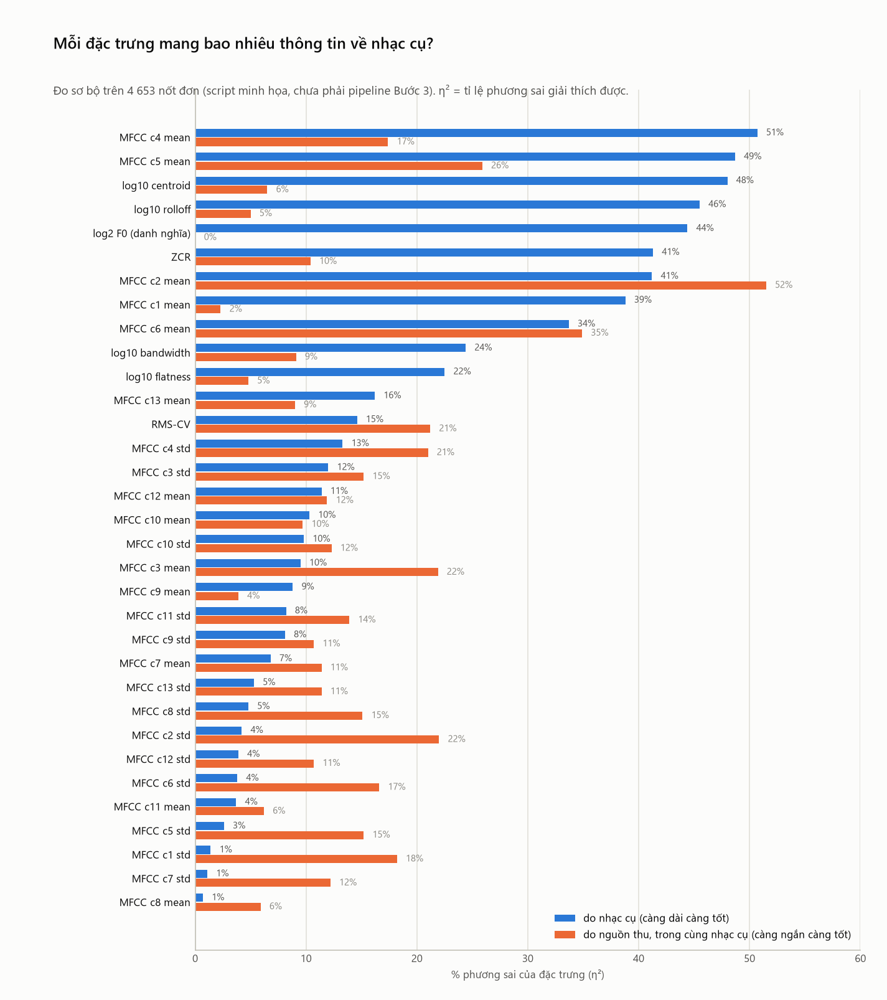
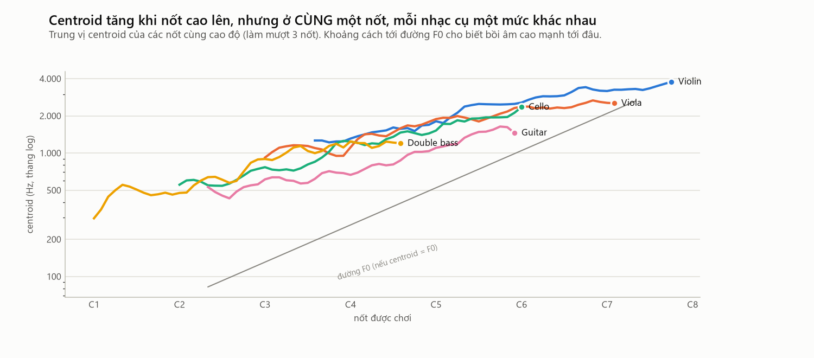
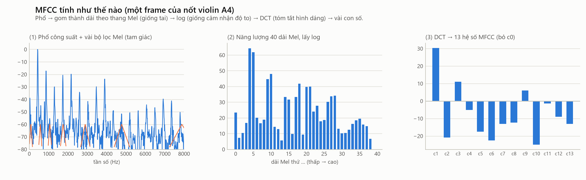
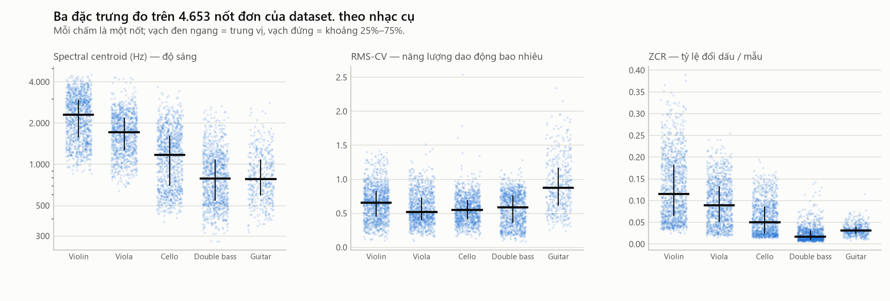

# 15. Đặc trưng âm thanh — mỗi đặc trưng đo gì, và có nên dùng không

> **Đọc xong file này bạn sẽ biết:** đặc trưng là gì và vì sao cần; cách đánh giá một đặc trưng "tốt" bằng số; với **từng** đặc trưng (RMS-CV, ZCR, centroid, bandwidth, rolloff, flatness, MFCC, F0, chroma, spectral flux): nó đo gì, tính từ đâu, ý nghĩa vật lý, đổi thế nào khi đổi nốt / nhạc cụ / cách chơi / phòng thu, có hữu ích không, có nên đưa vào vector của project không. Cuối file là vector 32 chiều của project, kèm những điểm cần xem lại mà số đo đã chỉ ra.
> **Cần biết trước:** [13](13_WAVEFORM.md) (dạng sóng, RMS, ZCR), [14](14_FFT_STFT_SPECTRUM.md) (phổ, Mel).
> **Đọc tiếp:** [16 Mô hình dữ liệu](16_DATASET_MODEL.md).

---

## 1. Đặc trưng là gì, vì sao cần

**Là gì.** Một **đặc trưng** (feature) là **một con số tính từ tín hiệu**, tóm tắt một khía cạnh của âm thanh: độ sáng, độ ồn, đường bao…

**Vì sao cần.** Một nốt 1.5 s có khoảng 33 000 mẫu, hay một spectrogram khoảng 66 600 con số ([14](14_FFT_STFT_SPECTRUM.md) §3). Không thể so trực tiếp từng mẫu ([13](13_WAVEFORM.md) §3). Đặc trưng nén các con số đó xuống còn vài chục, và quan trọng hơn là **không phụ thuộc pha, thời điểm, độ dài**.

**So sánh đời thường.** Mô tả một người bằng "cao 1m70, nặng 60 kg, tóc đen" thay vì so hai bức ảnh từng điểm ảnh. Chọn đúng đặc trưng thì hai người giống nhau sẽ có các con số gần nhau.

---

## 2. Thế nào là một đặc trưng tốt — và đo bằng gì

Với bài toán "tiếng nhạc cụ nào giống nhau", một đặc trưng tốt phải:

| Tiêu chí | Đo bằng (trong file này) |
|---|---|
| 1. **Khác nhiều giữa các nhạc cụ** | **η² nhạc cụ**: nhạc cụ giải thích bao nhiêu % sự biến thiên của đặc trưng |
| 2. Ít đổi theo **nốt** trong cùng nhạc cụ (hoặc đổi theo cách dự đoán được) | **\|ρ\| với cao độ**: hệ số tương quan hạng (Spearman) giữa đặc trưng và số MIDI, trung vị trên 5 nhạc cụ. 0 là không phụ thuộc nốt, 1 là phụ thuộc hoàn toàn |
| 3. Ít đổi theo **phòng thu / micro** | **η² nguồn thu**: trong cùng nhạc cụ và cùng các cao độ chung, nguồn thu (Iowa hay Philharmonia) giải thích bao nhiêu % biến thiên |
| 4. Không đổi khi âm **to / nhỏ** lên do thu gần / xa | Lý luận (§12) |
| 5. Không trùng thông tin với đặc trưng khác | Tương quan giữa các đặc trưng (đo ở Bước 3, mục chờ P01) |

**η² (eta bình phương) là gì.** Lấy mọi nốt, tính độ biến thiên tổng của đặc trưng. Rồi hỏi: bao nhiêu phần của độ biến thiên đó là do các nhạc cụ **có trung bình khác nhau**?
```
η² = Σ_nhạc cụ  n_c × (trung bình nhóm c − trung bình chung)²   /   Σ_mọi nốt (giá trị − trung bình chung)²
```
**Ví dụ:** η² = 0.48 nghĩa là 48% sự khác nhau giữa các nốt được giải thích bởi "nốt đó của nhạc cụ nào". 52% còn lại là khác biệt **bên trong** từng nhạc cụ (nốt, cường độ, phòng thu…). η² = 0 là đặc trưng vô dụng; η² = 1 là chỉ cần đặc trưng này là tách hoàn toàn.

**Số đo trong file này** lấy từ 4 653 nốt đơn dùng được, đo bằng script minh họa ([`scripts/theory_figures.py`](../../scripts/theory_figures.py)). Đây là số **sơ bộ**, chưa phải pipeline chính thức của Bước 3: chỉ đo trên nốt đơn, 1.5 s đầu, frame có âm; F0 lấy theo tên nốt thay vì đo bằng pYIN. Bảng đầy đủ: `reports/theory/feature_information.csv`, `feature_sensitivity.csv`.



---

## 3. Từ nhiều frame tới một con số

Hầu hết đặc trưng được tính **trên từng frame** (93 ms, [14](14_FFT_STFT_SPECTRUM.md) §3), nên một đoạn cho ra **một dãy** giá trị theo thời gian. Muốn có một con số, phải **thống kê** dãy đó:

| Thống kê | Ý nghĩa | Project dùng cho |
|---|---|---|
| **Trung bình (mean)** | Giá trị điển hình | Centroid, bandwidth, rolloff, ZCR, MFCC |
| **Độ lệch chuẩn (std)** | Thay đổi nhiều hay ít theo thời gian (vibrato, tắt dần) | MFCC |
| **Trung vị (median)** | Giá trị giữa, bền với giá trị bất thường | F0 (vì pYIN hay nhảy quãng tám) |
| **Hệ số biến thiên CV = std / mean** | Dao động tương đối; không đổi khi nhân tín hiệu với hằng số | RMS |

Chỉ tính trên **frame có âm** (RMS > −40 dB so với đỉnh), để khoảng lặng không làm lệch số.

**Vì sao lấy log của các đặc trưng đo bằng Hz** (centroid, bandwidth, rolloff)? Tai nghe tần số theo **tỉ lệ** ([02](02_PITCH_NOTE_OCTAVE_SEMITONE.md) §2): 500 → 1 000 Hz và 2 000 → 4 000 Hz đều là "gấp đôi". Lấy log10 thì hai bước đó bằng nhau, và phân bố số liệu đỡ lệch hơn.

---

## 4. RMS-CV — độ dao động của đường bao

**Là gì.** Độ lệch chuẩn của RMS chia cho trung bình RMS trên các frame có âm ([13](13_WAVEFORM.md) §5).

**Hình dung.** Âm giữ đều thì RMS gần như phẳng → CV nhỏ. Âm bật lên rồi tắt dần thì RMS tụt mạnh → CV lớn.

**Ví dụ:** RMS lần lượt 0.50, 0.50, 0.50, 0.50 → CV = 0. RMS 0.80, 0.40, 0.20, 0.10 (tắt dần) → trung bình 0.375, độ lệch chuẩn 0.27 → CV = 0.72.

| Câu hỏi | Trả lời |
|---|---|
| 1. Đo cái gì? | Năng lượng có **giữ đều** hay **dao động / tắt dần** |
| 2. Tính từ đâu? | Dạng sóng → RMS từng frame → std / mean |
| 3. Ý nghĩa vật lý / cảm nhận | Kéo vĩ (vĩ bơm năng lượng liên tục) ↔ gảy (không có gì bơm thêm, [04](04_HOW_STRING_INSTRUMENTS_WORK.md) §6) |
| 4. Khi đổi nốt | Gần như không đổi: \|ρ\| = 0.06–0.37 (thấp nhất trong mọi đặc trưng). **Tốt** |
| 5. Khi đổi nhạc cụ | Trung vị: guitar **0.88**; violin 0.65; double bass 0.59; cello 0.55; viola 0.52. Nhưng η² nhạc cụ chỉ **15%**, và guitar so với nhóm kéo vĩ chỉ 13% (xem câu 7) |
| 6. Khi đổi cách chơi | **Rất nhạy**: pizzicato +0.59; snap pizz +0.61; col legno +0.30; không vibrato −0.27 (violin, [05](05_VIOLIN.md) §8). Mandolin vê có RMS-CV như violin (0.66, [10](10_BANJO_MANDOLIN.md) §3.4) |
| 7. Bị phòng thu ảnh hưởng? | **Có, và đây là điểm yếu lớn**: η² nguồn thu **21%**, lớn hơn η² nhạc cụ (15%). Nguyên nhân chính là **độ dài nốt khi thu**: nốt violin Philharmonia 0.25 s có RMS-CV 0.88 (bằng guitar!), nốt 1.5 s chỉ 0.48. Nốt ngắn kết thúc ngay trong cửa sổ phân tích nên trông như "tắt dần" |
| 8. Hữu ích để phân biệt? | Có, cho câu hỏi **"gảy hay kéo vĩ"**, nhưng bị nhiễu bởi độ dài nốt |
| 9. Đưa vào vector? | **Có** (1 chiều), nhưng cần xem lại cách đo ở Bước 3 (§16, mục chờ P10) |

---

## 5. ZCR — tỉ lệ cắt trục 0

**Là gì.** Tỉ lệ các cặp mẫu liên tiếp đổi dấu ([13](13_WAVEFORM.md) §6). Sóng sin tần số f có ZCR ≈ 2f / sr.

| Câu hỏi | Trả lời |
|---|---|
| 1. Đo cái gì? | Lượng **tần số cao và nhiễu** (thô, không cần FFT) |
| 2. Tính từ đâu? | Dạng sóng, đếm đổi dấu trong từng frame → trung bình |
| 3. Ý nghĩa | Âm "sáng, xì, rè" → ZCR cao; âm "tròn, trầm" → ZCR thấp |
| 4. Khi đổi nốt | Tăng mạnh khi nốt cao lên (\|ρ\| = 0.68–0.80) |
| 5. Khi đổi nhạc cụ | Trung vị: violin 0.115 · viola 0.089 · cello 0.050 · guitar 0.031 · double bass **0.017**. Chênh lớn nhất trong mọi đặc trưng (6.6 lần). η² nhạc cụ **41%**; tách cello – double bass tốt (27%) |
| 6. Khi đổi cách chơi | Sul ponticello ×1.79; pizzicato ×0.66; col legno battuto ×0.58 (violin); to so với nhỏ ×1.09–1.33 |
| 7. Phòng thu? | **Nhạy**: trung vị lệch 50.8% giữa hai nguồn; η² nguồn thu 10%. Tiếng ồn nền làm tăng ZCR |
| 8. Hữu ích? | Có, đặc biệt để nhận double bass |
| 9. Vào vector? | **Có** (1 chiều) |

---

## 6. Spectral centroid — "độ sáng"

**Là gì.** **Trọng tâm** của phổ: tần số trung bình, có trọng số là độ mạnh của từng tần số.

**Hình dung.** Đặt phổ lên một cái cân dài, mỗi tần số là một vị trí, độ mạnh là khối lượng đặt ở đó. Centroid là **điểm thăng bằng**. Nhiều năng lượng ở tần số cao thì điểm thăng bằng dịch sang phải: âm **sáng**.

**Công thức** (một frame):
```
centroid = Σ_k f_k × |X[k]|  /  Σ_k |X[k]|
```
| Thành phần | Ý nghĩa |
|---|---|
| `f_k` | Tần số của bin k (Hz) |
| `\|X[k]\|` | Độ mạnh của bin k ([14](14_FFT_STFT_SPECTRUM.md) §2) |
| Mẫu số | Chuẩn hóa (tổng trọng số), nên centroid **không đổi** khi âm to hay nhỏ |

**Ví dụ.** Phổ chỉ có 3 vạch: 440 Hz (độ mạnh 1.0), 880 Hz (0.5), 1 320 Hz (0.25). Centroid = (440×1 + 880×0.5 + 1 320×0.25) / (1 + 0.5 + 0.25) = 1 210 / 1.75 = **691 Hz**. Nếu harmonic cao mạnh hơn (1.0, 1.0, 1.0): centroid = **880 Hz**, sáng hơn.

| Câu hỏi | Trả lời |
|---|---|
| 1. Đo cái gì? | Độ sáng: năng lượng dồn về vùng cao hay vùng thấp |
| 2. Tính từ đâu? | Phổ biên độ từng frame → trung bình log10 |
| 3. Ý nghĩa | Gắn chặt với cảm nhận "sáng – tối"; phản ánh **công thức harmonic** + cộng hưởng thân đàn |
| 4. Khi đổi nốt | **Tăng mạnh** (\|ρ\| = 0.70–0.87): violin quãng tám 3 → 7: 1 250 → 3 269 Hz ([05](05_VIOLIN.md) §10) |
| 5. Khi đổi nhạc cụ | Trung vị: violin 2 299 · viola 1 712 · cello 1 172 · double bass 790 · guitar 781 Hz. η² **48%**. Nhưng ở **cùng nốt** thì các nhạc cụ sát nhau: G4 violin 1 753, viola 1 696 Hz ([03](03_F0_HARMONICS_TIMBRE.md) §6); violin – viola chỉ 12% |
| 6. Khi đổi cách chơi | Ponticello ×1.28; tasto ×0.89; pizzicato ×0.68; harmonic ×0.79 (violin); to so với nhỏ ×1.10–1.18 ([11](11_PLAYING_TECHNIQUES.md)) |
| 7. Phòng thu? | Trung vị lệch 10.5% (cello tới **60%**, [07](07_CELLO.md) §9.1); η² nguồn thu 6.5%. Tiếng ồn nền trên nốt gảy nhỏ cũng làm centroid tăng sai ([09](09_GUITAR.md) §8.1) |
| 8. Hữu ích? | **Có**, một trong những đặc trưng mạnh nhất |
| 9. Vào vector? | **Có**: mean log10(centroid), 1 chiều |



---

## 7. Spectral bandwidth và spectral rolloff

**Bandwidth (độ trải phổ).** Độ lệch chuẩn của tần số quanh centroid, cũng có trọng số theo độ mạnh:
```
bandwidth = √( Σ_k (f_k − centroid)² × |X[k]|  /  Σ_k |X[k]| )
```
Năng lượng tập trung quanh một vùng hẹp → bandwidth nhỏ; trải rộng (nhiều harmonic xa nhau, nhiều nhiễu) → lớn.

**Rolloff 85%.** Tần số mà **85% năng lượng** nằm bên dưới nó. "Giới hạn trên" của phần lớn năng lượng.
```
rolloff = f_R nhỏ nhất sao cho  Σ_{f_k ≤ f_R} |X[k]|²  ≥  0.85 × Σ_k |X[k]|²
```
**Ví dụ:** phổ 3 vạch như §6 (độ mạnh 1, 0.5, 0.25 → năng lượng 1, 0.25, 0.0625; tổng 1.3125; 85% = 1.116). Cộng dần: 440 Hz → 1.0 (chưa đủ); 880 Hz → 1.25 (đủ) → rolloff = **880 Hz**.

| Câu hỏi | Bandwidth | Rolloff |
|---|---|---|
| 1–3. Đo gì, ý nghĩa | Độ "rộng" của phổ: âm giàu harmonic xa nhau / nhiều nhiễu | Nơi phổ "hết" năng lượng: độ sáng, nhìn từ đầu trên |
| 4. Khi đổi nốt | \|ρ\| = 0.61–0.81 | \|ρ\| = 0.61–0.83 |
| 5. Khi đổi nhạc cụ | Trung vị: violin 2 029 · viola 1 731 · double bass 1 484 · guitar 1 452 · cello 1 318 Hz; η² **24%** (yếu) | violin 4 063 · viola 2 934 · cello 1 954 · double bass 1 289 · guitar 1 021 Hz; η² **46%** |
| 7. Phòng thu? | Lệch 7.8%; η² nguồn 9% | Lệch 22.2%; η² nguồn 5% |
| 8. Hữu ích? | Vừa phải; tách violin – viola được 15% (cao hơn centroid) | Mạnh, nhưng **gần như trùng thông tin với centroid** (cùng đo độ sáng) |
| 9. Vào vector? | **Có** (1 chiều) | **Có** (1 chiều). Là ứng viên số 1 bị bỏ nếu tương quan với centroid > 0.95 (mục chờ P01) |

---

## 8. Spectral flatness — độ "phẳng" của phổ

**Là gì.** Tỉ số giữa trung bình nhân và trung bình cộng của phổ. Phổ **phẳng** (mọi tần số mạnh như nhau, như tiếng xì) → gần 1. Phổ **nhọn** (vài vạch harmonic nổi bật) → gần 0.

| Câu hỏi | Trả lời |
|---|---|
| 1–3 | Âm giống "nốt" (có cao độ) hay giống "tiếng ồn" |
| 4. Khi đổi nốt | \|ρ\| = 0.40–0.63 |
| 5. Khi đổi nhạc cụ | Trung vị rất nhỏ (0.0002–0.0013), chênh 6.5 lần; η² 22% |
| 6. Khi đổi cách chơi | **Cực nhạy**: snap pizz ×15.7; au talon ×3.4; col legno ×3.1; cello col legno ×7.0 |
| 7. Phòng thu? | Trung vị lệch **60%** giữa hai nguồn (lớn nhất), vì tiếng ồn phòng làm phổ "phẳng" hơn |
| 8. Hữu ích? | Để phát hiện **kỹ thuật** gõ, snap; ít hữu ích cho nhạc cụ |
| 9. Vào vector? | **Không**. Nhạy với phòng thu và kỹ thuật hơn là với nhạc cụ. Chỉ dùng trong tài liệu để giải thích |

---

## 9. MFCC — hình dạng của đường bao phổ

**Là gì.** MFCC (*Mel-Frequency Cepstral Coefficients*) là khoảng một chục con số mô tả **hình dạng đường bao phổ** trên thang Mel. Đây là đặc trưng âm sắc được dùng nhiều nhất trong xử lý âm thanh.

**Vì sao cần.** Centroid, rolloff chỉ nói "trọng tâm" và "giới hạn trên", tức là **một hai con số** về phổ. Nhưng âm sắc nằm ở **hình dạng** đường bao: vùng nào được thân đàn khuếch đại, vùng nào lõm ([14](14_FFT_STFT_SPECTRUM.md) §6). Hai phổ có cùng centroid vẫn có thể có hình dạng rất khác (con sordino là ví dụ, [11](11_PLAYING_TECHNIQUES.md) §3.5). MFCC mô tả hình dạng đó.

**Các bước tính** (mỗi bước có lý do):



| Bước | Làm gì | Vì sao |
|---|---|---|
| 1 | Phổ công suất của frame (\|X[k]\|²) | Năng lượng từng tần số |
| 2 | Qua **bộ lọc Mel** (project: 128 dải; hình vẽ 40 dải cho dễ nhìn) | Gom tần số giống tai: mịn ở vùng thấp, thô ở vùng cao ([14](14_FFT_STFT_SPECTRUM.md) §5). Các vạch harmonic riêng lẻ bị "làm mờ" phần nào |
| 3 | Lấy **log** | (a) Giống cảm nhận độ to. (b) **Quan trọng nhất:** âm phát ra = (dao động của dây) **×** (bộ lọc thân đàn) **×** (micro, phòng). Lấy log biến phép **nhân** thành phép **cộng**, nên các phần này trở thành **cộng** với nhau |
| 4 | **DCT** (biến đổi cosine rời rạc) dãy log-Mel, giữ 14 hệ số đầu | Mô tả hình dạng dãy log-Mel bằng tổng các đường cos: c1 = một nửa chu kỳ cos (độ nghiêng), c2 = một chu kỳ (độ cong), các hệ số sau là những gợn nhỏ dần. Giữ các hệ số **đầu** = giữ **đường bao mượt**, bỏ chi tiết lởm chởm (các vạch harmonic, tức là phần do **nốt** quyết định) |
| 5 | **Bỏ c0** | c0 ≈ tổng năng lượng (độ to), không phải âm sắc |

**Ý nghĩa của các hệ số** (gần đúng):

| Hệ số | Mô tả | Ví dụ |
|---|---|---|
| c1 | **Độ nghiêng** của phổ: năng lượng dồn về vùng thấp (c1 lớn) hay trải lên vùng cao (c1 nhỏ) | Rất gần với "độ tối"; liên quan chặt với centroid |
| c2 | **Độ cong**: vùng giữa nhô lên hay lõm xuống so với hai đầu | |
| c3 … c13 | Các gợn chi tiết dần của đường bao: vị trí các **vùng cộng hưởng** | Cộng hưởng thân đàn, "đồi ngựa đàn" 2–3 kHz của violin |

Trong hình 13 (một frame nốt violin A4): c1 ≈ +30, c2 ≈ −21, c3 ≈ +11, và các hệ số sau dao động quanh 0.

**Số đo** (mean của từng hệ số trên các frame có âm):

| | c1 | c2 | c3 | c4 | c5 | c6 | c7–c13 |
|---|---|---|---|---|---|---|---|
| η² nhạc cụ | 39% | 41% | 10% | **51%** | **49%** | 34% | 1–16% |
| Tách violin – viola | **19%** | 7% | 3% | 18% | 4% | 3% | 0–16% (c13: 16%) |
| Tách cello – double bass | 4% | 23% | 17% | 13% | **66%** | 53% | 0–15% |
| \|ρ\| với cao độ | 0.78 | 0.25 | 0.35 | 0.37 | 0.38 | 0.09 | 0.14–0.31 |
| η² nguồn thu | 2% | **52%** | 22% | 17% | 26% | **35%** | 4–12% |

Đọc bảng:
- **c4, c5 là hai con số mạnh nhất trong mọi đặc trưng** (51%, 49%), và chúng **ít phụ thuộc nốt** (\|ρ\| ≈ 0.37) hơn centroid (0.82). Đúng như lý thuyết: hệ số bậc giữa mô tả **cộng hưởng thân đàn**, thứ cố định theo nhạc cụ, không theo nốt.
- **c5 tách cello – double bass tới 66%**, trong khi centroid chỉ 12%. Thân đàn của hai nhạc cụ khác nhau rõ dù độ sáng gần nhau.
- **c1** hành xử gần giống centroid (phụ thuộc nốt mạnh, 0.78), và là hệ số tốt nhất cho cặp khó violin – viola (19%).
- **c2 và c6 bị phòng thu ảnh hưởng nặng** (52%, 35%), thậm chí nhiều hơn mức nhạc cụ ảnh hưởng (c2).

**Vì sao MFCC "nghe" được cả phòng thu?** Ở bước 3, log biến **thân đàn** và **micro + phòng** thành hai phần **cộng** vào cùng một dãy số. Cả hai đều là **bộ lọc cố định** (không đổi theo thời gian), nên trong **một** bản thu, về toán học **không có cách nào tách** "phần của thân đàn" khỏi "phần của phòng thu". Kỹ thuật "trừ trung bình MFCC" (CMN), hay dùng trong nhận dạng tiếng nói để bỏ ảnh hưởng micro, ở đây sẽ **xóa luôn cả dấu vân tay của nhạc cụ**. Lời giải nằm ở **dữ liệu**: mỗi nhạc cụ được thu ở **nhiều** nơi (D21), và hệ thống học "violin" qua cả hai nơi thu.

**MFCC std (độ biến đổi theo thời gian).** Đo độ lệch chuẩn của từng hệ số theo thời gian (vibrato làm phổ dao động; nhạc cụ gảy có phổ đổi khi harmonic tắt dần).

| | c1 std | c2 std | c3 std | c4 std | c5–c13 std |
|---|---|---|---|---|---|
| η² nhạc cụ | 1% | 4% | 12% | 13% | 1–10% |
| η² nguồn thu | 18% | 22% | 15% | 21% | 11–17% |

**Kết quả đáng chú ý:** đo từng chiều riêng lẻ, 13 hệ số std mang **rất ít** thông tin về nhạc cụ (tối đa 13%), và ở **cả 13 hệ số**, **phòng thu ảnh hưởng tới chúng nhiều hơn** chính nhạc cụ. Trong vector 32 chiều của project, 13 chiều std chiếm **40%**. Đây là số đo **từng chiều riêng lẻ**: các chiều có thể có ích khi đi cùng nhau. Vì vậy cần một **thử nghiệm bỏ bớt** (ablation) ở Bước 3–5 trước khi quyết định (§16, mục chờ P09).

| Câu hỏi | MFCC mean (c1–c13) | MFCC std (c1–c13) |
|---|---|---|
| 1–3. Đo gì, ý nghĩa | Hình dạng đường bao phổ = **cộng hưởng thân đàn** + cách kích thích | Đường bao phổ **đổi nhiều hay ít** theo thời gian (vibrato, tắt dần) |
| 4. Khi đổi nốt | c1 đổi mạnh; c4–c13 đổi ít | Vừa phải |
| 5. Khi đổi nhạc cụ | **Mạnh nhất** (c4 51%, c5 49%) | Yếu (≤ 13%) |
| 6. Khi đổi cách chơi | Đổi theo con sordino, ponticello (đổi hình dạng phổ) | Đổi theo vibrato, gảy |
| 7. Phòng thu? | c2, c6 rất nhạy; c1, c9 ít nhạy | Nhạy (11–22%) |
| 8. Hữu ích? | **Rất hữu ích**: manh mối chính cho các cặp khó | Chưa rõ, cần thử nghiệm |
| 9. Vào vector? | **Có**: 13 chiều | **Có** theo thiết kế hiện tại (13 chiều), **cần kiểm chứng** (P09) |

---

## 10. F0 (pYIN) — cao độ đo từ tín hiệu

**Là gì.** Tần số cơ bản **đo được** từ tín hiệu (khác với F0 "danh nghĩa" tính từ tên nốt, [16](16_DATASET_MODEL.md) §2).

**Vì sao không tìm đỉnh mạnh nhất trên phổ?** Vì đỉnh mạnh nhất thường **không phải** F0: violin A3 có h2 mạnh hơn h1 tới 19 dB ([05](05_VIOLIN.md) §10); double bass ở quãng tám 1 có "trọng tâm" quanh harmonic thứ 10 ([08](08_DOUBLE_BASS.md) §3). Ngoài ra độ phân giải FFT (10.8 Hz) quá thô cho nốt trầm ([14](14_FFT_STFT_SPECTRUM.md) §3.2).

**YIN — ý tưởng.** Tìm **chu kỳ** trực tiếp trên dạng sóng: dịch dạng sóng đi τ mẫu rồi so với chính nó. Khi τ đúng bằng một chu kỳ, dạng sóng "chồng khít" lên chính nó và hiệu số **nhỏ nhất**:
```
d(τ) = Σ_n ( x[n] − x[n + τ] )²         τ nhỏ nhất làm d(τ) gần 0  →  chu kỳ T = τ / sr  →  F0 = sr / τ
```
**Ví dụ:** nốt A4 ở 22 050 Hz: d(τ) nhỏ nhất ở τ ≈ 50 mẫu → F0 = 22 050 / 50 = 441 Hz.

**pYIN** (*probabilistic YIN*) chạy YIN với nhiều ngưỡng, ra **xác suất** cho từng ứng viên F0, rồi dùng một mô hình chuỗi (HMM) chọn đường F0 **liền mạch** theo thời gian và quyết định frame nào **có cao độ** (voiced).

**Lỗi đặc trưng: sai quãng tám.** Khi F0 yếu, τ = 2T (hoặc T/2) cũng cho d(τ) nhỏ, và pYIN báo nhầm một quãng tám. Project gặp đúng lỗi này khi cắt nốt Iowa ([17](17_ONSET_SEGMENTATION.md) §8).

| Câu hỏi | Trả lời |
|---|---|
| 1–3 | Cao độ của nốt: **âm vực** nhạc cụ đang chơi |
| 2. Tính từ đâu? | Dạng sóng → pYIN từng frame → **trung vị của log2(F0)** trên các frame có cao độ |
| 4. Khi đổi nốt | Theo định nghĩa: đổi hoàn toàn (\|ρ\| = 1) |
| 5. Khi đổi nhạc cụ | η² **44%** (âm vực khác nhau), nhưng violin – viola chỉ **7%** và guitar so với kéo vĩ chỉ 0.2%, vì âm vực chồng lấn |
| 6. Khi đổi cách chơi | Harmonic làm nốt cao hẳn lên; láy, vuốt làm F0 không ổn định |
| 7. Phòng thu? | Về nguyên lý gần như không bị ảnh hưởng, trừ khi nhiễu lớn làm pYIN sai quãng tám |
| 8. Hữu ích? | Có: nốt dưới G3 → không phải violin; nốt dưới C2 → chỉ có double bass ([08](08_DOUBLE_BASS.md) §10) |
| 9. Vào vector? | **Có** (1 chiều). Vì sao **log2**: lên 1 quãng tám = +1, đều theo cảm nhận. Vì sao **trung vị**: bền với các frame sai quãng tám. Nếu dưới 20% frame có cao độ: gán giá trị trung bình của REF và bật cờ `f0_missing` |

**Lưu ý về tham số:** thiết kế hiện tại đặt `fmin = 40 Hz` cho pYIN. Nhưng dataset có **18 nốt double bass dưới 40 Hz** (C1 → D♯1, 32.70–38.89 Hz). pYIN không thể tìm F0 dưới fmin, nên những nốt này sẽ bị đo sai. Cần hạ `fmin` xuống khoảng **30 Hz** (mục chờ P08, §16).

---

## 11. Hai đặc trưng KHÔNG đưa vào vector

### 11.1. Chroma
**Là gì.** Gom năng lượng phổ vào **12 lớp cao độ** (C, C♯, … B), bỏ qua quãng tám. Kết quả là 12 số cho biết "nốt nào đang vang".

**Vì sao loại.** Chroma đo **giai điệu, hòa âm** chứ không đo **nhạc cụ**. Violin và cello chơi cùng giai điệu cho chroma gần giống nhau; hai đoạn violin chơi hai giai điệu khác nhau cho chroma khác nhau. Bài toán "tìm tiếng nhạc cụ giống" sẽ bị kéo sai hướng.

### 11.2. Spectral flux
**Là gì.** Tổng mức **tăng** của phổ giữa hai frame liên tiếp ([17](17_ONSET_SEGMENTATION.md) §4).

**Dùng ở đâu.** Dùng để **tìm đầu nốt** (biến thể SuperFlux), không đưa vào vector: nó đo "có thay đổi không", không đo "nghe như nhạc cụ nào".

---

## 12. Bất biến: đặc trưng nào không đổi khi điều kiện đổi

| Thay đổi | Đặc trưng **không đổi** | Đặc trưng **đổi** |
|---|---|---|
| Âm to hơn / nhỏ hơn đều (nhân tín hiệu với hằng số, ví dụ micro gần hơn) | Centroid, bandwidth, rolloff, ZCR, RMS-CV, MFCC c1+, F0 | RMS trung bình, MFCC c0 (vì vậy cả hai bị bỏ) |
| Đổi nốt | Gần đúng: MFCC bậc giữa, RMS-CV | F0, centroid, rolloff, ZCR, c1 |
| Đổi phòng thu, micro | F0 | Mọi đặc trưng phổ, ở các mức khác nhau (§4–9) |
| Đổi tần số lấy mẫu | — | **Gần như tất cả** → mọi file phải cùng 22 050 Hz ([12](12_DIGITAL_AUDIO.md) §3) |

Lưu ý: "to lên do chơi mạnh" **khác** "to lên do micro gần". Chơi mạnh làm âm sáng hơn thật ([11](11_PLAYING_TECHNIQUES.md) §3.3), nên centroid đổi theo. Micro gần chỉ nhân tín hiệu với hằng số, nên centroid không đổi.

---

## 13. Bảng tổng hợp 9 câu hỏi

| Đặc trưng | Đo gì | η² nhạc cụ | \|ρ\| nốt | η² phòng thu | Cách chơi ảnh hưởng | Vào vector? |
|---|---|---|---|---|---|---|
| RMS-CV | Đường bao giữ đều hay tắt | 15% | **0.14** | 21% | Rất mạnh | Có, cần xem lại cách đo (P10) |
| ZCR | Tần số cao + nhiễu (thô) | 41% | 0.70 | 10% | Mạnh | Có |
| log centroid | Độ sáng | 48% | 0.82 | 6% | Mạnh | Có |
| log bandwidth | Độ trải phổ | 24% | 0.66 | 9% | Vừa | Có |
| log rolloff | Giới hạn trên năng lượng | 46% | 0.80 | 5% | Mạnh | Có (có thể bỏ nếu trùng centroid, P01) |
| log flatness | Giống nốt hay giống tiếng ồn | 22% | 0.51 | 5% | Cực mạnh | **Không** |
| MFCC mean c1–c13 | Hình dạng đường bao phổ | đến **51%** (c4) | 0.09–0.78 | 2–52% | Vừa | Có (13 chiều) |
| MFCC std c1–c13 | Biến đổi theo thời gian | ≤ 13% | 0.04–0.44 | 11–22% | Vừa | Có, **cần kiểm chứng** (P09) |
| log2 F0 | Âm vực | 44% | 1.00 | ≈ 0 | Ít | Có (sửa fmin, P08) |
| Chroma | Nốt nào đang vang | — | — | — | — | **Không**: đo giai điệu |
| Spectral flux | Phổ thay đổi | — | — | — | — | **Không**: chỉ dùng tìm đầu nốt |

**Không đặc trưng nào tự mình tách được 5 nhạc cụ** (cao nhất chỉ 51%), và cặp **violin – viola** không đặc trưng nào tách quá 19%. Đây là lý do project dùng **32 đặc trưng cùng lúc** và so sánh cả vector ([18](18_FEATURE_VECTOR.md), [19](19_DISTANCE_SIMILARITY.md)).



---

## 14. Vector 32 chiều của mỗi đoạn

Thiết kế chi tiết: [FEATURE_SET](../04_PART_1/03_FEATURE_DESIGN/FEATURE_SET.md).

| Vị trí | Đặc trưng | Số chiều | Vì sao có mặt |
|---|---|---|---|
| 0–12 | MFCC c1–c13 mean | 13 | Hình dạng phổ: manh mối chính cho các cặp khó |
| 13–25 | MFCC c1–c13 std | 13 | Biến đổi theo thời gian (vibrato, tắt dần). Cần kiểm chứng |
| 26 | log10 centroid | 1 | Độ sáng |
| 27 | log10 bandwidth | 1 | Độ trải phổ |
| 28 | log10 rolloff | 1 | Giới hạn trên của năng lượng |
| 29 | ZCR | 1 | Nhiễu, tần số cao; nhận double bass |
| 30 | RMS-CV | 1 | Gảy hay kéo vĩ |
| 31 | median log2 F0 | 1 | Âm vực |

Tham số: 22 050 Hz · frame 2 048 · hop 512 · Hann · 128 Mel · 14 MFCC bỏ c0 · rolloff 0.85 · chỉ frame có âm (−40 dB).

---

## 15. Áp dụng cho 5 nhạc cụ: mỗi nhạc cụ được nhận ra nhờ gì

| Nhạc cụ | Đặc trưng nổi bật | Dễ nhầm với | Đặc trưng giúp tách cặp đó |
|---|---|---|---|
| Violin | Sáng nhất (centroid, rolloff, ZCR cao nhất) | Viola | MFCC c1, c4, c13; bandwidth (đều yếu, ≤ 19%) |
| Viola | Mọi giá trị ở giữa | Violin, cello | Như trên |
| Cello | Ấm, vùng giữa – trầm | Double bass, viola | **MFCC c5 (66%)**, c6 |
| Double bass | ZCR thấp nhất, nốt dưới C2 | Cello, guitar | ZCR, F0, MFCC c5 |
| Guitar | RMS-CV cao nhất, tối nhất | Double bass (độ sáng) | RMS-CV, MFCC c2 |

---

## 16. Những điểm cần xem lại mà số đo đã chỉ ra

### 16.1. Phát hiện quan trọng nhất: đặc trưng nhận ra "nhạc cụ **trong một điều kiện thu**"
Thử nghiệm đơn giản trên 4 653 nốt, với vector 32 chiều ở §14 đã chuẩn hóa z: mỗi nốt tìm **một nốt gần nhất**, bỏ qua mọi nốt cùng cao độ (đúng quy tắc chia tập), rồi xem nốt đó có cùng nhạc cụ không (`reports/theory/source_transfer_1nn.csv`):

| Truy vấn → tìm trong | Đúng nhạc cụ | Violin | Viola | Cello | Double bass | Guitar |
|---|---|---|---|---|---|---|
| Iowa → Iowa | **97.5%** | 96% | 99% | 96% | 99% | 97% |
| Philharmonia → Philharmonia | **93.8%** | 96% | 92% | 90% | 98% | 84% |
| Iowa → Philharmonia | **53.3%** | 80% | 45% | 52% | 69% | 29% |
| Philharmonia → Iowa | **29.2%** | 39% | **2%** | 27% | 40% | 75% |

Đoán ngẫu nhiên 5 nhạc cụ đúng khoảng 20%. **Trong cùng nguồn** thì gần như luôn đúng, nhưng **sang nguồn kia** thì giảm mạnh, có cặp gần như không nhận ra (viola Philharmonia tìm trong Iowa: 2%). Hình PCA cũng cho thấy điều này: trục biến thiên lớn thứ hai của dữ liệu (PC2, 19% phương sai) chủ yếu là **nguồn thu** ([20](20_PCA.md) §6).

**"Nguồn" ở đây gộp nhiều thứ cùng lúc:** phòng, micro, nén MP3 ([12](12_DIGITAL_AUDIO.md) §5), độ dài nốt (Iowa nốt dài, Philharmonia nhiều nốt ngắn), và **cây đàn, người chơi khác nhau**. Mỗi nhạc cụ chỉ có **một cây đàn** cho mỗi nguồn, nên không tách được yếu tố nào gây ra phần lớn chênh lệch.

**Hệ quả cho project:**
- Vì mọi tập dữ liệu đều trộn cả hai nguồn (D21), truy vấn thường tìm thấy nốt **cùng nguồn** trong CSDL. Kết quả đánh giá vì vậy sẽ **cao**, nhưng có thể **lạc quan** so với một truy vấn thu ở phòng mới, micro mới, cây đàn mới.
- Cần báo cáo thêm một phép đánh giá **khác nguồn** (CSDL dựng từ một nguồn, truy vấn từ nguồn kia) để đo độ bền thật. Đây là mục chờ P12.
- Bỏ 13 chiều MFCC std cải thiện trường hợp khác nguồn một chút (53% → 59%; 29% → 34%) và giảm nhẹ trường hợp cùng nguồn. Đây thêm một dữ kiện cho P09.

### 16.2. Danh sách mục chờ quyết định
Các phát hiện dưới đây được ghi vào [DESIGN_DECISIONS](../08_AI_CONTEXT/DESIGN_DECISIONS.md) dưới dạng **mục chờ quyết định**. Chúng **chưa** làm thay đổi thiết kế; sẽ kiểm chứng ở Bước 3–5:

| Mã | Phát hiện | Hướng xử lý cần thử |
|---|---|---|
| P08 | pYIN `fmin = 40 Hz` không đo được 18 nốt double bass dưới 40 Hz | Hạ `fmin` xuống khoảng 30 Hz |
| P09 | 13 chiều MFCC std mang ít thông tin về nhạc cụ (≤ 13%) và bị phòng thu ảnh hưởng nhiều hơn (11–22%) | Thử bỏ hoặc giảm khối std trên tập dev; giữ nếu bỏ đi làm kết quả kém hơn |
| P10 | RMS-CV phụ thuộc **độ dài nốt khi thu** (violin 0.25 s: 0.88; 1.5 s: 0.48), làm mờ ranh giới gảy – kéo vĩ | Đo đường bao trên cửa sổ cố định tính từ đầu nốt, hoặc đo độ dốc tắt dần sau đỉnh |
| P11 | Trên phần đuôi đang tắt của nốt gảy nhỏ, **tiếng ồn nền** làm centroid tăng sai ([09](09_GUITAR.md) §8.1) | Thử ngưỡng frame có âm chặt hơn (−30 dB) cho đặc trưng phổ, hoặc lấy trung bình có trọng số theo năng lượng |
| P12 | Đặc trưng gần như không "chuyển" được sang nguồn thu khác (1-NN khác nguồn: 29–53%, §16.1) | Thêm phép đánh giá khác nguồn vào Phần 2; thử bỏ hoặc giảm đặc trưng nhạy với nguồn (MFCC std, c2, c6); cân nhắc thêm nguồn thứ ba nếu có |
