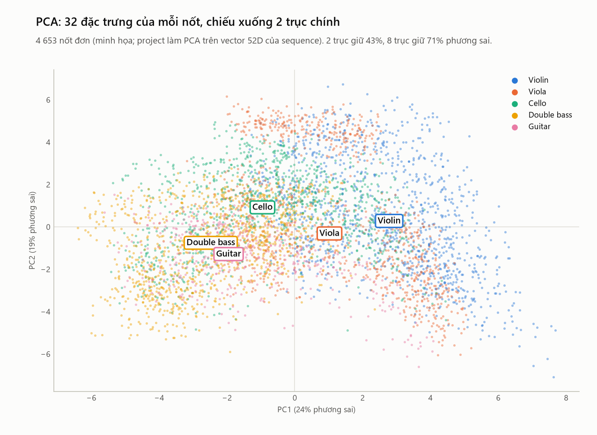

# 20. PCA — giảm số chiều mà vẫn giữ nhiều thông tin nhất

> **Đọc xong file này bạn sẽ biết:** vì sao project phải giảm vector 52 chiều xuống 8 chiều; PCA là gì (trực giác trước, công thức sau, kèm ví dụ tính tay); "phương sai giữ lại" nghĩa là gì; tính chất **cận dưới**, thứ cho phép tìm kiếm vẫn chính xác sau khi giảm chiều; vì sao không dùng whitening; PCA trên dữ liệu thật của project cho thấy gì (kể cả một phát hiện về nguồn thu).
> **Cần biết trước:** [19](19_DISTANCE_SIMILARITY.md) (khoảng cách Euclid, chuẩn hóa z).
> **Đọc tiếp:** [21 R-tree](21_R_TREE.md).

---

## 1. Vì sao phải giảm số chiều

Mỗi file là một vector **52 chiều** ([18](18_FEATURE_VECTOR.md)). Để tìm nhanh, project đặt các vector vào **R-tree** ([21](21_R_TREE.md)), một cấu trúc chia không gian bằng các **hộp chữ nhật**. R-tree chỉ hiệu quả khi số chiều **thấp** (khoảng dưới 10):
- Ở 52 chiều, gần như mọi hộp đều **chồng lên nhau**, và khoảng cách từ truy vấn tới mọi điểm **xấp xỉ bằng nhau**. R-tree phải mở gần hết các hộp, tức là không nhanh hơn quét toàn bộ.
- Hiện tượng này gọi là **lời nguyền số chiều** ([21](21_R_TREE.md) §6).

**Cần:** một cách đưa 52 chiều về khoảng 8 chiều mà **mất ít thông tin nhất**, và **không làm sai** kết quả tìm kiếm. PCA làm được cả hai.

---

## 2. Trực giác: xoay trục theo hướng dữ liệu trải dài nhất

**Hình dung 2 chiều.** Một đám điểm có dạng **elip dẹt**, nằm chéo:
```
  y│            ·  ·
   │        · ·  ·          ← đám điểm trải dài theo đường chéo
   │     ·  · ·
   │  · · ·
   │ ·
   └────────────────── x
```
- Nhìn theo trục x hay y, đám điểm đều trải rộng: cần **cả 2** con số để mô tả mỗi điểm.
- **Xoay hệ trục** cho trục mới thứ nhất (PC1) nằm **dọc** theo hướng dài nhất. Khi đó gần như mọi khác biệt giữa các điểm nằm trên PC1, còn trục thứ hai (PC2, vuông góc) chỉ còn chút "độ dày" của elip.
- **Bỏ PC2**: mỗi điểm chỉ còn **1 con số** (vị trí trên PC1) mà mất rất ít thông tin.

**PCA** (*Principal Component Analysis*, phân tích thành phần chính) làm đúng việc đó trong nhiều chiều: tìm các trục mới **vuông góc** với nhau, xếp theo thứ tự dữ liệu **trải rộng nhất** (phương sai lớn nhất) tới hẹp nhất; giữ vài trục đầu, bỏ phần còn lại.

---

## 3. Công thức

```
X: N điểm × d chiều (đã chuẩn hóa z)            m = trung bình các điểm
Σ = (X − m)ᵀ (X − m) / (N − 1)                  ma trận hiệp phương sai, d × d
Σ = Q Λ Qᵀ                                       phân tích trị riêng: λ₁ ≥ λ₂ ≥ … ≥ λ_d
W = d' cột đầu của Q                             d × d', các cột vuông góc và dài 1
u = Wᵀ (x − m)                                   tọa độ mới: d' số
tỉ lệ phương sai giữ lại = (λ₁ + … + λ_d') / (λ₁ + … + λ_d)
```
| Thành phần | Ý nghĩa |
|---|---|
| **Hiệp phương sai** Σ_ij | Hai đặc trưng i, j có **cùng tăng cùng giảm** không. Dương lớn: cùng tăng; gần 0: không liên quan |
| **Vector riêng** (cột của Q) | Một **hướng** trong không gian: một trục mới |
| **Trị riêng** λ | Dữ liệu **trải rộng bao nhiêu** theo hướng đó (phương sai dọc trục) |
| `W` | "Phép xoay rồi bỏ bớt trục": giữ d' hướng trải rộng nhất |
| `u` | Tọa độ của điểm trên các trục mới |

**Ví dụ tính tay (2 chiều → 1 chiều).** 5 điểm: (1, 1.2), (2, 1.9), (3, 3.2), (4, 3.8), (5, 5.1).
1. Trung bình m = (3, 3.04).
2. Hiệp phương sai: Σ = [[2.500, 2.425], [2.425, 2.383]]. Hai chiều có hiệp phương sai lớn, tức là x và y gần như cùng tăng.
3. Trị riêng: λ₁ = **4.867**, λ₂ = **0.016**. Vector riêng thứ nhất: PC1 ≈ (0.716, 0.699), gần đường chéo 45°.
4. PC1 giữ 4.867 / (4.867 + 0.016) = **99.7%** phương sai. Bỏ PC2 gần như không mất gì.
5. Tọa độ mới (1 số mỗi điểm): −2.72, −1.51, 0.11, 1.25, 2.87.

---

## 4. Tính chất cận dưới — vì sao tìm kiếm vẫn chính xác

**Phát biểu.** Vì các cột của W vuông góc và dài 1, phép chiếu **không bao giờ làm dài** khoảng cách:
```
‖u_a − u_b‖ = ‖Wᵀ (x_a − x_b)‖  ≤  ‖x_a − x_b‖
```
**Trực giác.** Chiếu một cái que lên mặt đất: bóng của nó **ngắn hơn hoặc bằng** chiều dài que, không bao giờ dài hơn. Bỏ bớt trục cũng chỉ **bỏ bớt** phần chênh lệch nằm trên các trục đó.

**Ví dụ (§3):** điểm 2 và điểm 3 cách nhau 1.640 trong 2 chiều, còn trên PC1 là 1.624 ≤ 1.640 ✓.

**Vì sao quan trọng.** Khoảng cách ở 8 chiều là **cận dưới** của khoảng cách thật ở 52 chiều. Nếu một điểm **đã xa** truy vấn ở 8 chiều, thì ở 52 chiều nó **còn xa hơn**. Vì vậy có thể:
1. **Lọc** ứng viên nhanh bằng R-tree ở 8 chiều.
2. **Tinh chỉnh** bằng khoảng cách thật 52 chiều trên số ít ứng viên.
3. **Dừng** đúng lúc mà **chắc chắn không bỏ sót** kết quả nào.

Đây là khung **lọc rồi tinh chỉnh** (GEMINI) của CSDL đa phương tiện ([21](21_R_TREE.md) §5). Số chiều giữ lại (8) chỉ ảnh hưởng **số ứng viên** phải tinh chỉnh (tốc độ), **không** ảnh hưởng độ chính xác của Top-5.

**Kiểm chứng trên dữ liệu thật** (§6): 9 999 cặp nốt ngẫu nhiên, tỉ lệ (khoảng cách 8 chiều / khoảng cách 32 chiều) lớn nhất là **0.982**, trung vị 0.836. **Không cặp nào vi phạm** cận dưới (`reports/theory/pca_lower_bound_check.csv`).

### Vì sao KHÔNG dùng whitening
**Whitening** chia thêm mỗi trục cho √λ, để mọi trục có phương sai 1. Với các trục có λ < 1, phép chia làm khoảng cách **dài ra**, nên tính chất cận dưới **mất** và tìm kiếm có thể bỏ sót kết quả. Project đặt `whiten = False`.

---

## 5. Quy tắc dùng đúng trong project

```
v (52 chiều) → chuẩn hóa z (scaler_file, tính trên 500 file CSDL) → cân bằng khối ([19] §4) → v'
v' → PCA 8 chiều (tính trên 500 file CSDL, whiten = False) → u (8 số) → R-tree
```
| Câu hỏi | Trả lời |
|---|---|
| Tính PCA trên tập nào? | **500 vector của CSDL**, chính là bộ sưu tập được tìm kiếm. Không dùng truy vấn, phrase, unseen |
| Truy vấn thì sao? | Chỉ **áp** phép biến đổi đã có (`transform`), không tính lại. Tính lại sẽ ra hệ trục khác, tọa độ không so được |
| Phải chuẩn hóa trước? | **Có**. Nếu không, trục chính sẽ chỉ chạy theo đặc trưng có thang lớn ([19](19_DISTANCE_SIMILARITY.md) §3) |
| Giữ bao nhiêu chiều? | **8** (mục chờ P04: thử 5–6 nếu số ứng viên quá nhiều) |
| Có cần giữ 95% phương sai? | **Không**: kết quả cuối vẫn tính trên 52 chiều (§4) |

Chi tiết: [NORMALIZATION_PCA](../05_PART_2/02_INDEX/NORMALIZATION_PCA.md).

---

## 6. PCA trên dữ liệu thật: 32 đặc trưng của 4 653 nốt

Project làm PCA trên vector 52 chiều của **sequence** (Bước 9–10, chưa có). Để thấy PCA làm gì với âm thanh thật, phần này chạy PCA trên vector **32 chiều của từng nốt đơn** (đúng bộ đặc trưng [15](15_AUDIO_FEATURES.md) §14; F0 lấy theo tên nốt) (`scripts/theory_figures.py`).



**Phương sai giữ lại** (`reports/theory/pca_notes_explained.csv`):

| Số trục giữ | 1 | 2 | 3 | 8 | 12 | 18 | 22 |
|---|---|---|---|---|---|---|---|
| % phương sai | 24% | 43% | 51% | **71%** | 80% | 90% | 95% |

Phương sai trải khá đều trên nhiều trục: 8 trục giữ 71%, phải tới 22 trục mới giữ 95%. Điều này hợp với [15](15_AUDIO_FEATURES.md): không có một hai đặc trưng nào quyết định tất cả.

**Trục 1 (PC1, 24%) = trục "sáng – tối / cao – trầm".** Các đặc trưng đóng góp nhiều nhất: centroid (+0.34), log2 F0 (+0.33), rolloff (+0.33), MFCC c1 (−0.31), ZCR (+0.28), bandwidth (+0.28). Trên hình, violin nằm bên phải, double bass và guitar bên trái. Nhạc cụ giải thích **48%** biến thiên dọc trục này.

**Trục 2 (PC2, 19%) = chủ yếu là NGUỒN THU.** Đóng góp nhiều nhất: MFCC c2, c6, RMS-CV và các MFCC std. Đây đúng là những đặc trưng [15](15_AUDIO_FEATURES.md) đã chỉ ra là nhạy với phòng thu. Dọc PC2, **nguồn thu giải thích 23%** biến thiên, **nhạc cụ chỉ 10%** (`pca_notes_axes_eta2.csv`). Trên hình, violin và viola tách thành hai đám trên – dưới: đám trên là nốt Iowa (PC2 trung bình +3.9 với violin, +4.5 với viola), đám dưới là Philharmonia (−0.5 và −1.2).

**Đọc kết quả:** hướng biến thiên **lớn thứ hai** của dữ liệu không phải là "nhạc cụ nào" mà là "thu ở đâu". Đây là cùng một phát hiện với thử nghiệm láng giềng gần nhất ở [15](15_AUDIO_FEATURES.md) §16.1, nhìn từ một góc khác. Hệ quả cho PCA của project: nếu không xử lý, một trong 8 trục của R-tree có thể dành phần lớn cho nguồn thu (mục chờ P12).

---

## 7. Áp dụng cho 5 nhạc cụ

| Nhạc cụ | Vị trí trên PC1 (sáng – tối) | Ghi chú |
|---|---|---|
| Violin | Phải nhất | Sáng nhất, cao nhất |
| Viola | Giữa – phải, **chồng lên violin** | Cặp khó: trên 2 trục đầu gần như trùng violin |
| Cello | Giữa | Trải rộng (âm vực rộng, chịu ảnh hưởng nguồn thu mạnh) |
| Double bass | Trái | Trầm, tối nhất |
| Guitar | Trái, **chồng lên double bass** | Trên 2 trục đầu gần double bass. Tách nhau ở các trục sau (đường bao, ZCR) |

Hai trục đầu chỉ giữ 43% phương sai, nên các đám **chồng nhau nhiều** trên hình 2D. Ở 8 trục (71%) và nhất là ở 52 chiều đầy đủ, chúng tách nhau tốt hơn nhiều. Đó là lý do bước tinh chỉnh cuối dùng **52 chiều** ([21](21_R_TREE.md) §5).
