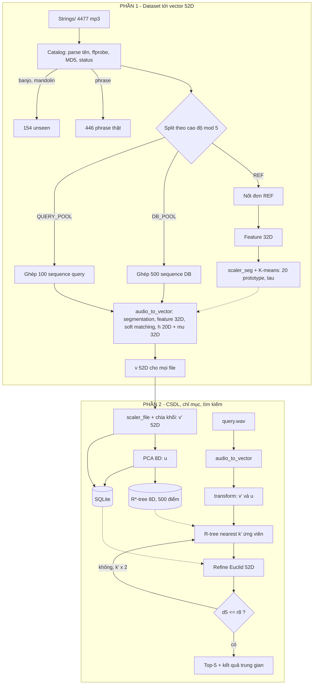

# MASTER WORKFLOW

## 1. Sơ đồ toàn hệ thống

## 2. Khối chức năng và vào/ra (đề mục 4a)

| Khối | Chức năng | Vào | Ra | Phần |
|---|---|---|---|---|
| Catalog | Kiểm kê, lọc lỗi, chia tập | `Strings/*.mp3` | `catalog.csv` | 1 |
| Synthesizer | Ghép multi-note | Nốt DB_POOL/QUERY_POOL | WAV + ground truth JSON | 1 |
| Preprocessor | Chuẩn hóa tín hiệu | File audio | y | 1 |
| Feature extractor | Đặc trưng segment | y, (start, end) | s 32D | 1 |
| Reference builder | Học prototype | s của REF | 20 prototype, τ | 1 |
| Segmenter | Tách nốt | y | Danh sách segment | 1 |
| Vectorizer | Gộp thành vector file | Segment, prototype | v 52D | 1 |
| Normalizer + PCA | Chuẩn hóa, giảm chiều | v | v' 52D, u 8D | 2 |
| Database | Lưu metadata + vector | Tất cả ở trên | `mmdb.sqlite` | 2 |
| Spatial index | R\*-tree | u của 500 DB | `rtree_v1` | 2 |
| Search engine | k-NN chính xác | v'_q, u_q | Top-5 | 2 |
| Query interface | CLI | File query | Top-5 + kết quả trung gian | 2 |

Chi tiết: [PART_1_WORKFLOW](PART_1_WORKFLOW.md), [PART_2_WORKFLOW](PART_2_WORKFLOW.md), [DATA_FLOW](DATA_FLOW.md).
