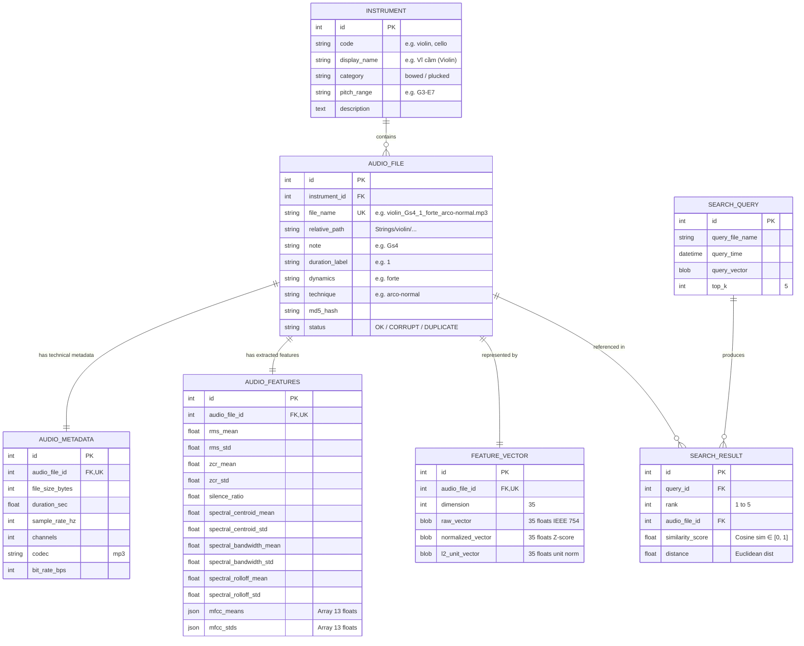

# 06. DATABASE DESIGN & SCHEMA SPECIFICATION

Tài liệu này thiết kế kiến trúc Cơ sở Dữ liệu Đa phương tiện (MMDBMS) cho hệ thống, áp dụng nguyên lý lưu trữ hỗn hợp (**Hybrid storage principle**) từ [Lecture 4 - MMDS Architecture](file:///D:/Ki1_4/HCSDLDPT/BTL/MMDB%20slides/Lecture%204%20-%20MMDS%20Architecture.pdf) và mô hình dữ liệu quan hệ hướng đối tượng (**Object-Relational Data Model**) từ [Lecture 5 - MM data model](file:///D:/Ki1_4/HCSDLDPT/BTL/MMDB%20slides/Lecture%205%20-%20MM%20data%20model.pdf).

---

## 1. Nguyên Lý Thiết Kế Lưu Trữ Đa Phương Tiện
Theo bài giảng Lecture 4 (Slide 8-15):
* **Lưu trữ BLOB âm thanh (Separation)**: Các file âm thanh nhị phân gốc `.mp3` được lưu trực tiếp trên hệ thống tệp tin (File System) dưới thư mục `Strings/`. CSDL chỉ lưu đường dẫn tương đối (`relative_path`) và mã băm MD5 để tránh phình to kích thước database và tận dụng tối đa cơ chế I/O buffer của hệ điều hành.
* **Lưu trữ Metadata & Đặc trưng (Homogeneity)**: Toàn bộ thông tin cấu trúc, thông tin định danh, kỹ thuật và vector đặc trưng số học được lưu trữ tập trung trong CSDL quan hệ (SQLite hoặc PostgreSQL).
* **Kết hợp (Hybrid Principle)**: Giúp các truy vấn lọc theo metadata (như lọc kỹ thuật diễn tấu, lọc dải nốt) kết hợp với truy vấn vector tương đồng (Content-based similarity query) được thực thi trong cùng một hệ quản trị.

---

## 2. Sơ Đồ Thực Thể Quan Hệ (Mermaid ERD)



---

## 3. Đặc Tả Chi Tiết Các Bảng Dữ Liệu

### 3.1. Bảng `instruments` (Danh mục nhạc cụ)
* `id` (`INTEGER PRIMARY KEY AUTOINCREMENT`): Định danh duy nhất.
* `code` (`VARCHAR(50) UNIQUE NOT NULL`): Mã nhạc cụ (`banjo`, `cello`, `double bass`, `guitar`, `mandolin`, `viola`, `violin`).
* `display_name` (`VARCHAR(100)`): Tên hiển thị người dùng.
* `category` (`VARCHAR(50)`): Phân loại họ dây (`bowed_string`, `plucked_string`).
* `pitch_range` (`VARCHAR(50)`): Dải cao độ chuẩn.
* `description` (`TEXT`): Mô tả đặc điểm âm học và lịch sử nhạc cụ.

### 3.2. Bảng `audio_files` (Thực thể file âm thanh)
* `id` (`INTEGER PRIMARY KEY AUTOINCREMENT`): Khóa chính OID.
* `instrument_id` (`INTEGER NOT NULL, FK -> instruments.id`): Nhạc cụ sở hữu.
* `file_name` (`VARCHAR(255) UNIQUE NOT NULL`): Tên file vật lý.
* `relative_path` (`VARCHAR(500) NOT NULL`): Đường dẫn lưu trữ tương đối từ thư mục gốc project.
* `note` (`VARCHAR(10)`): Nốt nhạc được gán nhãn trong tên file (ví dụ: `Gs4`, `C2`).
* `duration_label` (`VARCHAR(20)`): Nhãn thời lượng danh định (`025`, `05`, `1`, `very-long`, `phrase`...).
* `dynamics` (`VARCHAR(30)`): Nhãn cường độ (`pianissimo`, `forte`...).
* `technique` (`VARCHAR(50)`): Kỹ thuật diễn tấu (`arco-normal`, `pizz-normal`, `tremolo`...).
* `md5_hash` (`CHAR(32)`): Mã băm MD5 kiểm tra tính toàn vẹn và trùng lặp.
* `status` (`VARCHAR(20)`): Trạng thái file (`OK`, `CORRUPT`, `DUPLICATE`).

### 3.3. Bảng `audio_metadata` (Thông số kỹ thuật đa phương tiện)
* `id` (`INTEGER PRIMARY KEY AUTOINCREMENT`): Khóa chính.
* `audio_file_id` (`INTEGER UNIQUE NOT NULL, FK -> audio_files.id`): Liên kết 1-1 với file.
* `file_size_bytes` (`INTEGER`): Kích thước file theo bytes.
* `duration_sec` (`FLOAT`): Thời lượng thực tế (giây).
* `sample_rate_hz` (`INTEGER`): Tần số lấy mẫu ($44,100\text{ Hz}$).
* `channels` (`INTEGER`): Số kênh âm thanh ($1$ - Mono).
* `codec` (`VARCHAR(20)`): Định dạng codec (`mp3`).
* `bit_rate_bps` (`INTEGER`): Tốc độ bit rate (bps).

### 3.4. Bảng `audio_features` (Đặc trưng âm học chi tiết)
* `id` (`INTEGER PRIMARY KEY AUTOINCREMENT`): Khóa chính.
* `audio_file_id` (`INTEGER UNIQUE NOT NULL, FK -> audio_files.id`): Liên kết 1-1.
* Các trường scalar:
  * `rms_mean`, `rms_std` (`FLOAT`): Năng lượng trung bình và độ biến động.
  * `zcr_mean`, `zcr_std` (`FLOAT`): Tỷ lệ cắt điểm 0.
  * `silence_ratio` (`FLOAT`): Tỷ lệ khoảng lặng.
  * `spectral_centroid_mean`, `spectral_centroid_std` (`FLOAT`): Trọng tâm phổ.
  * `spectral_bandwidth_mean`, `spectral_bandwidth_std` (`FLOAT`): Độ rộng dải phổ.
  * `spectral_rolloff_mean`, `spectral_rolloff_std` (`FLOAT`): Tần số cuộn phổ 85%.
* Các trường mảng vector:
  * `mfcc_means` (`JSON` / `TEXT`): Danh sách 13 giá trị trung bình MFCC.
  * `mfcc_stds` (`JSON` / `TEXT`): Danh sách 13 độ lệch chuẩn MFCC.

### 3.5. Bảng `feature_vectors` (Vector đặc trưng phục vụ tìm kiếm)
* `id` (`INTEGER PRIMARY KEY AUTOINCREMENT`): Khóa chính.
* `audio_file_id` (`INTEGER UNIQUE NOT NULL, FK -> audio_files.id`): Liên kết 1-1.
* `dimension` (`INTEGER DEFAULT 35`): Số chiều của vector (35-D).
* `raw_vector` (`BLOB`): 35 số thực float32 nhị phân liền kề (140 bytes).
* `normalized_vector` (`BLOB`): 35 số thực sau chuẩn hóa Z-score.
* `l2_unit_vector` (`BLOB`): 35 số thực sau chuẩn hóa L2 norm (phục vụ tính Cosine Similarity nhanh bằng tích vô hướng BLAS/NumPy).

---

## 4. Ví Dụ Một Bản Ghi Thực Tế Trong CSDL

```json
{
  "audio_file": {
    "id": 1042,
    "file_name": "violin_Gs4_1_forte_arco-normal.mp3",
    "relative_path": "Strings/violin/violin_Gs4_1_forte_arco-normal.mp3",
    "instrument": "violin",
    "note": "Gs4",
    "duration_label": "1",
    "dynamics": "forte",
    "technique": "arco-normal",
    "status": "OK"
  },
  "metadata": {
    "file_size_bytes": 19018,
    "duration_sec": 1.489,
    "sample_rate_hz": 44100,
    "channels": 1,
    "codec": "mp3"
  },
  "features": {
    "rms_mean": 0.1425,
    "rms_std": 0.0381,
    "zcr_mean": 0.0812,
    "zcr_std": 0.0124,
    "silence_ratio": 0.065,
    "spectral_centroid_mean": 3241.6,
    "spectral_centroid_std": 482.3,
    "spectral_bandwidth_mean": 2105.4,
    "spectral_bandwidth_std": 298.1,
    "spectral_rolloff_mean": 5620.0,
    "spectral_rolloff_std": 810.2,
    "mfcc_means": [-182.4, 85.2, -14.6, 22.1, -8.3, 15.4, -6.1, 9.8, -4.2, 7.1, -3.5, 5.2, -1.8]
  },
  "feature_vector": {
    "dimension": 35,
    "l2_unit_vector": "[0.042, 0.011, ..., 0.128]"
  }
}
```
