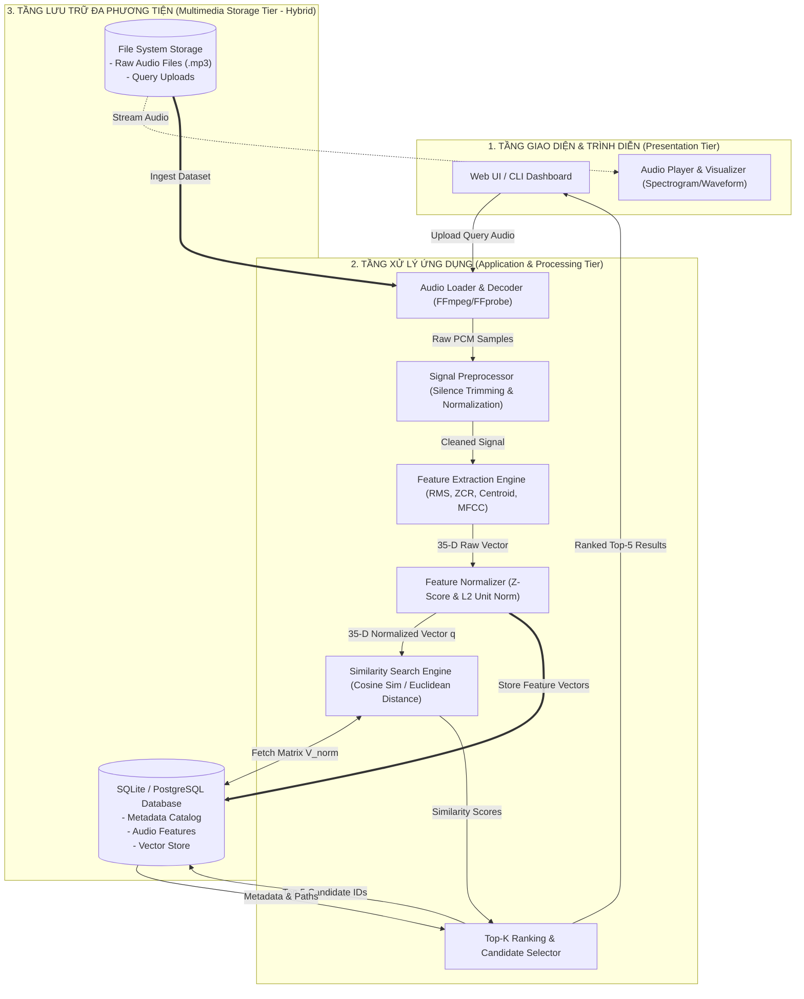

# 08. SYSTEM ARCHITECTURE & BLOCK DIAGRAM

Tài liệu này trình bày sơ đồ khối kiến trúc tổng thể của hệ thống CBAR (Content-Based Audio Retrieval) phục vụ lưu trữ và tìm kiếm tiếng nhạc cụ bộ dây, tuân thủ nguyên lý kiến trúc 3 tầng (**3-Tier Architecture**) và nguyên lý tổ chức dữ liệu hỗn hợp (**Hybrid Storage Principle**) từ [Lecture 4 - MMDS Architecture](file:///D:/Ki1_4/HCSDLDPT/BTL/MMDB%20slides/Lecture%204%20-%20MMDS%20Architecture.pdf) và [Lecture 10 - Indexing and Retrieval for Audio](file:///D:/Ki1_4/HCSDLDPT/BTL/MMDB%20slides/Lecture%2010%20-%20Indexing%20and%20Retrieval%20for%20Audio.pdf).

---

## 1. Sơ Đồ Khối Tổng Thể Hệ Thống (System Block Diagram)

---

## 2. Đặc Tả Chi Tiết Chức Năng Từng Module

| STT | Khối / Module | Chức năng chính | Dữ liệu Đầu vào (Input) | Dữ liệu Đầu ra (Output) | File/Công nghệ liên quan |
| :---: | :--- | :--- | :--- | :--- | :--- |
| **1** | **Audio Loader & Decoder** | Đọc các định dạng âm thanh nén (.mp3, .wav), giải mã thành mảng số thực tuyến tính Mono PCM. | Đường dẫn file hoặc file stream nhị phân tải lên. | Mảng tín hiệu âm thanh `1D numpy array (float32)` và sample rate `sr=44100`. | `FFmpeg`, `subprocess`, `scipy.io.wavfile` |
| **2** | **Signal Preprocessor** | Cắt bỏ khoảng lặng đầu/cuối (silence trimming); chuẩn hóa biên độ cực đại (peak/loudness normalization). | Mảng tín hiệu thô. | Tín hiệu đã lọc sạch khoảng lặng, biên độ chuẩn hóa trong $[-1.0, 1.0]$. | `numpy`, bộ lọc năng lượng năng động |
| **3** | **Feature Extractor** | Phân khung (framing), đặt cửa sổ Hann (windowing), tính STFT, trích xuất 7 nhóm đặc trưng (RMS, ZCR, Centroid, Bandwidth, Rolloff, MFCCs) và tính trung bình/độ lệch chuẩn. | Tín hiệu âm thanh sạch. | Vector đặc trưng thô 35 chiều (Raw Feature Vector $x \in \mathbb{R}^{35}$) và các ma trận trung gian (Spectrogram, MFCC map). | `numpy.fft`, `scipy.fft`, `scipy.signal` |
| **4** | **Feature Normalizer** | Chuẩn hóa vector đặc trưng theo tham số thống kê toàn cục $(\mu, \sigma)$ của CSDL và chuẩn hóa độ dài đơn vị L2. | Vector thô 35 chiều. | Vector chuẩn hóa Z-score ($\hat{x}$) và Vector đơn vị ($q_{\text{norm}}$). | `numpy`, ma trận thống kê CSDL |
| **5** | **Multimedia Storage Engine** | Quản lý bảng CSDL quan hệ lưu trữ Metadata, đặc trưng và vector; đồng bộ với kho file vật lý trên đĩa. | Thông tin file, metadata, vector chuẩn hóa. | Lưu bản ghi vào SQLite; cung cấp ma trận vector $V_{\text{norm}}$ khi truy vấn. | `SQLAlchemy`, `sqlite3` |
| **6** | **Similarity Search Engine** | Tính toán độ tương đồng giữa vector truy vấn $q_{\text{norm}}$ và toàn bộ vector trong CSDL bằng tích vô hướng Cosine hoặc khoảng cách Euclid. | Vector truy vấn $q_{\text{norm}}$ và Ma trận vector CSDL $V_{\text{norm}}$. | Mảng điểm số tương đồng (Similarity Scores $\in [0, 1]$) cho tất cả $M$ file. | Phép nhân ma trận vector `np.dot(V, q)` |
| **7** | **Ranking & Selector** | Lọc và sắp xếp giảm dần theo điểm số tương đồng; trích xuất 5 bản ghi có điểm cao nhất; kết hợp metadata từ CSDL. | Mảng điểm số tương đồng. | Danh sách Top-5 gồm: Hạng (1-5), Tên file, Nhạc cụ, Nốt nhạc, Kỹ thuật, Điểm tương đồng, Khoảng cách. | `np.argsort`, Query Builder |
| **8** | **Presentation Layer (UI/CLI)** | Hiển thị giao diện người dùng: cho phép chọn/tải file âm thanh truy vấn, hiển thị bảng kết quả Top 5, trực quan hóa Spectrogram và cho phép nghe thử âm thanh. | Danh sách Top 5 và dữ liệu trung gian. | Giao diện đồ họa tương tác (Web HTML/JS) hoặc CLI console. | `FastAPI`, HTML5/CSS, `matplotlib` |
