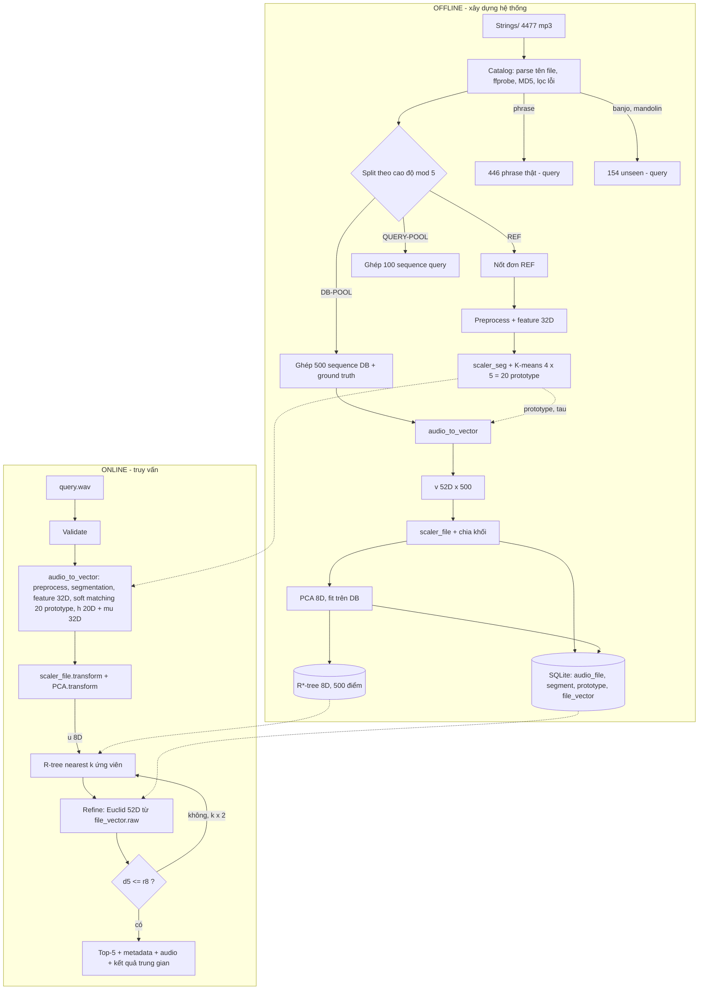

# 17. IMPLEMENTATION ROADMAP — Phương hướng thực hiện toàn bộ BTL

> **Đề tài:** Xây dựng hệ CSDL lưu trữ và tìm kiếm tiếng nhạc cụ bộ dây
> **Phạm vi tài liệu:** thiết kế + giải thích + roadmap. **Không có implementation.** Chỉ có công thức, pseudocode, DDL thiết kế.
> **Ngày lập:** 07/10/2026
> **Trạng thái:** tài liệu này **thay thế** các phần mâu thuẫn trong `docs/00`–`docs/16` (xem §2.14 và §21). Khi có xung đột, tài liệu này được ưu tiên.

---

## 0. Cách đọc tài liệu này

- §1 trả lời ngắn 16 câu hỏi cốt lõi. Nếu chỉ có 5 phút, hãy đọc §1, §18 và phần A–D ở cuối.
- §2 là audit thực tế, gồm các con số đã đo trực tiếp trên `Strings/`.
- §3 đến §17 là thiết kế chi tiết theo đúng thứ tự pipeline.
- §18 là **PHƯƠNG ÁN CHÍNH đã chốt**.
- §19 là roadmap theo phase.

### 0.1. Tám khái niệm phải phân biệt (dùng xuyên suốt tài liệu)

| Khái niệm | Là gì | Kích thước điển hình | Có lưu trong CSDL? |
|---|---|---|---|
| **Raw audio** | Chuỗi mẫu PCM sau khi giải mã file (mono, 22 050 Hz) | ~22 050 số/giây | Không. CSDL chỉ lưu đường dẫn, file nằm trên đĩa |
| **Frame** | Cửa sổ 2048 mẫu (≈ 93 ms), bước nhảy 512 mẫu (≈ 23 ms) | ~43 frame/giây | **Không bao giờ.** Frame chỉ là dữ liệu trung gian trong RAM |
| **Segment** | Một đoạn liên tục của file, *hy vọng* tương ứng một nốt, do thuật toán segmentation tìm ra | 0.12–2 s | Có (bảng `segment`: start, end, vector 32D), dùng cho minh họa |
| **Segment feature vector** `s` | Vector 32D mô tả âm sắc của **một segment** (tổng hợp từ các frame của nó) | 32D | Có (BLOB trong `segment`) |
| **Reference prototype** `P_j` | Tâm cụm K-means của các vector nốt đơn tham chiếu thuộc **một nhạc cụ** | 20 prototype × 32D | Có (bảng `prototype`) |
| **File-level vector** `v` | **MỘT** vector duy nhất đại diện cho **cả file** = [histogram prototype 20D ‖ trung bình segment 32D] | 52D | Có (`file_vector.raw`) |
| **Indexed vector** `u` | `v` sau chuẩn hóa và PCA. Đây là **điểm** được đưa vào R-tree | 8D | Có (`file_vector.pca`) và nằm trong file R-tree |
| **Database record** | Một dòng `audio_file` (metadata) + một dòng `file_vector` + một entry trong R-tree. **1 file = 1 record** | — | Có |

> Một câu cần nhớ: **frame → segment → (so với prototype) → file-level vector 52D → PCA 8D → một điểm trong R-tree → một record.**

---

## 1. Trả lời nhanh 16 câu hỏi cốt lõi

| # | Câu hỏi | Trả lời ngắn (chi tiết ở mục) |
|---|---|---|
| 1 | Tôi đang xây dựng cái gì? | Một hệ **CBAR** (Content-Based Audio Retrieval): CSDL 500 file multi-note của 5 nhạc cụ dây. Mỗi file được biểu diễn bằng một vector cố định và được đánh chỉ mục bằng R-tree. Nhận một file truy vấn và trả về Top-5 file có âm sắc gần nhất. (§18) |
| 2 | Tại sao phải thu thập single-note? | Nốt đơn là mẫu **"sạch"**, có nhãn chắc chắn (nhạc cụ, cao độ, kỹ thuật), chỉ chứa một sự kiện âm thanh. Đây là nguyên liệu tốt nhất để học "trông một nốt violin/cello… trong không gian đặc trưng sẽ ra sao". (§3, §7) |
| 3 | Single-note dùng để làm gì? | Có **hai vai trò tách biệt**: (a) tập **REF** dùng học 20 prototype âm sắc; (b) tập **DB-POOL / QUERY-POOL** là nguyên liệu ghép thành file multi-note. Hai tập này **không giao nhau**. (§3, §16) |
| 4 | Multi-note dùng để làm gì? | Là **đối tượng được lưu và tìm kiếm** (500 record trong CSDL), đồng thời là dạng của file truy vấn. (§3) |
| 5 | Một file audio biến thành vector như thế nào? | Tiền xử lý → segmentation → mỗi segment thành `s` (32D) → so `s` với 20 prototype → lấy trung bình phân bố mềm thành histogram `h` (20D) → nối với trung bình `s` (32D) → `v` (52D). (§8, §9) |
| 6 | Tại sao phải segmentation? | Để so sánh **từng nốt** với thư viện nốt đơn. Đơn vị của REF là "một nốt", nên đơn vị so sánh phía multi-note cũng phải là "một nốt", nếu không sẽ so sánh khập khiễng. (§6) |
| 7 | Segmentation bằng thuật toán gì? | Kết hợp phát hiện vùng có âm theo năng lượng (RMS) với onset detection bằng **SuperFlux** (spectral flux có lọc vibrato) và peak-picking, sau đó hậu xử lý (gộp segment quá ngắn, chặt segment quá dài). (§6) |
| 8 | Feature extraction bằng thuật toán gì? | STFT (Hann 2048/512), MFCC 1–13 (mean + std), log-Centroid, log-Bandwidth, log-Rolloff, ZCR, hệ số biến thiên RMS, median log-f0 (pYIN). Tổng cộng **32D cho mỗi segment**. (§5) |
| 9 | Single-note và multi-note liên hệ thế nào? | Thông qua **prototype**: mọi segment của multi-note được đo khoảng cách tới 20 prototype học từ single-note REF. Kết quả là "file này giống violin-cụm-2 bao nhiêu %, cello-cụm-1 bao nhiêu %…". (§7) |
| 10 | Vector được tạo chính xác như thế nào? | `v = [h_1..h_20 ‖ μ_1..μ_32]`, với `h_j = Σ_i dur_i·w_ij / Σ_i dur_i` và `w_ij = softmax_j(−‖z_i − P_j‖²/τ)`. (§7.4, §8) |
| 11 | Tại sao 500 file phải cùng số chiều? | Khoảng cách Euclid, PCA và R-tree đều chỉ định nghĩa được giữa các điểm **trong cùng một không gian ℝ^d**. Nếu vector khác chiều thì không có phép so sánh nào. (§8.3) |
| 12 | R-tree nằm ở bước nào? | Sau PCA. R-tree đánh chỉ mục **500 điểm 8D** (không lưu audio). Khi truy vấn, R-tree sinh **tập ứng viên**, sau đó tính khoảng cách chính xác 52D để xếp hạng. (§12) |
| 13 | Query đi qua những bước nào? | **Đúng hàm `audio_to_vector()`** đã dùng để xây CSDL, nhưng dùng các tham số đã được fit (scaler, prototype, PCA) chứ không fit lại. Sau đó tìm k-NN qua R-tree, re-rank, trả Top-5. (§14) |
| 14 | Similarity tính thế nào? | Khoảng cách **Euclid** trên vector 52D đã chuẩn hóa. Điểm hiển thị `sim = 1/(1+d)`. (§11) |
| 15 | Làm sao lấy Top-5? | Dùng thuật toán k-NN **nhiều bước, chính xác** (filter-and-refine): R-tree lấy ứng viên theo khoảng cách 8D, khoảng cách này là **cận dưới** của khoảng cách 52D, nên có thể dừng sớm mà vẫn đúng tuyệt đối. (§12.4) |
| 16 | Đánh giá đúng/sai thế nào? | Ground truth là **cùng nhạc cụ**. Đo P@5, Top-1, Hit@5, MRR trên 100 query giữ riêng, 446 phrase thật, và 154 file banjo/mandolin (nhạc cụ chưa có). Ngoài ra đo F-measure của segmentation, độ chính xác của R-tree so với brute-force, và latency. (§15) |

---

## 2. Audit project hiện tại (số liệu đo trực tiếp ngày 07/10/2026)

### 2.1. Dataset có bao nhiêu file?
- **4 477 file `.mp3`** trong `Strings/`, cùng 7 file `.zip` gốc và 1 file rác `double bass/_notes/dwsync.xml`.
- 100% tên file đúng mẫu 5 thành phần (đã kiểm tra bằng script, không có file sai mẫu).

### 2.2. Có những nhạc cụ nào?

| Nhạc cụ | Tổng file | Nốt đơn (không phải phrase) | `phrase` | Nốt đơn kỹ thuật "cơ bản"¹ | Số cao độ khác nhau |
|---|---|---|---|---|---|
| violin | 1 502 | 1 249 | 253 | 969 | 49 |
| viola | 974 | 919 | 55 | 789 | 51 |
| cello | 889 | 825 | 64 | 768 | 49 |
| double-bass | 852 | 778 | 74 | 768 | 44 |
| guitar | 106 | 106 | **0** | 106 | 42 |
| banjo | 74 | 74 | 0 | — | 41 |
| mandolin | 80 | 80 | 0 | — | 39 |

¹ "Cơ bản" gồm `arco-normal`, `molto-vibrato`, `non-vibrato`, `pizz-normal` (bộ kéo vĩ) và `normal`, `harmonics` (guitar).

### 2.3. File hiện tại là single-note hay multi-note?
- **Phần lớn (4 031 file) là single-note** (isolated notes, thư viện kiểu Philharmonia).
- **446 file nhãn `phrase` là đoạn nhiều sự kiện âm thanh.** Tôi đã chạy thử một bộ đếm onset kiểu spectral flux trên 25 file mẫu: `phrase` cho median ≈ 10 onset/file, nốt đơn `_1_` cho median ≈ 3 (đây là onset **giả**, do vibrato và tiếng vĩ), còn guitar cho ≈ 1.
  - Thời lượng `phrase`: cello median 12.2 s, double-bass 9.4 s, viola 8.3 s, **violin chỉ 1.0 s** (phần lớn là trill, tremolo, spiccato ngắn).
  - `phrase` **không có nhãn từng nốt**: chỉ có cao độ đầu (hoặc cao độ danh nghĩa) và kỹ thuật.
- **Kết luận:** dataset là thư viện nốt đơn kèm 446 đoạn phrase. **Không có sẵn 500 file multi-note** của 5 nhạc cụ. Guitar hoàn toàn không có multi-note.

### 2.4. Metadata hiện có
- Từ **tên file**: instrument, note, nhãn độ dài, dynamics, technique.
- Từ **header** (ffprobe, đã đo trong docs/02): duration, sample_rate (100% là 44 100 Hz), channels (100% mono).
- Kích thước file, MD5 (đã đo trong docs/02).
- **Không có:** onset/offset của nốt trong file phrase, BPM, người chơi, nhạc cụ cụ thể (cây đàn nào), phòng thu.

### 2.5. Filename mã hóa gì?
`<instrument>_<note>_<duration-label>_<dynamics>_<technique>.mp3`, ví dụ `cello_As2_05_forte_arco-normal.mp3`.
- `note`: tên nốt + quãng tám (`As2` = A♯2, ký tự `s` = thăng).
- `duration-label`: `025`, `05`, `1`, `15`, `long`, `very-long`, `phrase`. Đây là **nhãn danh nghĩa lúc thu**, **không phải thời lượng thật**. Thời lượng thật phải đo (ví dụ có file `_1_` chỉ dài 0.08 s).
- `dynamics`: pianissimo … fortissimo, molto-pianissimo, cresc-decresc, crescendo, decrescendo.
- `technique`: 20+ giá trị, ví dụ `arco-normal`, `pizz-normal`, `arco-col-legno-battuto`, `natural-harmonic`, `harmonics` (guitar), `tremolo` (mandolin)…

### 2.6–2.9. Có pitch / intensity / technique / duration-SR-channel không?

| Thông tin | Có? | Nguồn | Ghi chú |
|---|---|---|---|
| Pitch / note | **Có** (cho nốt đơn) | Tên file | Với `phrase`, chỉ là nhãn đại diện, không phải chuỗi nốt |
| Intensity | **Có** (nhãn định tính) | Tên file | Không có giá trị dB tuyệt đối |
| Playing technique | **Có** | Tên file | Phân bố rất lệch: `arco-normal` chiếm áp đảo |
| Duration (thực đo) | **Có** | ffprobe | 0.08 s → 29.5 s |
| Sample rate / channel | **Có** | ffprobe | 44.1 kHz, mono, đồng nhất |
| Ranh giới nốt trong phrase | **Không** | — | Không đánh giá được segmentation trên phrase |

### 2.10. Dataset có phù hợp với ý tưởng "single-note reference + multi-note retrieval" không?
- **Phần reference: rất phù hợp**, vì có nhiều nốt đơn được gán nhãn sạch.
- **Phần 500 multi-note: KHÔNG có sẵn.** Phải **tự xây dựng** (đề bài cho phép "xây dựng/sưu tầm"). Phương án chốt (§3): **ghép (synthesize) chuỗi nốt** từ các nốt đơn giữ riêng, kèm ground truth ranh giới. 446 phrase thật được dùng làm **tập kiểm thử thực tế**.
- **Guitar là điểm yếu:** chỉ có 106 bản ghi. Chi tiết và cách giảm thiểu ở §16.4.
- **Banjo và mandolin:** phù hợp làm truy vấn cho trường hợp **"nhạc cụ không có trong dữ liệu"**, một yêu cầu bắt buộc của đề (mục 4).

### 2.11. Những phần nào đã làm
- Thu thập dataset (4 477 file).
- `Strings/scan_dataset.py`: parse tên file + ffprobe, xuất CSV. **Lưu ý:** `DATA_DIR = D:\Ki1_4\HCSDLDPT\Strings` **sai đường dẫn** (thư mục thực tế là `D:\Ki1_4\HCSDLDPT\BTL\Strings`), nên script chưa chạy được ở vị trí hiện tại và `metadata_strings.csv` chưa tồn tại.
- Audit dữ liệu thủ công (docs/02): phát hiện 1 file hỏng (`viola_D6_05_piano_arco-normal.mp3`) và 2 cặp trùng MD5.

### 2.12. Những phần mới chỉ là tài liệu
Toàn bộ docs/04–12: đặc trưng 35D, schema SQLite, cosine search, kiến trúc, query pipeline, đánh giá, demo. **Không có dòng code nào** cho tiền xử lý, đặc trưng, CSDL, tìm kiếm hay giao diện.

### 2.13. Những phần đang thiếu
1. Bộ 500 file multi-note (chưa có nguồn).
2. Segmentation (chưa từng được đề cập trong docs cũ).
3. Reference prototype (chưa được đề cập).
4. R-tree (docs cũ chỉ ghi "nếu mở rộng lên hàng triệu file").
5. Kế hoạch split và chống data leakage.
6. Ground truth và protocol đánh giá cụ thể.
7. Thư viện: máy hiện **chưa có** `librosa`, `soundfile`, `scikit-learn`, `rtree` (đã có `numpy`, `scipy`, `matplotlib`, `fastapi`, ffmpeg/ffprobe, Python 3.13.9).

### 2.14. Mâu thuẫn giữa tài liệu cũ và ý tưởng mới

| Tài liệu cũ nói | Thực tế / ý tưởng mới | Xử lý |
|---|---|---|
| README đánh dấu "✅ Hoàn thành" cho yêu cầu 2, 3, 4 | Chưa có code | Sửa README thành "Đã thiết kế" |
| docs/02: toàn bộ 4 477 file là "single note" | Có 446 file `phrase` nhiều nốt | Cập nhật docs/02 |
| CSDL = toàn bộ 4 476 nốt đơn của 7 nhạc cụ | CSDL = 500 multi-note của 5 nhạc cụ; banjo và mandolin là truy vấn "unseen" | Cập nhật docs/00, 01, 06 |
| Vector 35D ở **mức file**, tính trên mọi frame | Vector 32D ở **mức segment**, sau đó gộp thành 52D ở mức file | Cập nhật docs/04, 05 |
| Có MFCC c0 và Silence Ratio | Bỏ c0 (chỉ phản ánh độ to) và Silence Ratio (phụ thuộc cách ghép, không phụ thuộc nhạc cụ) | Xem §5 |
| Giữ 44.1 kHz | Đưa về 22.05 kHz (lý do ở §4) | Cập nhật docs/05 |
| Cosine + quét tuyến tính; R-tree là "low priority" | **Euclid + R-tree bắt buộc** (filter-and-refine chính xác) | Cập nhật docs/07, 09 |
| Precision@5 = "cùng họ **hoặc** cùng phương thức" | Định nghĩa rõ: relevant = cùng nhạc cụ (§15) | Cập nhật docs/11 |
| Không có split, không nói tới leakage | Chia REF / DB-POOL / QUERY-POOL theo cao độ (§16) | Bổ sung |

---

## 3. Data model của dataset

### 3.1. Nguyên tắc
- **Không di chuyển, không sửa** `Strings/`. Đây là dữ liệu gốc (provenance). Việc chia tập là **logic**: mỗi bản ghi gốc được gán cột `split` trong CSDL.
- File multi-note sinh ra được ghi vào `data/` (định dạng **WAV 22 050 Hz mono 16-bit**, lossless, tránh nén MP3 lần hai).

### 3.2. Năm vai trò dữ liệu

| Vai trò | Nguồn | Số lượng (dự kiến) | Dùng để | Vào R-tree? |
|---|---|---|---|---|
| **A. REF** (reference single-note) | Nốt đơn 5 nhạc cụ, nhóm cao độ {0,1} mod 5 | ~1 360 | Fit scaler segment, học 20 prototype | Không |
| **B. DB sequences** (retrieval DB) | Ghép từ nốt đơn của **DB-POOL** (nhóm cao độ {2,3} mod 5) | **500** (100/nhạc cụ) | Là CSDL được tìm kiếm | **Có** |
| **C. QUERY sequences** | Ghép từ nốt đơn của **QUERY-POOL** (nhóm cao độ {4} mod 5) | 100 (20/nhạc cụ) | Truy vấn đánh giá chính thức | Không |
| **D. REAL phrases** | 446 file `phrase` (4 nhạc cụ kéo vĩ) | 446 | Truy vấn kiểm thử "âm nhạc thật" | Không |
| **E. UNSEEN** | Banjo 74 + mandolin 80 | 154 | Truy vấn "nhạc cụ không có trong CSDL" | Không |

Bị loại (`status ≠ OK`): 1 file hỏng, 2 cặp trùng MD5 (loại **cả hai** file của mỗi cặp vì không biết file nào đúng nhãn), các file < 0.2 s sau khi cắt lặng, và các kỹ thuật "đặc biệt" (col-legno, sul-ponticello, glissando, trill…) ở phiên bản v1. Các file này được giữ trong catalog với `split = NONE`.

### 3.3. Cấu trúc thư mục đề xuất

```
BTL/
├── Strings/                     # dữ liệu gốc, KHÔNG SỬA
├── data/                        # mọi thứ được sinh ra
│   ├── catalog.csv              # bảng source_note dạng CSV (Phase 1)
│   ├── sequences/
│   │   ├── db/      seq_violin_0001.wav … (500 file)
│   │   └── query/   q_violin_0001.wav … (100 file)
│   ├── ground_truth/            # 1 JSON/sequence: danh sách nốt, start/end
│   ├── models/                  # scaler_seg.npz, prototypes.npz, scaler_file.npz, pca.npz
│   ├── index/                   # rtree_v1.dat, rtree_v1.idx
│   └── mmdb.sqlite              # CSDL
├── src/strings_mmdb/            # code thư viện
├── scripts/                     # script chạy từng phase
├── app/                         # demo
└── tests/
```

### 3.4. Có cần train/test split không?
**Có, và bắt buộc.** Đây là hệ thống tìm kiếm, không phải bộ phân loại, nhưng vẫn có ba thành phần "học" từ dữ liệu: prototype, scaler và PCA. Nếu nốt dùng học prototype cũng nằm trong file truy vấn, kết quả đánh giá sẽ cao giả tạo. Chi tiết ở §16.

---

## 4. Single-note pipeline (tiền xử lý → prototype)

```
single-note .mp3
 → decode (ffmpeg) → mono → resample 22 050 Hz → float32 [-1,1]
 → peak-normalize (0.95)
 → trim lặng đầu/cuối (ngưỡng −40 dB so với max)
 → giới hạn 1.5 s đầu (giữ attack + phần sustain)
 → frame (Hann 2048, hop 512) → STFT
 → đặc trưng theo frame (§5) → aggregate trên frame "active"
 → s ∈ ℝ³² (một nốt đơn = một segment)
 → StandardScaler_seg (fit trên REF) → z
 → K-means theo từng nhạc cụ (k=4) → 20 prototype
```

| Câu hỏi | Quyết định | Lý do |
|---|---|---|
| 1. Normalize audio? | **Có**: peak normalize về 0.95 | Mức thu âm tuyệt đối phụ thuộc micro và gain, không phụ thuộc nhạc cụ. Normalize giúp ngưỡng segmentation ổn định. Lưu ý: dynamics vẫn ảnh hưởng âm sắc (forte sáng hơn), và điều này được giữ lại qua centroid/MFCC. |
| 2. Convert mono? | **Có** | Dataset đã mono. Query người dùng có thể stereo, nên lấy trung bình hai kênh. |
| 3. Sample rate? | **22 050 Hz cho mọi file** | Nyquist 11 kHz đã đủ cho thang Mel/MFCC và phần lớn năng lượng bồi âm của violin. Tính toán nhanh gấp đôi. Điều quan trọng nhất là **mọi file (DB và query) dùng cùng một SR**, vì MFCC, centroid và rolloff phụ thuộc SR. |
| 4. Silence trimming? | **Có** cho nốt đơn, ngưỡng −40 dB so với đỉnh | Lặng đầu/cuối làm lệch mean/std của đặc trưng. Với multi-note, phần lặng được xử lý trong segmentation (§6). |
| 5. Pre-emphasis? | **Không** | Pre-emphasis là quy ước của xử lý tiếng nói (bù độ dốc phổ của thanh quản). Ở đây độ dốc phổ **chính là thông tin âm sắc** cần giữ. Thêm pre-emphasis sẽ làm lệch centroid và rolloff. |
| 6. Frame length? | **2048 mẫu ≈ 93 ms** | Nốt thấp nhất là E1 = 41.2 Hz (chu kỳ 24 ms), nên frame phải chứa ≥ 3 chu kỳ để STFT và pYIN ổn định. Độ phân giải tần 10.8 Hz/bin. |
| 7. Hop length? | **512 mẫu ≈ 23 ms** (overlap 75%) | Đủ mịn cho ranh giới onset (dung sai đánh giá ±50 ms). Một giây có ~43 frame, nên std ổn định. |
| 8. Window? | **Hann** | Giảm rò rỉ phổ (sidelobe −31 dB). Là chuẩn của librosa và được dùng trong slide Lecture 10. |
| 9. FFT/STFT để làm gì? | Chuyển mỗi frame sang phổ biên độ `|X[k]|` | Mọi đặc trưng phổ (centroid, bandwidth, rolloff, Mel → MFCC, spectral flux) đều tính từ STFT. ZCR, RMS và f0 tính trên miền thời gian. |

**Lưu ý về tính khớp phân phối (nâng cao):** segment trong multi-note thường là *phần đầu* của nốt (dài 0.35–1.2 s). Vì vậy REF cũng chỉ lấy tối đa 1.5 s đầu để hai phía "trông giống nhau". Có thể thêm 1–2 crop ngẫu nhiên/nốt để tăng độ phủ.

---

## 5. Feature extraction

### 5.1. Phân tích từng đặc trưng

| Feature | Đo cái gì | Ý nghĩa âm học | Giúp phân biệt | Input → Output | Theo frame? | Aggregate đề xuất | Rủi ro dư thừa |
|---|---|---|---|---|---|---|---|
| **MFCC** | Hình bao phổ (spectral envelope) trên thang Mel, nén bằng DCT | **Âm sắc**: cộng hưởng của thùng đàn, formant | Violin ↔ viola ↔ cello (cùng cơ chế kéo vĩ, khác thân đàn); gảy ↔ kéo | STFT → Mel(128) → log → DCT → 14 hệ số/frame | Có | **Mean + Std** của c1..c13. **Bỏ c0** (chỉ là log-năng lượng, phụ thuộc độ to) | Các c bậc cao tương quan thấp nhờ DCT, nên ít dư |
| **Spectral Centroid** | "Trọng tâm" phổ Σf·|X|/Σ|X| (Hz) | **Độ sáng** | Violin sáng ↔ bass tối; sul ponticello sáng | \|X\| → 1 số/frame | Có | **Mean của log10(centroid)** (log để giảm lệch phân bố) | Tương quan cao với rolloff, bandwidth và MFCC c1 |
| **Spectral Bandwidth** | Độ trải phổ quanh centroid | Âm "dày/mỏng", nhiều bồi âm hay ít | Âm gảy (bồi âm tắt nhanh) ↔ kéo vĩ | \|X\|, centroid → 1 số/frame | Có | Mean của log | Tương quan với centroid |
| **Spectral Rolloff (85%)** | Tần số dưới đó chứa 85% năng lượng | Giới hạn trên "hữu ích" của phổ | Tương tự centroid nhưng nhạy với bồi âm cao | \|X\| → 1 số/frame | Có | Mean của log | Tương quan mạnh với centroid |
| **ZCR** | Tỷ lệ đổi dấu tín hiệu/frame | Độ "nhiễu"/cao tần (tiếng vĩ cọ dây, nhiễu hơi) | Tiếng sạch ↔ tiếng có tạp âm vĩ | y → 1 số/frame | Có | Mean | Tương quan với centroid; vẫn giữ 1 chiều vì nhạy với tạp âm không tuần hoàn |
| **RMS Energy** | Năng lượng trung bình/frame | **Đường bao thời gian** | Gảy (tắt dần, RMS giảm mạnh) ↔ kéo (ổn định) | y → 1 số/frame | Có | **Không** dùng mean (vì phụ thuộc độ to). Dùng **CV = std/mean** (bất biến với gain) | Thấp |
| **Chroma** | Năng lượng 12 lớp cao độ (C, C♯, …) | **Hòa âm/giai điệu**, gộp mọi quãng tám | Bài nhạc/hợp âm, **không phải nhạc cụ** | STFT → 12/frame | Có | — | **LOẠI**, xem 5.2 |
| **f0 (pYIN)** | Tần số cơ bản | **Cao độ / âm vực** | Bass (41–250 Hz) ↔ violin (196–3 500 Hz); bổ trợ khi âm sắc gần nhau (viola ↔ cello) | y → f0 + cờ voiced/frame | Có | **Median log2(f0)** trên frame voiced (median chống octave-error) | Tương quan vừa với centroid |

**Về các phép thống kê:**
- **Mean:** có, vì là "giá trị điển hình" của segment.
- **Std:** có cho MFCC, vì nắm biến thiên theo thời gian (vibrato, tắt dần của âm gảy). Không dùng cho centroid/bandwidth/rolloff để tránh phình số chiều.
- **Median:** chỉ dùng cho f0, vì pYIN hay nhảy quãng tám, median chống ngoại lai tốt hơn mean. Với các đặc trưng khác, median gần trùng mean nên dư thừa.

### 5.2. Tại sao loại Chroma (một chỉnh sửa có chủ đích)
Chroma trả lời câu hỏi *"nốt nào đang vang"*, không trả lời *"nhạc cụ nào đang chơi"*. Hai file violin chơi giai điệu khác nhau sẽ có chroma rất khác. Một file cello và một file violin cùng chơi Đô–Mi–Sol sẽ có chroma gần trùng. Đề bài yêu cầu tìm **"tiếng nhạc cụ"** tương đồng, nên Chroma sẽ kéo kết quả về phía "cùng giai điệu" thay vì "cùng nhạc cụ". Có thể dùng Chroma để *hiển thị* trong demo, nhưng **không** đưa vào vector.

### 5.3. CHỐT bộ đặc trưng segment-level: 32 chiều

| Chỉ số | Đặc trưng | Số chiều |
|---|---|---|
| 1–13 | Mean MFCC c1..c13 | 13 |
| 14–26 | Std MFCC c1..c13 | 13 |
| 27 | Mean log10(Spectral Centroid) | 1 |
| 28 | Mean log10(Spectral Bandwidth) | 1 |
| 29 | Mean log10(Spectral Rolloff 85%) | 1 |
| 30 | Mean ZCR | 1 |
| 31 | CV của RMS (std/mean) | 1 |
| 32 | Median log2(f0) trên frame voiced (nếu < 20% frame voiced thì gán giá trị trung bình REF và bật cờ `f0_missing`) | 1 |
| | **Tổng** | **32** |

- Mọi thống kê chỉ tính trên **frame active** của segment (RMS > −40 dB so với đỉnh file).
- Tham số pYIN: `fmin = 40 Hz` (E1), `fmax = 4 200 Hz` (violin trong dataset lên tới A♯7 ≈ 3 729 Hz).
- **Kiểm tra dư thừa (Phase 4):** tính ma trận tương quan 32×32 trên REF. Cặp nào có |r| > 0.95 thì bỏ bớt một (khả năng cao là rolloff ↔ centroid), và ghi lại quyết định.

---

## 6. Segmentation multi-note

### 6.1. Vì sao cần, và cần đúng tới mức nào
Mục tiêu **không phải** là "phiên âm" (transcription) chính xác. Mục tiêu là chia file thành các đơn vị **gần với một nốt**, để mỗi đơn vị so sánh được với thư viện nốt đơn. Biểu diễn file-level (§7) được thiết kế để **chịu được lỗi segmentation**: chia thừa hay gộp sót một nốt chỉ làm vector thay đổi ít (§7.6).

### 6.2. Phân tích các phương án

| Phương pháp | Nguyên lý | Mạnh | Yếu | Dùng? |
|---|---|---|---|---|
| **Energy-based** (RMS + ngưỡng) | Vùng có RMS > ngưỡng là có âm | Đơn giản; tách tốt các nốt có **khoảng lặng** giữa chúng; loại phần lặng | Không tách được nốt **liền nhau** (legato, gảy nối) | **Có**, ở bước 1 (tìm vùng active) |
| **Spectral flux** | Tổng mức **tăng** biên độ phổ giữa hai frame liên tiếp; nốt mới tạo cột bồi âm mới nên flux nhảy vọt | Bắt được nốt liền nhau khi phổ đổi | **Vibrato và tiếng vĩ tạo onset giả**. Probe trên dataset: một nốt kéo vĩ đơn cho 3–5 đỉnh | Có, ở dạng **SuperFlux** |
| **SuperFlux** (Böck & Widmer 2013) | Spectral flux trên log-Mel, nhưng trừ đi **max-filter theo trục tần số** của frame trước | Được thiết kế đúng để **khử onset giả do vibrato**, vấn đề chính của bộ kéo vĩ | Cần tinh chỉnh ngưỡng | **Có (lõi)** |
| **HPSS** | Tách thành phần harmonic/percussive | Hữu ích với nhạc có trống, nhiều nguồn | Dataset là **đơn nhạc cụ**, không có nguồn percussive cần loại; phần "percussive" của attack lại chính là dấu hiệu onset | **Không** (chỉ nhắc như nâng cao) |
| **Pitch tracking** (pYIN) | Ranh giới là nơi f0 đổi ổn định > 0.8 semitone | Bắt được **legato** (đổi nốt mà không có attack mới) | Chậm; lỗi quãng tám; glissando/vibrato gây đổi f0 liên tục | **Nâng cao** (bước 5 tùy chọn) |

### 6.3. Thuật toán CHỐT

```
INPUT : y (mono, 22 050 Hz, peak-normalized)
OUTPUT: danh sách segment [(start_s, end_s), ...]

1. ACTIVE REGIONS (energy):
   rms_db[t] = 20·log10(RMS[t] / max RMS)
   active[t] = rms_db[t] > −40 dB
   gộp các vùng active cách nhau < 50 ms; bỏ vùng active < 120 ms

2. ONSET STRENGTH (SuperFlux):
   M = log(1 + 10·MelSpec(y; n_fft=2048, hop=512, 128 band))
   Mmax = maximum_filter(M, size=3 theo trục tần số)
   flux[t] = Σ_f max(0, M[f,t] − Mmax[f,t−2])
   flux := flux / max(flux)

3. PEAK PICKING (adaptive):
   t là onset nếu:
     flux[t] = max(flux[t−3 .. t+3])                (cực đại cục bộ ±70 ms)
     flux[t] ≥ mean(flux[t−10 .. t+10]) + δ        (vượt trung bình động; δ ≈ 0.1, tune ở Phase 5)
     t − onset_trước ≥ 100 ms                      (min inter-onset interval)
   backtrack: dời onset về cực tiểu RMS gần nhất phía trước (bắt đầu attack)

4. HỢP NHẤT:
   boundaries = {đầu mỗi vùng active} ∪ {onset nằm trong vùng active}
   segment k = [boundary_k, min(boundary_{k+1}, cuối vùng active chứa nó))

5. (TÙY CHỌN, nâng cao) PITCH SPLIT:
   trong segment > 0.8 s, nếu median f0 của cửa sổ 60 ms đổi > 0.8 semitone
   và giữ ổn định ≥ 60 ms → thêm boundary

6. HẬU XỬ LÝ:
   - segment < 120 ms → gộp vào segment trước (không đủ ~5 frame để tính std)
   - segment > 2.0 s → chặt thành các khúc đều ≤ 1.0 s (xử lý legato bị sót, nốt ngân dài)
   - segment có mean rms_db < −35 dB → bỏ (đuôi vang, nhiễu)
   - file có 0 segment → báo lỗi "không phát hiện âm thanh"
```

**Smoothing:** có hai lớp làm mượt. (a) Trung bình động trong ngưỡng thích nghi ở bước 3. (b) Max-filter tần số của SuperFlux. Không cần lọc thêm.

### 6.4. Ví dụ minh họa

```
Audio:  |----A----|----B----|-------C-------|---D---|.....(lặng).....
time:   0.00     0.72      1.41            2.56    3.21              4.0

Bước 1 (energy): vùng active = [0.00, 3.21]          (sau 3.21 là lặng)
Bước 2–3 (SuperFlux): onset tại 0.00, 0.72, 1.41, 2.56
          (giả sử C có vibrato tạo một đỉnh nhỏ ở 1.95 nhưng không vượt ngưỡng δ → bị loại)
Bước 4: boundaries = {0.00, 0.72, 1.41, 2.56}, kết thúc vùng active = 3.21
   seg1 = [0.00, 0.72)   seg2 = [0.72, 1.41)   seg3 = [1.41, 2.56)   seg4 = [2.56, 3.21)
Bước 6: seg3 dài 1.15 s < 2.0 s → giữ nguyên.
→ 4 segment. Mốc 3.21 là OFFSET (điểm kết thúc), không phải onset.
   Năm mốc thời gian sinh ra bốn segment.
```

### 6.5. Giới hạn: thuật toán KHÔNG đảm bảo mỗi segment là một nốt

| Tình huống | Điều xảy ra | Chấp nhận được không? |
|---|---|---|
| **Legato** (đổi nốt không đổi hướng vĩ) | Không có attack, flux thấp, nên **2 nốt gộp thành 1 segment** | Có. Segment vẫn chứa âm sắc của đúng nhạc cụ; phần "chặt > 2 s" và pitch-split giảm thiểu được |
| **Hai nốt chồng nhau** (vang của nốt trước còn khi nốt sau bắt đầu, double-stop) | Segment chứa cả hai nốt, f0 có thể sai | Có. Âm sắc vẫn của một nhạc cụ (đề bảo đảm mỗi file một nhạc cụ). Median f0 giảm ảnh hưởng |
| **Vibrato, tremolo, trill** | Có nguy cơ **chia thừa** | Có. SuperFlux, min-IOI 100 ms và gộp < 120 ms giảm thiểu; chia thừa ít ảnh hưởng tới vector (§7.6) |
| **Noise / silence** | Energy gating loại phần lặng; nhiễu nền mạnh có thể tạo segment rác | Ngưỡng −35 dB loại phần lớn. Nhiễu nền thật sự mạnh là giới hạn đã biết |
| **Có cần giới hạn độ dài segment?** | **Có**: min 120 ms, max 2.0 s | Lý do đã nêu ở bước 6 |

**Cách đo:** trên các sequence tự ghép đã biết ranh giới, đo Onset F-measure (dung sai ±50 ms) và sai số số nốt (§15.3). Mục tiêu thực tế là **F ≥ 0.80**. Không hứa 100%.

---

## 7. Single-note reference kết hợp với multi-note như thế nào

### 7.1. Điểm cần sửa trong ý tưởng ban đầu: prototype theo **từng cao độ** là sai hướng

Ý tưởng gốc: `R1 = G4 violin arco, R2 = A4 violin arco, …`, mỗi segment được gán vào reference gần nhất, rồi lập histogram.

**Vấn đề 1: vector sẽ mã hóa giai điệu, không mã hóa nhạc cụ.** Xét ví dụ:

```
File X (violin): G4 A4 B4    → histogram có 1 ở các bin {violin-G4, violin-A4, violin-B4}
File Y (violin): D5 E5 F5    → histogram có 1 ở các bin {violin-D5, violin-E5, violin-F5}
File Z (cello) : C3 D3 E3    → histogram có 1 ở các bin {cello-C3, cello-D3, cello-E3}
```
X và Y **không chung bin nào**. Vì vậy ‖X−Y‖ = ‖X−Z‖ = √(6·(1/3)²) ≈ 0.816: hệ thống **không phân biệt được** "cùng là violin" với "khác nhạc cụ".

**Vấn đề 2: quá nhiều bin, quá thưa.** 5 nhạc cụ × ~45 cao độ × nhiều kỹ thuật cho ra **hàng trăm bin**, trong khi mỗi file chỉ có 4–8 nốt. Vector gần như toàn số 0, và R-tree/PCA trong không gian thưa như vậy vô nghĩa.

**Vấn đề 3:** gán đúng một segment vào "violin-A4" chính là bài toán **nhận dạng cao độ + nhạc cụ đồng thời**, khó hơn nhiều so với cái ta cần.

**Sửa:** prototype là các **cụm âm sắc theo từng nhạc cụ**, học bằng K-means, **không gắn với một cao độ cụ thể**. Mỗi nhạc cụ có k = 4 cụm, tự nhiên tương ứng với "âm vực thấp/trung/cao" hoặc "arco/pizz". Tổng cộng **20 prototype**. Ý tưởng "so với từng nốt reference" vẫn được giữ, nhưng làm **công cụ giải thích** trong demo: với mỗi segment, hiển thị "nốt REF gần nhất là `cello_D3_1_forte_arco-normal`" (§14).

### 7.2. Phân tích các phương án gộp S₁…Sₙ thành vector cố định

| PA | Cách làm | Số chiều | Ưu | Nhược | Kết luận |
|---|---|---|---|---|---|
| **A. Concatenate** | [S₁‖S₂‖…‖Sₙ] | 32·n, **thay đổi theo n** | Giữ hết thông tin | Không cố định chiều. Padding/cắt bớt làm "segment thứ 3 của file A" bị so với "segment thứ 3 của file B", hai thứ vô nghĩa khi đặt cạnh nhau | **Loại** |
| **B. Mean/Std pooling** | μ = Σ dur·zᵢ / Σ dur (và/hoặc std) | 32 (hoặc 64) | Đơn giản, cố định, bền với lỗi segmentation | **Không dùng reference**. Trung bình làm mất phân bố: một file nửa trầm nửa cao trông như file chỉ có âm vực trung | **Giữ, làm một nửa vector** |
| **C. Bag-of-Prototypes (hard)** | Mỗi segment được gán vào prototype gần nhất, đếm | 20 | Dễ hiểu; dùng reference | Không ổn định: segment nằm giữa hai prototype "nhảy bin" khi đặc trưng thay đổi nhẹ | Dùng để **giải thích** |
| **D. Histogram theo lớp nhạc cụ** | 5 bin = 5 nhạc cụ | 5 | Rất dễ hiểu | **Quá thô**: mọi file violin ≈ [1,0,0,0,0], nên Top-5 hòa điểm, không xếp hạng được | **Loại** |
| **E. Soft/weighted histogram** | Mỗi segment chia "phiếu" cho mọi prototype theo softmax khoảng cách, có trọng số theo thời lượng | 20 | Ổn định, liên tục, dùng reference, diễn giải được ("file 62% giống cụm cello-2") | Cần chọn nhiệt độ τ | **CHỌN, làm nửa còn lại** |
| **F. VLAD / Fisher** | Cộng dồn phần dư (z − Pⱼ) theo cụm | 20×32 = 640 (VLAD) | Rất mạnh trong truy vấn ảnh/âm thanh | 640D: **không thể đưa vào R-tree**, khó giải thích với sinh viên | **Loại** (nhắc là hướng mở rộng) |
| **G. Sequence (DTW, HMM)** | So khớp chuỗi segment theo thứ tự | Không cố định | Nắm giai điệu, nhịp | Không có vector cố định, nên **không dùng được R-tree**; đề bài cũng không yêu cầu thứ tự | **Loại** |

### 7.3. CHỐT: E + B ("Soft Bag-of-Prototypes" + "Mean pooling")

```
v (52D) = [ h₁ … h₂₀  ‖  μ₁ … μ₃₂ ]
          └ phần "so với thư viện nốt đơn" ┘ └ phần "âm sắc trung bình" ┘
```

- `h` trả lời: *file này phân bố giữa các kiểu âm sắc đã biết ra sao?* Đây là phần dùng reference.
- `μ` trả lời: *âm sắc trung bình tuyệt đối của file là gì?* Nó vẫn có nghĩa khi query thuộc nhạc cụ lạ, nằm ngoài cả 20 prototype.
- Ở Phase 12 sẽ chạy **ablation** (chỉ h, chỉ μ, h+μ) và báo cáo P@5 của từng phương án. Đây là phần "đánh giá" có giá trị cho báo cáo.

### 7.4. Công thức toán học đầy đủ

**Bước offline (REF):**
1. Với mỗi nốt REF r: tính `s_r ∈ ℝ³²`.
2. `scaler_seg`: tính μ_seg, σ_seg trên mọi s_r. Đặt `z_r = (s_r − μ_seg) / σ_seg`.
3. Với mỗi nhạc cụ c ∈ {violin, viola, cello, double-bass, guitar}: chạy K-means(k=4, n_init=20, seed cố định) trên {z_r : r thuộc c}, được P_{c,1..4}. Đánh số lại thành P₁…P₂₀ (P₁–P₄ violin, P₅–P₈ viola, P₉–P₁₂ cello, P₁₃–P₁₆ double-bass, P₁₇–P₂₀ guitar).
4. Nhiệt độ: `τ = median_r ( min_j ‖z_r − P_j‖² )` (khoảng cách bình phương "điển hình" từ một nốt REF tới prototype gần nhất).

**Bước cho mỗi file (DB hoặc query):** file có n segment, segment i có thời lượng dur_i và vector s_i.

```
z_i  = (s_i − μ_seg) / σ_seg                                (dùng scaler REF, KHÔNG fit lại)
d_ij = ‖z_i − P_j‖₂                                          j = 1..20
w_ij = exp(−d_ij² / τ) / Σ_{j'} exp(−d_ij'² / τ)            (softmax, Σ_j w_ij = 1)
α_i  = dur_i / Σ_k dur_k                                     (trọng số thời lượng, Σ α_i = 1)

h_j  = Σ_i α_i · w_ij           → h ∈ ℝ²⁰, h_j ≥ 0, Σ_j h_j = 1
μ    = Σ_i α_i · z_i            → μ ∈ ℝ³²
v    = [h ‖ μ] ∈ ℝ⁵²
```

### 7.5. Tại sao dùng trọng số thời lượng α_i
Nếu một nốt dài 1.2 s bị chia nhầm thành 3 segment 0.4 s, thì không có trọng số, nốt đó được "ba phiếu"; có trọng số, nó vẫn chỉ đóng góp 1.2 s, đúng như khi không bị chia. Đây là cơ chế chính giúp vector **bền với lỗi chia thừa**.

### 7.6. Vì sao biểu diễn này chịu được lỗi segmentation
- **Chia thừa:** các mảnh cùng nốt có z gần nhau, nên w gần nhau. Nhờ α, tổng đóng góp không đổi, h gần như không đổi.
- **Gộp sót (legato):** segment gộp có z ≈ trung bình hai nốt cùng nhạc cụ, vẫn rơi gần các prototype của nhạc cụ đó.
- **Không phụ thuộc thứ tự nốt** (pooling bất biến hoán vị). Đây là chủ đích: ta tìm theo **tiếng nhạc cụ**, không tìm theo giai điệu.

---

## 8. Vector cuối cùng — ví dụ số hoàn chỉnh

### 8.1. Ví dụ theo đúng đề xuất của bạn (10 prototype)

Một file có 5 segment. Kết quả matching:

| Segment | Thời lượng | Prototype gần nhất | Similarity |
|---|---|---|---|
| S1 | 0.6 s | P3 | 0.91 |
| S2 | 0.4 s | P3 | 0.87 |
| S3 | 1.0 s | P7 | 0.95 |
| S4 | 0.5 s | P3 | 0.89 |
| S5 | 0.5 s | P9 | 0.92 |

**(a) Hard count:** `[0, 0, 3, 0, 0, 0, 1, 0, 1, 0]`. Sau khi chia cho n = 5: `[0, 0, 0.6, 0, 0, 0, 0.2, 0, 0.2, 0]`.

**(b) Similarity-weighted:** P3 = 0.91+0.87+0.89 = 2.67, P7 = 0.95, P9 = 0.92, tổng = 4.54.
→ `[0, 0, 0.588, 0, 0, 0, 0.209, 0, 0.203, 0]`.

**(c) Duration-weighted (hard):** tổng 3.0 s. P3 = (0.6+0.4+0.5)/3 = 0.50, P7 = 1.0/3 = 0.333, P9 = 0.5/3 = 0.167.
→ `[0, 0, 0.50, 0, 0, 0, 0.333, 0, 0.167, 0]`.

**(d) Soft + duration (PHƯƠNG ÁN CHỐT).** Giả sử softmax cho các phân bố sau (chỉ ghi các giá trị khác 0 đáng kể):

| Seg | α_i | w_i (phân bố trên prototype) |
|---|---|---|
| S1 | 0.200 | P3: 0.70, P4: 0.20, P1: 0.10 |
| S2 | 0.133 | P3: 0.60, P4: 0.30, P7: 0.10 |
| S3 | 0.333 | P7: 0.80, P8: 0.15, P3: 0.05 |
| S4 | 0.167 | P3: 0.75, P4: 0.25 |
| S5 | 0.167 | P9: 0.85, P10: 0.15 |

```
h1  = 0.200·0.10                                     = 0.020
h3  = 0.200·0.70 + 0.133·0.60 + 0.333·0.05 + 0.167·0.75
    = 0.140 + 0.080 + 0.017 + 0.125                  = 0.362
h4  = 0.200·0.20 + 0.133·0.30 + 0.167·0.25
    = 0.040 + 0.040 + 0.042                          = 0.122
h7  = 0.133·0.10 + 0.333·0.80 = 0.013 + 0.267        = 0.280
h8  = 0.333·0.15                                     = 0.050
h9  = 0.167·0.85                                     = 0.142
h10 = 0.167·0.15                                     = 0.025
h   = [0.020, 0, 0.362, 0.122, 0, 0, 0.280, 0.050, 0.142, 0.025]     (Σ ≈ 1.00, sai số do làm tròn)
```
Nếu P1–P4 là violin, P5–P8 là viola và P9–P10 là cello, file này có **"≈ 50% violin, 33% viola, 17% cello"**. Đây chính là dòng giải thích hiển thị trong demo. (Thực tế file DB chỉ chứa một nhạc cụ; các phần trăm lẫn sang nhạc cụ khác phản ánh độ gần âm sắc, ví dụ violin và viola rất gần nhau.)

Trong hệ thống thật có 20 prototype, nên `h` có 20 chiều. Phần `μ` (32D) được ghép thêm, tạo ra `v` 52D:
```
v = [h1 … h20,  μ1 … μ32]
    ví dụ: [0.02, 0, 0.36, 0.12, …, 0.00 | 0.41, −1.23, 0.08, …, 0.77]
```

### 8.2. Hard vs soft trên một trường hợp sát biên
Một segment có d tới P3 là 1.01 và tới P4 là 1.00. Với hard assignment, segment rơi trọn vào P4; chỉ cần nhiễu nhẹ là "nhảy" sang P3, làm vector thay đổi 1.0 trên hai chiều. Với soft assignment, phân bố là P3 ≈ 0.49, P4 ≈ 0.51; nhiễu nhẹ chỉ làm thay đổi khoảng 0.01. Vì vậy chọn soft.

### 8.3. Tại sao mọi file có cùng số chiều
- Số chiều của `h` = **số prototype** (20), được **cố định sau Phase 3**. Nó không phụ thuộc file.
- Số chiều của `μ` = **số đặc trưng segment** (32), cố định theo thiết kế.
- **File dài hay ngắn:** độ dài chỉ ảnh hưởng *số frame* và *số segment*, mà cả hai đều bị **lấy trung bình** đi (frame → segment bằng mean/std; segment → file bằng tổng có trọng số với Σα = 1).
- **Số nốt khác nhau (n = 1 hay n = 12):** tổng Σᵢ chạy trên n bất kỳ nhưng luôn cho 20 + 32 số. Một **file nốt đơn** (n = 1) cũng là trường hợp đặc biệt hợp lệ. Vì vậy hệ thống nhận được cả query là một nốt.

---

## 9. Normalization

### 9.1. Tại sao bắt buộc chuẩn hóa trước khi tính khoảng cách
Ví dụ hai segment chưa chuẩn hóa: centroid 2 400 Hz và 2 600 Hz, ZCR 0.05 và 0.15. Chênh centroid = 200, chênh ZCR = 0.10. Khi đó d² = 200² + 0.1² ≈ 40 000: **ZCR hoàn toàn vô hình**, dù chênh lệch 3 lần về tỷ lệ. Khoảng cách Euclid chỉ công bằng khi các chiều **có cùng thang đo**.

### 9.2. Các lựa chọn

| Kỹ thuật | Công thức | Nhận xét cho bài này |
|---|---|---|
| **Z-score / StandardScaler** | (x − μ)/σ | Mỗi chiều có mean 0, std 1. Ít nhạy với ngoại lai hơn Min-Max. Là tiền đề chuẩn cho PCA. **CHỌN** |
| Min-Max | (x − min)/(max − min) | Một ngoại lai (ví dụ file 0.08 s) sẽ nén mọi giá trị khác về gần 0. Query nằm ngoài [min, max] cho ra giá trị < 0 hoặc > 1. **Không chọn** |
| L2-normalize vector | v/‖v‖ | Biến Euclid thành tương đương cosine. Mất thông tin "độ lớn", nhưng với vector z-score thì độ lớn có nghĩa (độ khác thường so với trung bình). **Không chọn** |

### 9.3. CHỐT: hai scaler + cân bằng khối

| Scaler | Fit trên | Áp dụng cho | Lý do |
|---|---|---|---|
| `scaler_seg` (32D) | Vector nốt **REF** | Mọi segment (REF, DB, query) **trước** khi so với prototype | Prototype sống trong không gian z của REF |
| `scaler_file` (52D) | 500 vector **DB** | `v` của DB và query, **trước** PCA | Cột `h` và `μ` có phân bố khác nhau |

**Cân bằng khối:** sau `scaler_file`, mỗi chiều có phương sai 1. Khi đó khối μ (32 chiều) "nặng" hơn khối h (20 chiều). Để hai khối đóng góp ngang nhau:
`v' = [ h_z / √20  ‖  μ_z / √32 ]`. Nếu muốn ưu tiên một khối, thêm hệ số λ ∈ [0, 1] (`λ·h`, `(1−λ)·μ`) và tune λ trên dev (nâng cao). Mặc định λ = 0.5.

> Query **chỉ `transform`**, không bao giờ `fit`.

---

## 10. Giảm chiều (PCA)

| Câu hỏi | Trả lời |
|---|---|
| PCA có cần không? | **Có, vì R-tree.** R-tree làm việc tốt ở số chiều thấp (≲ 10). Ở 52D, các MBR chồng lấn gần như hoàn toàn và R-tree suy biến thành quét toàn bộ (curse of dimensionality) |
| PCA đặt ở đâu? | Sau `scaler_file` + cân bằng khối, trước R-tree |
| Fit trên tập nào? | **500 vector DB** (chính tập được đánh chỉ mục). Không dùng query, phrase hay unseen |
| Query có fit PCA riêng không? | **Tuyệt đối không.** Query dùng `W` của DB. Fit riêng sẽ cho ra một hệ trục khác, khiến tọa độ không còn so sánh được |
| Có data leakage không? | Fit PCA trên DB là hợp lệ, vì DB chính là "bộ sưu tập" mà hệ thống phục vụ. Nếu fit cả trên query đánh giá thì là leakage |
| Còn bao nhiêu chiều? | **8D** làm điểm khởi đầu. Ghi lại explained variance (dự kiến 60–85%). Không cần đạt 95%, vì nhờ §12.4 kết quả cuối vẫn chính xác trên 52D; số chiều PCA chỉ ảnh hưởng **số ứng viên phải kiểm tra** |
| Whitening? | **Không** (`whiten=False`). Whitening phá tính chất cận dưới ở §12.4 |

### 10.1. Hai loại vector cần phân biệt

| | Raw/Full vector `v'` | Indexed vector `u` |
|---|---|---|
| Số chiều | 52 | 8 |
| Dùng cho | **Khoảng cách chính xác, xếp hạng cuối** | **R-tree**: lọc ứng viên |
| Lưu ở | `file_vector.raw` | `file_vector.pca` + file R-tree |

**Tính chất then chốt (lower bound):** PCA không whitening là phép chiếu trực giao `u = Wᵀ(v' − m)`, với W có các cột trực chuẩn. Do đó:
```
‖u_a − u_b‖ = ‖Wᵀ(v'_a − v'_b)‖ ≤ ‖v'_a − v'_b‖
```
Khoảng cách trong 8D **không bao giờ lớn hơn** khoảng cách thật trong 52D. Đây là nền tảng của khung GEMINI / filter-and-refine trong CSDL đa phương tiện.

---

## 11. Similarity search

### 11.1. Ba độ đo

- **Euclid (L2):** d(Q,V) = √Σ(qᵢ − vᵢ)²
- **Manhattan (L1):** d(Q,V) = Σ|qᵢ − vᵢ|
- **Cosine:** cos(Q,V) = Q·V / (‖Q‖‖V‖)

### 11.2. Ví dụ 3D
Q = (0.5, −1.0, 2.0), V1 = (1.0, −0.5, 1.0), V2 = (−0.5, −1.0, 2.5), V3 = (1.0, −2.0, 4.0) = 2Q.

| | Euclid | Manhattan | Cosine |
|---|---|---|---|
| Q–V1 | √(0.25+0.25+1) = **1.225** | 0.5+0.5+1 = **2.0** | 3.0/(2.291·1.5) = **0.873** |
| Q–V2 | √(1+0+0.25) = **1.118** | 1+0+0.5 = **1.5** | 5.75/(2.291·2.739) = **0.916** |
| Q–V3 | √(0.25+1+4) = **2.291** | 0.5+1+2 = **3.5** | **1.000** |

V1 và V2 được ba độ đo xếp cùng thứ tự (V2 gần hơn). Riêng **V3** cho thấy sự khác biệt: cosine coi V3 "giống hệt" Q vì cùng hướng, trong khi Euclid coi V3 xa nhất. Trong không gian z-score, V3 = 2Q nghĩa là "khác thường gấp đôi Q" (ví dụ sáng gấp đôi mức lệch so với trung bình), tức là **một âm thanh khác**. Vì vậy, với vector z-score, Euclid phản ánh đúng hơn.

### 11.3. CHỐT: Euclid L2
1. **R-tree** dùng MINDIST trong không gian **Euclid** để cắt tỉa. Cosine không tương thích trực tiếp.
2. Tính **cận dưới qua PCA** (§10.1) đúng với L2.
3. Đơn giản, đúng với slide Lecture 7.

Điểm hiển thị cho người dùng: `similarity = 1 / (1 + d)`, nằm trong (0, 1]. **Xếp hạng luôn theo d tăng dần.** Similarity chỉ để hiển thị.

---

## 12. R-tree

### 12.1. R-tree index cái gì
- **KHÔNG** index file audio, frame hay segment.
- Index **500 điểm 8D**, mỗi điểm là `u` của một file DB, khóa là `audio_id`.
```
seq_violin_0001.wav → v (52D) → u = (0.81, −1.20, 0.33, …, 0.05) ∈ ℝ⁸ → point id=1
seq_cello_0042.wav  → v (52D) → u = (−1.74, 0.62, …)              → point id=242
```
Với điểm, MBR suy biến thành hộp có `min = max = u`.

### 12.2. Cấu trúc
```
Root  [MBR bao toàn bộ 500 điểm]
 ├── Internal node A [MBR_A]   ← vùng "trầm" (chủ yếu cello, bass)
 │     ├── Leaf A1 [MBR] → ids {242, 251, 260, …}  (≤ M entry)
 │     └── Leaf A2 [MBR] → ids {…}
 ├── Internal node B [MBR_B]   ← vùng "kéo vĩ, cao"
 │     └── …
 └── Internal node C [MBR_C]   ← vùng "âm gảy" (guitar, pizz)
       └── …
```
Chọn **capacity M = 10** cho cả leaf và internal (thay vì mặc định 100 của libspatialindex). Với 500 điểm, cây có ~50 leaf và cao 3 tầng, đủ để minh họa cắt tỉa thật. Biến thể: **R\*-tree** (giảm chồng lấn MBR).

### 12.3. Query trên R-tree (k-NN cổ điển)
Duyệt best-first bằng hàng đợi ưu tiên theo **MINDIST(q, MBR)**, tức khoảng cách từ q tới điểm gần nhất của hộp. Nếu MINDIST của một node lớn hơn khoảng cách hiện tại tới ứng viên thứ k, **cắt bỏ toàn bộ nhánh** đó (pruning). Thư viện `rtree.Index.nearest(q, k')` thực hiện đúng thủ tục này.

### 12.4. Thuật toán Top-5 CHÍNH XÁC (multi-step k-NN / filter-and-refine)

```
INPUT : v'_q (52D), u_q (8D), K = 5
OUTPUT: 5 audio_id có ‖v'_q − v'_x‖ nhỏ nhất (chính xác như brute force)

k' ← 20
loop:
    C ← rtree.nearest(u_q, k')               # k' ứng viên gần nhất theo khoảng cách 8D
    với mỗi x ∈ C: D(x) ← ‖v'_q − v'_x‖₂     # khoảng cách THẬT 52D (refine)
    top5 ← 5 phần tử có D nhỏ nhất trong C
    r8   ← khoảng cách 8D của ứng viên thứ k'  (ứng viên xa nhất trong C)
    nếu D(top5[4]) ≤ r8  hoặc  k' ≥ N:
        return top5                           # CHÍNH XÁC (xem chứng minh)
    k' ← 2·k'
```

**Chứng minh ngắn:** mọi điểm y ∉ C có d₈(y) ≥ r8. Theo cận dưới, D(y) ≥ d₈(y) ≥ r8 ≥ D(top5[4]). Vậy y không thể lọt Top-5.

**Kiểm chứng bắt buộc (Phase 10):** với mọi query đánh giá, kết quả R-tree phải **trùng 100%** với brute force 52D. Đồng thời ghi lại |C| (số ứng viên phải tính khoảng cách thật) để báo cáo mức độ cắt tỉa.

### 12.5. Hiệu quả trong 8D: nói thẳng
- Với N = 500, **quét tuyến tính còn nhanh hơn** (dưới 1 ms). R-tree trong bài có giá trị **minh họa cấu trúc chỉ mục đa chiều và cơ chế lọc-tinh chỉnh**, không phải để tăng tốc. Cần nói rõ điều này trong báo cáo.
- Trong 8D, MBR chồng lấn khá nhiều. Nếu |C| trung bình > 50% N, có hai lựa chọn: giảm PCA xuống 5–6D (cắt tỉa tốt hơn nhưng cận dưới lỏng hơn), hoặc giữ 8D và báo cáo trung thực. Chọn theo số liệu đo ở Phase 10.
- **Nâng cao (khuyến khích cho báo cáo):** dựng thêm một R-tree **2D** (PC1, PC2) chỉ để **vẽ** các MBR và điểm, minh họa trực quan R-tree trên dữ liệu thật.

---

## 13. Database design

### 13.1. Chọn công nghệ

| Lựa chọn | Ưu | Nhược | Kết luận |
|---|---|---|---|
| **SQLite + vector BLOB float32 + R-tree file (libspatialindex qua `rtree`)** | Không cần server, một file, dễ demo trên Windows. BLOB gọn (52·4 = 208 byte). R-tree tách riêng, hỗ trợ đủ 8D và có `nearest` | Index nằm ngoài DBMS, phải tự đồng bộ theo `model_version` | **CHỌN** |
| SQLite R\*Tree module (có sẵn) | Index nằm **trong** DBMS | **Tối đa 5 chiều**; chỉ hỗ trợ range query (k-NN phải tự lặp mở rộng hộp) | Phương án dự phòng nếu muốn "index trong DB" (PCA = 5D) |
| PostgreSQL + `cube` + GiST | GiST trên `cube` là R-tree-like, có k-NN `<->`, tới 100 chiều | Phải cài server | Nâng cao |
| PostgreSQL + pgvector | Rất tiện | Index là **HNSW/IVFFlat, không phải R-tree**, nên **làm mất phần R-tree của môn học** | **Không chọn** |
| JSON text cho vector | Dễ đọc | Chậm, tốn chỗ, mất độ chính xác khi in số | Chỉ dùng khi export |

### 13.2. Schema tối giản (DDL thiết kế, chưa phải code)

```sql
CREATE TABLE instrument (
  instrument_id INTEGER PRIMARY KEY,
  name          TEXT UNIQUE NOT NULL,        -- violin, viola, cello, double-bass, guitar, banjo, mandolin
  excitation    TEXT NOT NULL,               -- 'bowed' | 'plucked' (loại kích thích chủ đạo)
  in_database   INTEGER NOT NULL             -- 1 = có trong CSDL tìm kiếm; 0 = unseen (banjo, mandolin)
);

-- Bản ghi GỐC trong Strings/ (catalog, provenance)
CREATE TABLE source_note (
  recording_id    INTEGER PRIMARY KEY,
  rel_path        TEXT UNIQUE NOT NULL,
  instrument_id   INTEGER NOT NULL REFERENCES instrument,
  note            TEXT,  midi INTEGER,       -- 'As2' → 46
  duration_label  TEXT,                      -- 025|05|1|15|long|very-long|phrase
  dynamics        TEXT,  technique TEXT,
  technique_family TEXT,                     -- arco|pizz|harmonic|special
  duration_sec REAL, sample_rate INTEGER, channels INTEGER, md5 TEXT,
  status TEXT NOT NULL,                      -- OK|CORRUPT|DUPLICATE|TOO_SHORT
  split  TEXT NOT NULL                       -- REF|DB_POOL|QUERY_POOL|PHRASE|UNSEEN|NONE
);

-- File audio là ĐỐI TƯỢNG được tìm kiếm / truy vấn (1 file = 1 record)
CREATE TABLE audio_file (
  audio_id      INTEGER PRIMARY KEY,
  rel_path      TEXT UNIQUE NOT NULL,
  kind          TEXT NOT NULL,               -- db_sequence|query_sequence|phrase|unseen|user_query
  instrument_id INTEGER REFERENCES instrument,   -- NULL cho user_query chưa biết nhãn
  technique_family TEXT,
  duration_sec REAL, sample_rate INTEGER,
  n_notes_true  INTEGER,                     -- chỉ có với sequence tự ghép
  n_segments    INTEGER,                     -- do segmentation phát hiện
  in_index      INTEGER NOT NULL DEFAULT 0   -- 1 = nằm trong R-tree
);

-- Ground truth: sequence được ghép từ những nốt nào, ở đâu
CREATE TABLE sequence_note (
  audio_id INTEGER REFERENCES audio_file, position INTEGER,
  recording_id INTEGER REFERENCES source_note,
  start_sec REAL, end_sec REAL,
  PRIMARY KEY (audio_id, position)
);

-- Kết quả segmentation (phục vụ minh họa kết quả trung gian)
CREATE TABLE segment (
  audio_id INTEGER REFERENCES audio_file, idx INTEGER,
  start_sec REAL, end_sec REAL, f0_hz REAL,
  feat BLOB,                                 -- 32 × float32
  top_proto_id INTEGER, top_proto_dist REAL,
  PRIMARY KEY (audio_id, idx)
);

CREATE TABLE prototype (
  proto_id INTEGER PRIMARY KEY,              -- 1..20
  instrument_id INTEGER REFERENCES instrument,
  k_index INTEGER, centroid BLOB,            -- 32 × float32 (không gian z)
  n_members INTEGER, model_version TEXT
);

CREATE TABLE file_vector (
  audio_id INTEGER PRIMARY KEY REFERENCES audio_file,
  raw BLOB NOT NULL,                         -- 52 × float32, SAU scaler_file + cân bằng khối
  pca BLOB NOT NULL,                         -- 8 × float32 = điểm trong R-tree
  model_version TEXT NOT NULL
);

CREATE TABLE model (
  model_version TEXT PRIMARY KEY,
  params TEXT,                               -- JSON: SR, n_fft, hop, k, τ, λ, pca_dim, δ…
  artifacts_dir TEXT,                        -- data/models/<version>/ (*.npz)
  created_at TEXT
);
```

Quan hệ: `instrument 1–n source_note`, `instrument 1–n audio_file`, `audio_file 1–n segment`, `audio_file 1–1 file_vector`, `audio_file(db_sequence) 1–n sequence_note n–1 source_note`. **Không có bảng frame** (frame không phải record). Pitch và technique là **thuộc tính** của `source_note`; không tách bảng riêng vì không có thuộc tính đi kèm nào cần chuẩn hóa.

R-tree lưu ở `data/index/rtree_<model_version>.{dat,idx}`, key = `audio_id`. Khi rebuild model thì rebuild index; `model_version` bảo đảm DB và index luôn khớp.

---

## 14. Query pipeline

| # | Bước | Input | Xử lý | Output |
|---|---|---|---|---|
| 1 | Upload | File của người dùng | Lưu tạm `data/uploads/` | path |
| 2 | Validate | path | ffprobe đọc được; 0.3 s ≤ thời lượng ≤ 60 s (dài hơn thì lấy 30 s đầu); không lặng hoàn toàn | path hợp lệ hoặc thông báo lỗi |
| 3 | Preprocess | path | decode → mono → 22 050 Hz → peak-normalize | y (float32) |
| 4 | Segmentation | y | §6.3 | n segment [(start, end)] |
| 5 | Feature extraction | y, segments | §5.3 | S = {s_i ∈ ℝ³²} |
| 6 | Reference matching | S | `scaler_seg`, d_ij, w_ij; đồng thời tìm nốt REF gần nhất (để giải thích) | W (n×20), nốt REF gần nhất cho mỗi segment |
| 7 | Fixed-length vector | W, S, dur | §7.4 | v ∈ ℝ⁵² |
| 8 | Normalization | v | `scaler_file.transform` + cân bằng khối | v' ∈ ℝ⁵² |
| 9 | PCA | v' | `u = Wᵀ(v' − m)` | u ∈ ℝ⁸ |
| 10 | R-tree query | u | `nearest(u, k')` | tập ứng viên C |
| 11 | Exact similarity | v', C | Đọc `raw` của C từ CSDL, tính L2 | D(x) với x ∈ C |
| 12 | Sort + kiểm tra dừng | D, r8 | §12.4 | Top-5 (chính xác) |
| 13 | Trả kết quả | Top-5 ids | JOIN `audio_file` + `instrument` | Bảng: hạng, tên file, nhạc cụ, d, similarity, player audio |

**Kết quả trung gian hiển thị (đáp ứng yêu cầu 4b):** waveform kèm vạch ranh giới segment; bảng 32 đặc trưng của từng segment; heatmap W (n × 20); biểu đồ cột `h` gộp theo nhạc cụ ("62% cello-like"); tọa độ u (8D); số ứng viên |C|; bảng khoảng cách của Top-5; scatter PC1–PC2 với query và Top-5 được tô đậm.

> **Nguyên tắc nhất quán:** bước 3–9 là **một hàm duy nhất** `audio_to_vector(path, models)`, được gọi y hệt cho 500 file DB (lúc build) và cho query (lúc tìm). Không có code riêng cho query. Đây là cách chắc chắn nhất để tránh lệch pipeline.

---

## 15. Evaluation

### 15.1. Tiêu chí "similar" (ground truth)
- **Mức chính (bắt buộc):** relevant ⇔ **cùng nhạc cụ** với query. Lý do: đề bài là tìm "tiếng nhạc cụ" tương đồng. Nhạc cụ là nhãn khách quan duy nhất có ở mọi file.
- **Mức phân cấp (nâng cao):** rel = 2 nếu cùng nhạc cụ **và** cùng `technique_family` (arco/pizz/harmonic); rel = 1 nếu chỉ cùng nhạc cụ; 0 nếu khác. Dùng để tính nDCG@5.
- **Unseen (banjo/mandolin):** không có "cùng nhạc cụ" trong DB. Dùng **Excitation-P@5** = tỷ lệ kết quả có cơ chế **gảy** (guitar, hoặc sequence pizz của bộ kéo vĩ). Lý do: banjo và mandolin là nhạc cụ gảy, nên một hệ thống hợp lý phải trả về âm gảy. Đây là tiêu chí kiểm chứng được, không phải cảm tính.

Ví dụ ground truth cho query `q_cello_0007` (cello, arco): tập relevant = **100 file** `seq_cello_*` trong DB. Trả về `[seq_cello_0042, seq_cello_0013, seq_viola_0077, seq_cello_0090, seq_cello_0005]` cho P@5 = 4/5 = 0.8, Top-1 = 1, Hit@5 = 1, RR = 1.

### 15.2. Metric retrieval

| Metric | Công thức | Ghi chú |
|---|---|---|
| **P@5** (chính) | (#relevant trong Top-5)/5, lấy trung bình trên các query | |
| **Top-1 accuracy** | Kết quả hạng 1 có relevant không | Tương đương phân loại 1-NN |
| **Hit@5** (Top-5 acc.) | Có ít nhất 1 relevant trong Top-5 | |
| **MRR** | Trung bình của 1/hạng của relevant đầu tiên | |
| Recall@5 | #rel trong Top-5 / tổng #rel | **Không dùng làm chỉ số chính**: mỗi nhạc cụ có 100 relevant, nên R@5 ≤ 0.05 theo định nghĩa. Nếu cần đo recall, dùng **mAP** (nâng cao) |
| Confusion matrix | Nhạc cụ của query × nhạc cụ của Top-1 | Cho thấy violin↔viola, cello↔bass hay nhầm. Đây là chất liệu tốt cho phần "đánh giá" |

**Bộ query:**
1. **QUERY sequences** (100, cân bằng 20/nhạc cụ): **con số chính thức**.
2. **REAL phrases** (446): kiểm tra khả năng tổng quát từ dữ liệu ghép sang nhạc thật (4 nhạc cụ kéo vĩ).
3. **UNSEEN** (154): Excitation-P@5 + phân bố nhạc cụ trong kết quả.
4. (Tùy chọn) **Nốt đơn** của QUERY-POOL làm query với n = 1.

### 15.3. Metric segmentation (trên sequence ghép, có ranh giới thật)
- **Onset P / R / F-measure**, dung sai ±50 ms (onset dự đoán khớp tối đa một onset thật).
- Sai số số nốt: |n_detected − n_true|, trung bình và phân bố.
- Dùng để tune δ trên tập **dev** (§16.3), báo cáo trên tập query.

### 15.4. Metric hệ thống
- **Độ chính xác index:** % query mà Top-5 của R-tree trùng Top-5 của brute force (**phải bằng 100%**).
- |C| trung bình (số ứng viên được refine) / N.
- Latency theo từng bước (decode, segmentation, feature, search) và tổng thời gian.
- Thời gian build: trích xuất 500 file, build R-tree.

### 15.5. Ablation (cho phần 4c của đề)

| Cấu hình | P@5 | Top-1 | MRR |
|---|---|---|---|
| Chỉ μ (mean pooling, không reference) | | | |
| Chỉ h (soft BoP) | | | |
| **h + μ (chốt)** | | | |
| Không segmentation (pooling mọi frame của file) | | | |
| Hard BoP thay vì soft | | | |

---

## 16. Dataset split + data leakage

### 16.1. Nguồn rò rỉ trong bài này
1. **Cùng một bản ghi** nằm ở cả REF và DB/query, dẫn đến việc khớp prototype "hoàn hảo" một cách giả tạo.
2. **Gần cùng một bản ghi:** cùng nhạc cụ + cùng cao độ + cùng kỹ thuật, chỉ khác dynamics (ví dụ `violin_A4_1_forte` và `violin_A4_1_piano`). Âm sắc gần như trùng.
3. **Một nốt được tái dùng** trong cả sequence DB và sequence query, khiến query "tìm thấy chính mình".
4. **Tune siêu tham số** (δ, k, τ, λ, số chiều PCA) trên chính tập query.

### 16.2. Quy tắc chia: theo NHÓM CAO ĐỘ, xen kẽ
Với mỗi nhạc cụ, sắp các cao độ theo MIDI, rồi gán **toàn bộ bản ghi của cao độ thứ i** (mọi dynamics, mọi kỹ thuật) vào:
- i mod 5 ∈ {0, 1} → **REF** (~40%)
- i mod 5 ∈ {2, 3} → **DB-POOL** (~40%)
- i mod 5 = 4 → **QUERY-POOL** (~20%)

Cách chia xen kẽ bảo đảm **mỗi tập phủ đủ các âm vực** (thấp, trung, cao) mà **không tập nào có chung cao độ** với tập khác. Nhờ đó loại được rò rỉ (1) và (2). Hai nốt cách nhau một nửa cung vẫn giống nhau, nhưng đó là **tổng quát hóa hợp lệ**, không phải rò rỉ.

Quy tắc bổ sung:
- Mỗi bản ghi QUERY-POOL chỉ dùng cho sequence **query**. Mỗi bản ghi DB-POOL chỉ dùng cho sequence **DB**. Điều này loại rò rỉ (3).
- PHRASE và UNSEEN không tham gia fit bất cứ thứ gì.

### 16.3. Validation (dev) cho việc tune
Không lấy dev từ QUERY. Thay vào đó dùng **leave-one-out trên DB có loại trừ**: lấy lần lượt từng sequence DB làm query, tìm trên 499 file còn lại, **sau khi loại bỏ mọi sequence có chung bản ghi nốt** với nó. Mọi tham số được chọn trên dev này. Bộ QUERY chỉ chạy **một lần** để lấy con số cuối cùng. Điều này loại rò rỉ (4).

### 16.4. Vấn đề riêng của guitar
Guitar có 106 bản ghi trên 42 cao độ, chia ra được ~42 REF / ~42 DB-POOL / ~22 QUERY-POOL. Ghép 100 sequence × ~6 nốt = 600 lượt dùng từ 42 bản ghi, nên **mỗi bản ghi bị tái dùng ~14 lần** trong DB.
- Hậu quả: các sequence guitar trong DB giống nhau hơn mức thực tế, làm P@5 của guitar có xu hướng cao giả.
- Giảm thiểu: (a) mỗi lần dùng cắt **đoạn khác nhau** của nốt (guitar dài ~5 s, có thể lấy offset và độ dài ngẫu nhiên) và đổi gain; (b) cân bằng tần suất dùng (ưu tiên bản ghi ít được dùng); (c) **báo cáo P@5 theo từng nhạc cụ** và ghi rõ hạn chế này.
- **Khuyến nghị:** nếu có thời gian, **bổ sung ≥ 150 nốt guitar** từ một nguồn mở (phải ghi rõ nguồn và giấy phép). Tôi **không** giả định nguồn cụ thể nào; bạn chọn và kiểm tra.
- Bốn nhạc cụ kéo vĩ có ~310–390 bản ghi DB-POOL (40% của 768–969 nốt kỹ thuật cơ bản), nên mỗi bản ghi bị tái dùng ~1.5–2 lần. Mức này chấp nhận được, và vẫn áp dụng quy tắc cắt đoạn khác nhau mỗi lần dùng.

### 16.5. Đặc tả sinh sequence (Phase 5)
- Mỗi sequence: **một nhạc cụ**, **một technique family** (bộ kéo vĩ: 80% arco, 20% pizz; guitar: 70% normal, 30% harmonics), n ~ U{4..8} nốt.
- Chọn nốt: bước cao độ tiếp theo nằm trong ±7 semitone của nốt trước (giai điệu "hợp lý"), ưu tiên bản ghi ít dùng.
- Mỗi nốt: cắt lặng đầu, lấy L ~ U(0.35, 1.2) s (âm gảy: tới 1.5 s), fade-out 20 ms, gain ~ U(−6, 0) dB.
- Nối nốt: 50% có khoảng lặng U(0, 150) ms; 50% **crossfade chồng** 10–40 ms (giả lập legato và chồng vang).
- Tổng thời lượng ~3–8 s. Xuất WAV 22 050 Hz mono 16-bit kèm JSON ground truth (recording_id, start, end, note).
- **Seed ngẫu nhiên cố định** để tái lập được.
- (Nâng cao) Augmentation: thêm nhiễu trắng SNR 30 dB hoặc reverb nhẹ cho một phần query, để đo độ bền.

> **Phải nêu rõ trong báo cáo:** 500 file DB được **xây dựng** (ghép) từ thư viện nốt đơn thu âm thật. Đây là cách làm có kiểm soát để có ground truth. Hạn chế là nhạc ghép thiếu kỹ thuật chuyển nốt tự nhiên (legato thật, portamento). Tập 446 phrase thật được dùng chính để đo hạn chế này.

---

## 17. Rủi ro và các trường hợp khó

| # | Rủi ro | Ảnh hưởng | Xử lý ngay? | Giảm thiểu |
|---|---|---|---|---|
| 1 | Legato | Gộp nốt, n_detected < n_true | Không (đã chịu được nhờ pooling) | Chặt > 2 s; pitch-split (nâng cao) |
| 2 | Polyphonic (double-stop, hợp âm guitar) | f0 sai; segment chứa nhiều nốt | Không | Median f0; đề bảo đảm một nhạc cụ nên âm sắc vẫn đúng |
| 3 | Noise | Segment rác, centroid/ZCR lệch | Có (ngưỡng −35 dB) | Augmentation để đo; nhiễu mạnh là giới hạn đã biết |
| 4 | Silence | Lệch mean/std | **Có** | Energy gating, trim, chỉ tính trên frame active |
| 5 | Reverberation | Đuôi vang kéo dài segment, làm mờ onset | Không | Max segment 2 s; dataset gốc khá khô; ghi là giới hạn |
| 6 | Điều kiện thu khác (query ngoài) | Âm sắc lệch hệ thống, nên query ngoài kém hơn query nội bộ | Không | Bỏ c0, peak-normalize, đặc trưng log; báo cáo riêng kết quả query ngoài |
| 7 | Độ to khác nhau | Nếu không xử lý, vector đo "độ to" thay vì nhạc cụ | **Có** | Peak-normalize, bỏ MFCC c0, RMS dùng CV, ngưỡng tương đối |
| 8 | Tempo khác nhau | Nốt ngắn/dài khác, số segment khác | Đã xử lý | Trọng số thời lượng α, pooling không phụ thuộc n |
| 9 | Cao độ khác nhau | Âm sắc thay đổi theo âm vực (violin trầm giống viola) | Đã xử lý một phần | Prototype k = 4 mỗi nhạc cụ để phủ âm vực; f0 là một chiều đặc trưng |
| 10 | Kỹ thuật khác (pizz vs arco) | Pizz violin giống guitar hơn arco violin | Chấp nhận | Prototype tự tách cụm pizz; ghi trong confusion matrix (đây là hiện tượng âm học đúng) |
| 11 | Nốt chồng (do crossfade, vang) | Segment chứa hai nốt | Không | Như #2 |
| 12 | Segmentation sai | Vector lệch | Đo ngay ở Phase 5 | α theo thời lượng + soft assignment; F ≥ 0.8 là đủ |
| 13 | Metadata thiếu (phrase không có nốt; không có thông tin người chơi) | Không đánh giá được segmentation trên phrase | Không | Chỉ đo segmentation trên sequence ghép; phrase chỉ đo retrieval |
| 14 | Số chiều cao | R-tree vô dụng, khoảng cách kém phân biệt | **Có** | 32D/segment, 52D/file, PCA 8D, kiểm tra tương quan |
| 15 | Curse of dimensionality cho R-tree | Chồng lấn MBR, |C| lớn | Đo ở Phase 10 | R\*-tree, M = 10, 5–8D; kết quả vẫn **chính xác** nhờ §12.4, chỉ ảnh hưởng tốc độ |
| 16 | Guitar thiếu dữ liệu | P@5 guitar cao giả | Có (báo cáo) | §16.4 |
| 17 | librosa chưa cài; Python 3.13 | Không chạy được | **Có (Phase 0)** | Cài `librosa soundfile scikit-learn rtree`; nếu lỗi wheel thì tạo venv Python 3.12 |
| 18 | Thời gian chạy pYIN | Build chậm (pYIN tốn khoảng 0.3–1× thời gian thực) | Không | Cache đặc trưng segment vào CSDL; chạy batch một lần |

**Phương án dự phòng (nếu trễ hạn):** nếu segmentation hoặc sequence không kịp, pipeline **vẫn chạy được** với DB là các nốt đơn (n = 1 segment/file). Mọi module phía sau giữ nguyên. Đây là lý do thiết kế xem "nốt đơn = file 1 segment".

---

## 18. PHƯƠNG ÁN CHÍNH (đã chốt)

| # | Bước | INPUT | ALGORITHM | OUTPUT |
|---|---|---|---|---|
| 1 | Dataset | 4 477 MP3 trong `Strings/` | Parse tên file, ffprobe, MD5, lọc lỗi; chia REF / DB-POOL / QUERY-POOL theo cao độ mod 5; ghép 500 sequence DB + 100 sequence query | `catalog` (bảng `source_note`), 600 WAV + ground truth JSON |
| 2 | Preprocessing | File audio | ffmpeg decode → mono → 22 050 Hz → peak-normalize 0.95 (→ trim lặng cho REF) | y (float32) |
| 3 | Single-note reference | ~1 360 nốt REF | Feature 32D (bước 4) → `scaler_seg` → K-means k = 4 mỗi nhạc cụ | 20 prototype P₁..P₂₀ (32D) + τ |
| 4 | Feature extraction | y + 1 segment | STFT Hann 2048/512 → MFCC c1–13 mean+std, log centroid/bandwidth/rolloff, ZCR, RMS-CV, median log2 f0 (pYIN) | s ∈ ℝ³² |
| 5 | Segmentation | y | Energy gating −40 dB + SuperFlux onset + adaptive peak-picking (min-IOI 100 ms, backtrack) + hậu xử lý 120 ms / 2 s | n segment (start, end) |
| 6 | Reference matching | {s_i}, P, τ | z = scaler_seg(s); d_ij = ‖z_i − P_j‖; w_ij = softmax(−d²/τ) | W ∈ ℝⁿˣ²⁰ |
| 7 | Fixed-length vector | W, {z_i}, {dur_i} | h = Σα_i w_i, μ = Σα_i z_i, α = dur/Σdur | v = [h‖μ] ∈ ℝ⁵² |
| 8 | Normalization | v | `scaler_file` (fit trên 500 DB) + chia khối √20, √32 | v' ∈ ℝ⁵² |
| 9 | PCA | v' | PCA fit trên 500 DB, không whitening | u ∈ ℝ⁸ |
| 10 | R-tree | 500 điểm u | R\*-tree (libspatialindex), M = 10, key = audio_id | File index `rtree_v1` |
| 11 | Similarity | v'_q, v'_x | Euclid L2; hiển thị sim = 1/(1+d) | d |
| 12 | Top-5 | u_q, v'_q | Multi-step k-NN: R-tree lấy k' ứng viên → refine 52D → dừng khi d₅ ≤ r8, nếu không thì gấp đôi k' | 5 audio_id + d (chính xác như brute force) |
| 13 | Evaluation | 100 query + 446 phrase + 154 unseen | P@5, Top-1, Hit@5, MRR, confusion; onset F (±50 ms); R-tree == brute force; latency; ablation | Bảng số liệu + biểu đồ cho báo cáo |

**Công nghệ:** Python, numpy/scipy, **librosa** (STFT, Mel, MFCC, pYIN, onset), **scikit-learn** (StandardScaler, KMeans, PCA), **rtree** (libspatialindex), **SQLite** (`sqlite3` có sẵn), ffmpeg. Demo dùng **Streamlit** (nhanh nhất để có upload, audio player và biểu đồ); FastAPI là lựa chọn thay thế.

### 18.1. Bắt buộc vs nâng cao

| Bắt buộc (để đạt đề + đúng phương án) | Nâng cao (làm nếu còn thời gian) |
|---|---|
| Catalog + lọc lỗi + split theo cao độ | Pitch-split cho legato |
| 500 sequence DB + 100 query + ground truth | Bổ sung dữ liệu guitar |
| Feature 32D + kiểm tra tương quan | Augmentation (nhiễu, reverb) |
| Segmentation SuperFlux + đo F-measure | Tune λ cân bằng khối |
| 20 prototype + soft BoP + mean pooling | Graded relevance, nDCG@5, mAP |
| Scaler, PCA 8D | Tự cài đặt R-tree (insert/split) để trình bày thuật toán |
| CSDL SQLite theo schema §13 | R-tree 2D để vẽ MBR |
| R-tree + multi-step exact k-NN + kiểm chứng với brute force | PostgreSQL cube/GiST |
| Query pipeline + hiển thị kết quả trung gian | VLAD / DTW re-ranking |
| P@5, Top-1, Hit@5, MRR, confusion, ablation, unseen | Relevance feedback (Rocchio) |
| Demo upload → Top-5 kèm nghe thử | |

---

## 19. Roadmap thực hiện

> Quy ước file code: thư viện ở `src/strings_mmdb/`, script chạy ở `scripts/pXX_*.py`, test ở `tests/`. Mỗi phase **kết thúc bằng một kiểm tra có thể chạy được**.

### PHASE 0 – Hiểu bài toán và chuẩn bị môi trường
- **Mục tiêu:** đọc xong tài liệu này; cài thư viện.
- **Cần làm:** `pip install librosa soundfile scikit-learn rtree streamlit`. Nếu Python 3.13 lỗi wheel, tạo venv 3.12. Tạo khung thư mục §3.3 và `src/strings_mmdb/config.py` (SR = 22050, N_FFT = 2048, HOP = 512, K_PER_INSTR = 4, PCA_DIM = 8, TOP_K = 5, seed).
- **Input → Output:** máy hiện tại → môi trường chạy được.
- **Kiểm tra:** `import librosa, sklearn, rtree` không lỗi; `rtree.index.Property(dimension=8)` tạo được.
- **Hoàn thành khi:** import OK và bạn trả lời được 16 câu ở §1 mà không cần nhìn lại.

### PHASE 1 – Audit dataset → catalog
- **Mục tiêu:** bảng `source_note` đầy đủ, đáng tin.
- **Cần làm:** sửa và mở rộng `Strings/scan_dataset.py` (đường dẫn sai) thành `src/strings_mmdb/catalog.py` + `scripts/p01_build_catalog.py`: parse 5 trường, `note → midi`, `technique → technique_family`, ffprobe (duration, SR, channels), MD5, status (CORRUPT / DUPLICATE / TOO_SHORT / OK), split theo §16.2.
- **Input → Output:** `Strings/**/*.mp3` → `data/catalog.csv`.
- **Thuật toán:** regex, ffprobe, hashlib, quy tắc cao độ mod 5.
- **Kiểm tra:** 4 477 dòng; 1 CORRUPT; 4 DUPLICATE; không cặp (instrument, midi) nào nằm ở hai split; bảng đếm theo nhạc cụ × split in ra hợp lý.
- **Hoàn thành khi:** catalog có đủ cột và các test trên đều qua (`tests/test_catalog.py`).

### PHASE 2 – Chuẩn hóa audio
- **Mục tiêu:** một hàm `load_audio(path) → y` dùng chung cho mọi nơi.
- **File:** `src/strings_mmdb/audio_io.py`.
- **Thuật toán:** ffmpeg/librosa decode, mono, 22 050 Hz, peak-normalize, `trim(top_db=40)`.
- **Kiểm tra:** load 20 file ngẫu nhiên: dtype float32, max|y| = 0.95, SR đúng; file lỗi trả về exception có tên file.
- **Hoàn thành khi:** chạy qua toàn bộ catalog `status=OK` không lỗi và ghi lại thời gian.

### PHASE 3 – Feature extraction (segment-level)
- **Mục tiêu:** `segment_features(y, start, end) → s ∈ ℝ³²`.
- **File:** `src/strings_mmdb/features.py`.
- **Thuật toán:** §5.3.
- **Kiểm tra:** sine 440 Hz cho median f0 ≈ log2(440); white noise cho ZCR cao và centroid cao; tín hiệu ×0.1 làm 31 chiều gần như không đổi (bất biến gain). Không NaN.
- **Hoàn thành khi:** chạy trên toàn bộ REF và lưu ma trận `REF_S (N×32)`; ma trận tương quan đã vẽ và quyết định bỏ chiều (nếu có) đã ghi vào `model.params`.

### PHASE 4 – Reference prototypes
- **Mục tiêu:** 20 prototype + τ.
- **File:** `src/strings_mmdb/prototypes.py`, `scripts/p04_build_reference.py`.
- **Thuật toán:** StandardScaler → K-means k = 4 mỗi nhạc cụ (thử k = 3..6, chọn theo silhouette và dev retrieval ở Phase 12).
- **Input → Output:** REF_S → `data/models/v1/{scaler_seg, prototypes}.npz`.
- **Kiểm tra:** mỗi prototype có ≥ 10 thành viên; in phân bố cao độ và kỹ thuật trong từng cụm (kỳ vọng thấy cụm âm vực, cụm pizz); phân loại 1-NN-prototype trên REF (gán nhạc cụ của prototype gần nhất) đạt accuracy > 70% (nếu thấp hơn, xem lại đặc trưng).
- **Hoàn thành khi:** có bảng mô tả 20 prototype dùng được cho báo cáo.

### PHASE 5 – Sinh multi-note + segmentation
- **Mục tiêu:** 500 sequence DB + 100 sequence query có ground truth; hàm `segment(y)` đạt F ≥ 0.8.
- **File:** `src/strings_mmdb/synth.py`, `src/strings_mmdb/segmentation.py`, `scripts/p05_synthesize.py`.
- **Thuật toán:** §16.5 (sinh), §6.3 (tách).
- **Kiểm tra:** đếm 100 DB + 20 query mỗi nhạc cụ; không bản ghi nào dùng chung giữa DB và query; nghe thử 10 file; vẽ waveform với vạch GT và vạch dự đoán; onset F (±50 ms) trên dev.
- **Hoàn thành khi:** F-measure và sai số số nốt được ghi lại; δ đã chốt.

### PHASE 6 – Segment matching
- **Mục tiêu:** `match(S) → W (n×20)` + nốt REF gần nhất cho mỗi segment.
- **File:** `src/strings_mmdb/representation.py`.
- **Kiểm tra:** mỗi hàng của W có tổng bằng 1; với sequence DB, tỷ lệ segment có prototype top-1 **đúng nhạc cụ** được ghi lại (kỳ vọng > 60–70%).
- **Hoàn thành khi:** in được bảng "segment → P_j (nhạc cụ), d, w" cho một file mẫu, đúng dạng §8.1.

### PHASE 7 – File-level vector
- **Mục tiêu:** `audio_to_vector(path) → v ∈ ℝ⁵²` (hàm duy nhất dùng cho DB và query).
- **File:** `src/strings_mmdb/representation.py`.
- **Kiểm tra:** v.shape == (52,) với mọi file (kể cả file 1 nốt); Σh = 1; chạy hai lần cho cùng kết quả (deterministic); chia nhân tạo một segment làm đôi thì h thay đổi < 0.05 (kiểm tra tính bền).
- **Hoàn thành khi:** có ma trận `V_DB (500×52)` + vector của mọi query.

### PHASE 8 – Database
- **Mục tiêu:** SQLite theo §13.2.
- **File:** `src/strings_mmdb/db.py`, `scripts/p08_load_db.py`.
- **Kiểm tra:** đếm số dòng mỗi bảng; ràng buộc khóa ngoại bật; đọc BLOB ra `np.frombuffer` khớp với vector gốc (sai số 0); truy vấn SQL mẫu ("các sequence cello có ≥ 6 nốt") chạy đúng.
- **Hoàn thành khi:** CSDL tạo lại được từ đầu bằng một lệnh.

### PHASE 9 – Normalization + PCA
- **File:** `src/strings_mmdb/reduction.py`.
- **Thuật toán:** `scaler_file` + chia khối + PCA(8, whiten = False), fit chỉ trên DB.
- **Kiểm tra:** sau scaler, mean ≈ 0 và std ≈ 1 trên DB; explained variance được ghi; **kiểm tra cận dưới**: với 10 000 cặp ngẫu nhiên, ‖u_a − u_b‖ ≤ ‖v'_a − v'_b‖ + 1e-6 luôn đúng.
- **Hoàn thành khi:** `file_vector.raw` và `file_vector.pca` được ghi cho 500 file.

### PHASE 10 – R-tree
- **File:** `src/strings_mmdb/index_rtree.py`, `scripts/p10_build_index.py`.
- **Thuật toán:** R\*-tree 8D, M = 10, bulk load; multi-step exact k-NN §12.4.
- **Kiểm tra:** cây chứa 500 entry; với 100 query, Top-5 R-tree **== brute force 100%**; ghi |C| trung bình và thời gian.
- **Hoàn thành khi:** test `tests/test_search_exact.py` qua.

### PHASE 11 – Query
- **File:** `src/strings_mmdb/search.py`, `scripts/p11_query.py` (CLI: `python scripts/p11_query.py file.wav`).
- **Kiểm tra:** query bằng chính một file DB thì hạng 1 là chính nó với d ≈ 0; query file stereo 44.1 kHz chạy được; file lặng bị từ chối có thông báo.
- **Hoàn thành khi:** CLI in ra Top-5 + kết quả trung gian (segment, h theo nhạc cụ, |C|).

### PHASE 12 – Evaluation
- **File:** `src/strings_mmdb/evaluation.py`, `scripts/p12_evaluate.py`.
- **Cần làm:** tune trên dev (LOO có loại trừ) cho δ, k, τ, λ, pca_dim; sau đó chạy **một lần** trên QUERY / PHRASE / UNSEEN; ablation §15.5.
- **Kiểm tra:** script xuất CSV + hình (confusion matrix, P@5 theo nhạc cụ, scatter PCA).
- **Hoàn thành khi:** có bảng số liệu cuối cùng và đoạn phân tích lỗi (cặp nào nhầm và vì sao).

### PHASE 13 – Demo
- **File:** `app/streamlit_app.py`.
- **Cần làm:** upload → hiển thị waveform + segment → bảng đặc trưng → biểu đồ h theo nhạc cụ → số ứng viên R-tree → Top-5 có audio player + d + similarity. Chuẩn bị sẵn 5 file demo: 1 query mỗi nhóm (cello, guitar, phrase thật, banjo, file người dùng tự thu nếu có).
- **Kiểm tra:** demo chạy từ đầu tới cuối trong < 5 s mỗi query trên máy demo.
- **Hoàn thành khi:** kịch bản demo trong docs/12 được cập nhật và chạy thử trọn vẹn một lần.

---

## 20. Tài liệu cũ cần cập nhật sau khi bạn duyệt phương án
Theo `CLAUDE.md`, docs là nguồn thiết kế. Cần cập nhật: **README** (bỏ "✅ Hoàn thành"), **02** (phrase, split), **04/05** (32D segment, 52D file, 22.05 kHz, bỏ c0/Silence Ratio/Chroma), **06** (schema §13), **07/09** (Euclid + R-tree + multi-step), **11** (ground truth, metric, bộ query), **14/15** (trạng thái mới, guitar). Tài liệu này **chưa** sửa các file đó.

---

## A. TÓM TẮT TRONG 10 DÒNG

1. Hệ CBAR: CSDL gồm **500 file multi-note** của 5 nhạc cụ dây (violin, viola, cello, double bass, guitar); tìm Top-5 file có tiếng nhạc cụ gần nhất với file truy vấn.
2. Dữ liệu gốc là thư viện **nốt đơn** thu âm thật (4 477 file); 500 file multi-note được **ghép** từ các nốt này, kèm ranh giới nốt làm ground truth.
3. Nốt đơn được chia **theo cao độ** thành ba tập không giao nhau: REF (học), DB-POOL (ghép CSDL), QUERY-POOL (ghép query). Nhờ vậy không rò rỉ dữ liệu.
4. Từ nốt REF, mỗi nốt được biểu diễn bằng vector âm sắc 32D (MFCC mean/std, centroid, bandwidth, rolloff, ZCR, RMS-CV, f0), sau đó K-means lấy **4 prototype/nhạc cụ, tổng 20**.
5. File multi-note được **segmentation** bằng energy gating + SuperFlux onset (chống vibrato) thành các đoạn xấp xỉ nốt.
6. Mỗi segment thành vector 32D, được so với 20 prototype và cho ra một phân bố mềm (softmax khoảng cách).
7. Gộp có trọng số thời lượng thành **histogram 20D** ("file giống cụm âm sắc nào bao nhiêu %") nối với **trung bình 32D**, tạo **một vector 52D cố định** cho mọi file, bất kể độ dài hay số nốt.
8. Chuẩn hóa z-score, rồi **PCA 8D**; 500 điểm 8D được đánh chỉ mục bằng **R\*-tree**.
9. Query đi qua **đúng hàm đó**. R-tree lấy ứng viên theo khoảng cách 8D (là cận dưới), refine bằng Euclid 52D, cho **Top-5 chính xác tuyệt đối**.
10. Đánh giá bằng P@5, Top-1, MRR (relevant = cùng nhạc cụ) trên 100 query giữ riêng, 446 đoạn nhạc thật, và banjo/mandolin (nhạc cụ chưa có); kèm F-measure segmentation và kiểm chứng R-tree trùng brute force.

## B. SƠ ĐỒ TOÀN BỘ HỆ THỐNG



## C. CHECKLIST IMPLEMENTATION

- [ ] Phase 0: môi trường (librosa, scikit-learn, rtree, streamlit) + `config.py`
- [ ] Dataset: catalog 4 477 dòng, status, split theo cao độ
- [ ] Preprocessing: `load_audio()` dùng chung
- [ ] Feature extraction: `segment_features()` → 32D + kiểm tra tương quan
- [ ] Reference prototype: 20 prototype + τ + bảng mô tả cụm
- [ ] Sinh 500 sequence DB + 100 query + ground truth JSON
- [ ] Segmentation: SuperFlux + hậu xử lý, onset F ≥ 0.8
- [ ] Matching: W (n×20), nốt REF gần nhất
- [ ] File-level vector: `audio_to_vector()` → 52D, test tính bền
- [ ] Database: SQLite theo schema §13
- [ ] Normalization + PCA 8D + test cận dưới
- [ ] R-tree: R\*-tree 8D, M = 10
- [ ] Query: multi-step k-NN, Top-5 == brute force 100%
- [ ] Top-5 + kết quả trung gian (CLI)
- [ ] Evaluation: P@5, Top-1, Hit@5, MRR, confusion, ablation, unseen, latency
- [ ] Demo Streamlit + 5 file demo
- [ ] Cập nhật docs 00–16 và README

## D. TÔI PHẢI LÀM GÌ TRƯỚC?

**Một bước duy nhất: xây dựng catalog (Phase 1).**

Sửa `Strings/scan_dataset.py` (đường dẫn đang sai) thành script tạo `data/catalog.csv` cho **đủ 4 477 file**, với các cột: instrument, note, midi, duration_label, dynamics, technique, technique_family, duration_sec, sample_rate, channels, md5, **status**, **split** (theo quy tắc cao độ mod 5 ở §16.2).

Lý do bước này đi trước: mọi phase sau (REF, ghép sequence, đánh giá, chống rò rỉ) đều đọc từ catalog. Nó chỉ cần `ffprobe` và thư viện chuẩn, là thứ máy đã có, nên làm được ngay hôm nay. Nếu split sai ở đây, mọi con số đánh giá về sau đều vô nghĩa.
